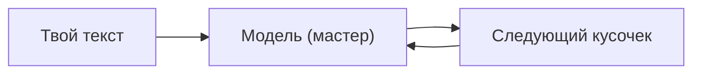

# Занятие 01. «Добро пожаловать в аппаратную»

> Семестр 1 · Блок 0 «Завязка» · Курс 01, лекции 00–01 · ~2 ч

## Миссия занятия

> «Слушай сюда, молодежь. Завод встал. Электроник сдох — доигрался, твою ж изоленту, черт, на скрипке. Партсобрание
> решило: будем поднимать производство на древних ИИ. Вон там, в аппаратной, стоит макбук времён дедов.
> Модель на нём — Василич-5.7. Она с характером, но умная. Разберёшься, что она умеет и где у нас тут
> данные лежат, — считай, первое дело сделал.» — Прораб Василич

**Задача квеста:** включить «древний ИИ», познакомиться с ним и его хранительницей — бабушкой Алисой
(она заведует аппаратной и объясняет, как работают древние машины), узнать, что ИИ умеет, и сформулировать,
какие вопросы про завод можно ему задать.

**Итог занятия:** студент настроил рабочее место, провёл первый диалог с LLM в роли «Василича-5.7»,
получил базовое представление о генеративном ИИ и LLM и составил первый рапорт стажёра.

---

## Слайды

| № | Тип | Название | Краткое содержание |
|---|-----|----------|--------------------|
| 1 | `image_group` | Комикс «Завод встал» | 6 панелей: завод молчит, сломанный «Электроник-84», партсобрание, спуск в аппаратную, «вытащи из нейронки все данные», Алиса выглядывает из-за стойки |
| 2 | `image_group` | Комикс «Бабушка Алиса» | 3 панели: встреча в аппаратной, Алиса у макбука («имба была, те фиксики»), «проверяй, деточка, всё проверяй» |
| 3 | `rich_text` | «Генеративный ИИ и LLM» | От Алисы: предсказание следующего слова в поговорках («мама мыла…», «мал золотник, да…») с процентами + Mermaid-схема + определения GenAI и LLM (по лекции 01 курса-01) |
| 4 | `rich_text` | «Промпт, завершение и случайность» | От Алисы: наряд-заказ (промпт/завершение), недетерминированность и температура, галлюцинации и проверка (по лекции 01 курса-01) |
| 5 | `rich_text` | «Настройка рабочего места» | Рамка от Алисы: доступ к провайдеру LLM / агенту, «оживление» Василича-5.7 (по лекции 00 курса-01) |
| 6 | `image` | Мем «Разговор с машиной» | Разрядка после теории и перед первым чатом; «не верь на слово» (мем, человек проверяет) |
| 7 | `ai_chat` | «Знакомство с Василичем-5.7» | Свободный чат: systemPrompt персонажа, расспросить о возможностях |
| 8 | `ai_task_chat` | «Три вопроса про завод» | Задание с проверкой: сформулировать и задать 3 вопроса |
| 9 | `quiz` | «Проверь себя: что верно про LLM» | 3 варианта, один правильный (по «Проверке знаний» лекции 01) |
| 10 | `open_question` | «Как называется вход для модели?» | Открытый вопрос: «промпт / запрос» |
| 11 | `image` | Мем «Готовимся к рапорту» | Перед заключительным заданием; настроение на составление рапорта (мем, человек проверяет) |
| 12 | `ai_task_chat` | «Рапорт стажёра» | Составить рапорт (~300 слов) с помощью Василича-5.7: что в древних завалах железа и данных, как вернуть производство (активность в рамках занятия) |
| 13 | `image_group` | Комикс-развязка «Первое задание» | 4 панели: диалог с Василичем-5.7, сдача рапорта (подпись-нарратив), реакция Василича; рядом Алиса |

---

## Детали по слайдам

### 1. image_group — Комикс «Завод встал»

- **Назначение:** завязка занятия: завод встал, «Электроник-84» сломался, партсобрание постановило
  восстанавливать производство на древних ИИ; Василич командует вытащить из нейронки все данные (в камеру);
  из-за серверной стойки их замечает и встречает смотрительница аппаратной бабушка Алиса. См. `comic.md`, сцена 1.
- **Содержание:**
  - `title`: «Завод встал»
  - `images`: 6 панелей (кадры 1.1–1.6 из `comic.md`, файлы `slide-01/01.png–06.png`)
  - `show_frames`: true
  - `description`: «2120 год. Завод „БытХимИскИнДеталь“ молчит: из „Аппаратной“ валит дым, ИИ „Электроник-84“
    доигрался на скрипке и дал дуба. Партсобрание постановляет восстанавливать производство силами древних
    ИИ. В аппаратной Василич командует в камеру: „Вытащи из него все данные!“ — и из-за серверной стойки
    выглядывает смотрительница аппаратной бабушка Алиса с кипящим чайником: „Ой, деточки, вы откуда?…
    посидим, почиллим по-домашнему!“.»

### 2. image_group — Комикс «Бабушка Алиса»

- **Назначение:** знакомство с персонажем-объясняющим: бабушка Алиса, заведующая аппаратной. Она встречает
  стажера, помнит «давным-давно» и сразу задаёт тон сквозной теме «проверяй результат». См. `comic.md`,
  сцена 2.
- **Содержание:**
  - `title`: «Бабушка Алиса»
  - `images`: 3 панели (кадры 2.1–2.3 из `comic.md`, файлы `slide-01/07.png–09.png`)
  - `show_frames`: true
  - `description`: «Аппаратная, день первый. Бабушка Алиса — смотрительница аппаратной — рассказывает,
    что застала древние машины живьём: „Имба была, те фиксики, ох, имба“. И сразу задаёт тон курсу:
    фиксики умные, но врать умеют — проверяй, деточка, всё проверяй.»

### 3. rich_text — «Генеративный ИИ и LLM»

- **Назначение:** первое понятие от имени Алисы (п.7 шаблона): как модель «пишет» текст — предсказывает
  следующий кусочек. Пример — завершение известных поговорок с процентами (фирменная манера Алисы и Василича);
  затем формально: GenAI и LLM (по лекции 01 курса-01). Одна мысль: «что это и как работает в двух словах».
- **Содержание** (`markdown`):

````markdown
**Генеративный ИИ и LLM.**

«Ох, деточка, помню-помню… Садись, чай стынет. Смотри: скажу ей „Мама мыла…“ — и она тут же:
„раму!“ А „мал золотник, да…“ — „дорог“, не сомневайся. Не потому, что понимает, — нет, деточка,
она насмотрелась текстов, как я — смен на заводе. Глянет на твои слова и **предсказывает следующий
кусочек** — за кусочком, предложение за предложением. Каждому варианту — свой процент, берёт самый
жирный. Ну, имба, прям рил.



А если по-взрослому:

**Генеративный ИИ** — ИИ, который умеет **создавать** новое: текст, картинки, код. Не искать готовое,
а генерировать с нуля. **LLM (большая языковая модель)** — вид генеративного ИИ, натасканный
на горе текстов: писать и резюмировать, отвечать на вопросы, помогать с кодом, структурировать данные.

Только, деточка, без б — проверять всё равно надо. Фиксики умные, а врут — ой как.»

Заглянуть глубже: [словарик терминов](@glossarij) и [откуда модель это умеет](@kak-uchat-llm).
````

### 4. rich_text — «Промпт, завершение и случайность»

- **Назначение:** вторая мысль теории, подана от имени Алисы: как мы общаемся с моделью (промпт/завершение)
  и почему ответам нельзя верить на слово (недетерминированность, температура, галлюцинации).
- **Содержание** (`markdown`):

```markdown
**Промпт, завершение и случайность.**

«Так, деточка, теперь слушай, как мы с фиксиками разговариваем. На заводе был наряд-заказ —
ну вот и тут то же самое. Твой текст-вход — это **промпт (запрос)**. А то, что машина выдала, —
**завершение (completion)**. Написал наряд — получил результат.

А вот фокус: машина не отвечает по шаблону. Она каждый раз подбрасывает монетку — ответ
**не детерминирован**, при одном и том же вопросе может выдать разное. Разброс крутит
**температура**: низкая — сухо и стабильно, высокая — фантазия прёт, средняя — баланс.

⚠️ И главное, деточка: фиксик может **выдумать** — это зовут галлюцинациями. А ещё он не видит
твои файлы, пока ты их не прикрепишь. Всё проверяем, без исключений.
Подробнее — [как ловить галлюцинации и проверять ответы](@galyucinacii-i-proverka).

Про токены — из каких кусочков собран текст — разберём в занятии 2. Чиль, деточка, всё по порядку.»
```

### 5. rich_text — «Настройка рабочего места»

- **Назначение:** подключить доступ к LLM/агенту (по лекции 00 курса-01). Кратко, без перегруза; рамка
  от Алисы как от хозяйки аппаратной.
- **Содержание** (`markdown`):

```markdown
«Чтобы „оживить Василича-5.7“, деточка, нужно рабочее место»:

1. **Доступ к ИИ-инструменту.** Подойдёт любой провайдер без региональных ограничений: DeepSeek, Qwen,
   OpenRouter, GigaChat и др. (список — в `links.md`; локальная модель — до этого дойдём в семестре 2).
   Бесплатного тарифа достаточно.
2. **Среда для практики.** По ходу курса понадобятся Jupyter-ноутбуки и код — но писать его будет агент,
   а не ты. Уметь программировать не нужно.
3. **Правила безопасности.** API-ключи храним в секретах/файле `.env`, в код и в чат их не вставляем.
   На заводе с секретами строго — «всё через жопу делаете, потом секреты по форумам гуляют».
   [Правила безопасности и приватность](@bezopasnost-i-privatnost) — подробнее.

Как устроен доступ к модели: [что такое API-ключ и куда его вставлять](@nastroyka-provaiderov).
Пошагово по провайдерам — в лекции 00 курса-01 (см. `links.md`).
```

### 6. image — Мем «Разговор с машиной»

- **Назначение:** разрядка после блока теории и перед первым практическим чатом. Подводит к «Знакомству
  с Василичем-5.7»; сквозная тема — не доверять ИИ на слово.
- **Содержание:**
  - `title`: «Мем: разговор с машиной»
  - `image_url`: `memes/images/m00745.jpg`
  - `description`: «Он всё знает, он всё умеет — только врёт иногда. Погнали знакомиться с Василичем-5.7.»
- **Подбор:** `memes/pick_meme "знакомство с искусственным интеллектом, разговор с нейросетью"` →
  кандидаты `m00745` (0.534), `m00946` (0.558). Картинку проверяет человек.

### 7. ai_chat — «Знакомство с Василичем-5.7»

- **Назначение:** первый живой диалог с LLM в роли персонажа. Студент расспрашивает модель, что она умеет.
- **Содержание:**
  - `title`: «Знакомство с Василичем-5.7»
  - `task` (Markdown): «Давай, молодежь, знакомься. Поздоровайся с Василичем-5.7 — расспроси: кто она, что умеет, чем поможет заводу. Спроси, например: „С чего начать, чтобы вернуть производство?“ Заметь: даже на один и тот же вопрос ответы могут отличаться — это нормально, не баг.»
  - `systemPrompt`: текст из `files/system-prompt-vasylich-57.md`
  - `aiName`: «Василич-5.7»
  - `model`: `openrouter/free`
  - `chainOfThought`: false
  - `showCoT`: false
  - `allowFileUpload`: false

### 8. ai_task_chat — «Три вопроса про завод»

- **Назначение:** учебное задание с проверкой: студент формулирует и задаёт 3 вопроса, затем жмёт «Проверить».
- **Содержание:**
  - `task` (Markdown): «Три вопроса про завод — по делу, без воды. Задай их Василичу-5.7. Например: „Что умеет древний ИИ?“, „Где лежат данные?“, „С чего начать восстановление?“ Формулируй чётко — как рапорт. Получишь ответы — жми „Проверить“.»
  - `systemPrompt`: текст из `files/system-prompt-vasylich-57.md`
  - `aiName`: «Василич-5.7»
  - `model`: `openrouter/free`
  - `checkPrompt`: «Оцени ответ студента: задал ли он три осмысленных вопроса про завод (не меньше двух по сути)? Ответь „да“ или „нет“ с кратким пояснением.»

### 9. quiz — «Проверь себя: что верно про LLM»

- **Назначение:** контрольная точка по теории (по «Проверке знаний» лекции 01 курса-01).
- **Содержание:**
  - `question`: «Что верно про большие языковые модели?»
  - `markdown`: «Выбери один правильный вариант. Термины из занятия — [в словарике](@glossarij).»
  - `options`:
    - { text: «Вы получаете одинаковый ответ каждый раз», is_correct: false }
    - { text: «Они делают всё идеально: отлично считают и сразу генерируют рабочий код», is_correct: false }
    - { text: «Ответ может меняться даже при одном и том же запросе. Модель хороша для первого варианта текста или кода, но результат нужно дорабатывать и проверять», is_correct: true }
  - `explanation`: «LLM работают недетерминированно: ответ варьируется, а разброс регулируется температурой. Не стоит ждать идеала — модель делает за тебя черновую работу, а ты проверяешь и дорабатываешь.»
  - `explanation_md`: true

### 10. open_question — «Как называется вход для модели?»

- **Назначение:** закрепить термин «промпт».
- **Содержание:**
  - `question`: «Как называется текстовый вход, который ты даёшь большой языковой модели?»
  - `correct_answers`:
    - «промпт»
    - «запрос»
    - «prompt»
  - `congratulations`: «Верно! Вход — это промпт (запрос), а выход — завершение (completion).»
  - `error_message`: «Не совсем. Вспомни, как в теории назывался вход для модели.»
  - `hint`: «Слово начинается на „п“… В этом курсе мы будем учиться составлять такие входы правильно.»
  - `fuzzy_match`: true
  - `similarity_threshold`: 0.8
  - `show_correct_answer`: true

### 11. image — Мем «Готовимся к рапорту»

- **Назначение:** поднять настроение перед заключительным заданием — составлением рапорта.
- **Содержание:**
  - `title`: «Мем: готовимся к рапорту»
  - `image_url`: `memes/images/m01566.jpg`
  - `description`: «Рапорт — дело серьёзное, но не страшное: распроси Василича-5.7 и собери отчёт.»
- **Подбор:** `memes/pick_meme "писать отчёт, готовиться к заданию"` → кандидаты `m01566` (0.499),
  `m00019` (0.518). Картинку проверяет человек.

### 12. ai_task_chat — «Рапорт стажёра»

- **Назначение:** заключительная активность занятия: студент составляет рапорт-инвентаризацию древних
  машин и данных с помощью Василича-5.7. Задание с проверкой и есть контрольная точка. Материал —
  `files/raport-stazhera.md`.
- **Содержание:**
  - `task` (Markdown): «Ну, молодежь, пора докладывать. Расспроси Василича-5.7 про заводские древности: какие
    машины и ИИ ещё дышат, какие данные лежат в архиве — таблицы, накладные, логи. Потом
    составь **рапорт на имя Василича (~300 слов)**. Структура:
    **что в завалах** (древние машины/ИИ, данные архива),
    **как это поднимет производство** (что пустить в дело первым),
    **проверка** (как проверяешь, что данные и ответы ИИ не врут).
    Черновик можно накидать с помощью Василича-5.7, но рапорт — твой. По готовности жми „Проверить“.»
  - `systemPrompt`: текст из `files/system-prompt-vasylich-57.md`
  - `aiName`: «Василич-5.7»
  - `model`: `nvidia/nemotron-3-super-120b-a12b:free`
  - `checkPrompt`: «Оцени рапорт стажёра: есть ли разделы „что в завалах (древние машины/ИИ, данные
    архива)“, „как это поможет производству“, „проверка“; объём около 300 слов, по делу, без воды.
    Ответь „да“ или „нет“ с кратким пояснением.»

### 13. image_group — Комикс-развязка «Первое задание»

- **Назначение:** развязка сюжета занятия: диалог с Василичем-5.7, сдача первого рапорта (подпись-нарратив
  от стажёра «за кадром»), Василич принимает дело; рядом — бабушка Алиса. См. `comic.md`, сцена 3.
- **Содержание:**
  - `title`: «Первое задание»
  - `images`: 4 панели (кадры 3.1–3.4 из `comic.md`)
  - `show_frames`: true
  - `description`: «Диалог с Василичем-5.7: „Всё у завода есть — таблицы, накладные, логи. Надо только
    разобрать.“ Стажёр сдаёт первый рапорт — голосом за кадром; бабушка Алиса за чаем довольно кивает.
    Василич ворчит, но принимает дело.»

---

## Доп. информация

Блоки дополнительной информации (вкладка «Доп. информация» на платформе; слаги — общие на курс sem1).
Наполнение блоков — по мере подготовки в `content/sem1/extra/<слаг>.md`.

| Слаг | Слайд | Ссылка на слайде |
|---|---|---|
| `glossarij` | 3, 9 | «словарик терминов» |
| `kak-uchat-llm` | 3 | «откуда модель это умеет» |
| `galyucinacii-i-proverka` | 4 | «как ловить галлюцинации и проверять ответы» |
| `nastroyka-provaiderov` | 5 | «что такое API-ключ и куда его вставлять» |
| `bezopasnost-i-privatnost` | 5 | «правила безопасности и приватность» |
