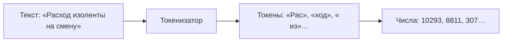
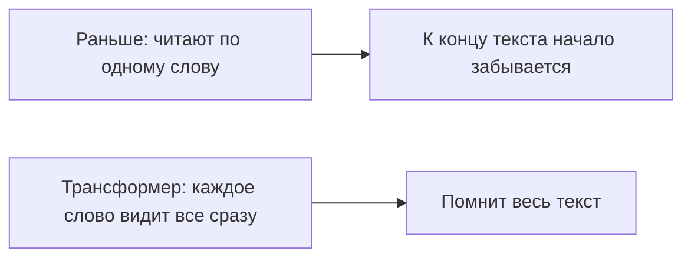

# Занятие 02. «Что у неё внутри»

> Семестр 1 · Блок 1 «Мозги древних машин» · Курс 01, лекции 01–02 · ~2 ч

## Миссия занятия

> «Ну чё, молодежь, ожил черт — ёлки-палки, надо же. Теперь раскуривай его мозги:
> из чего сделан, чем один от другого отличается и какого под какой цех ставить.
> Разберёшься — доложишь. Только запомни: врут они все, без исключений. С этим — потом.» — Прораб Василич

**Задача квеста:** разобрать «мозги» древнего ИИ: из чего он сделан (токены, служебные токены, окно
контекста, вероятностная генерация), чем модели отличаются друг от друга, почему современные LLM
построены на трансформерах, и обоснованно выбрать «модель под цех».

**Итог занятия:** студент понимает, как LLM «видит» текст (токены → числа), знает, почему современные LLM построены на трансформерах (вместо рекуррентных сетей), знает про служебные токены
(`<|im_start|>`, `<|im_sep|>`, `<|im_end|>` и др.), окно контекста и температуру, умеет сравнить две модели
на одной задаче и выбирает модель под конкретную заводскую работу с учётом качества, скорости и цены.

---

## Слайды

| № | Тип | Название | Краткое содержание |
|---|-----|----------|--------------------|
| 1 | `image_group` | Комикс «Вскрытие» | 6 панелей: Василич собирается «вскрыть» макбук, Василич-5.7 в ужасе, Алиса объясняет про токены, договор «раскуривать вопросами», работа за макбуком от первого лица |
| 2 | `rich_text` | «Токен и эмбеддинг» | От Алисы (~80 слов): токен — кусочек текста, каждый получает ID-число и эмбеддинг-вектор; кнопка «смотри ролик» |
| 3 | `video` | «Фраза → токены → дополнение» | Manim-ролик: поговорка «Без труда не вытащишь и рыбку из пруда» нарезается на токены с ID, затем модель циклически дополняет текст токен за токеном (программа в `videos/manim/03-tokenizaciya.py`) |
| 4 | `rich_text` | «Токены: точнее» | Рамка от Алисы + формально (~100 слов): токенизатор, под-слова, ID, словарь ~100 тыс. + Mermaid-схема «Текст → Токены → Числа» + указатель на инструмент (слайд 5) |
| 5 | `embed` | «tiktokenizer: разбери текст на токены» | Инструмент в слайде: текст → токены → ID; шаблон `gpt-4o` — служебные токены |
| 6 | `video` | «Узкое горлышко против матрицы внимания» | Manim-ролик на примере «Клей для цеха испорчен. Выкинуть ___»: RNN читает по одному, токены и блоки блекнут, начало забывается — модель предлагает выкинуть цех; трансформер видит все слова сразу (по кругу, все связаны) и отвечает верно — «клей» |
| 7 | `rich_text` | «От RNN к трансформерам» | От Алисы (~120 слов): метафора «читали по очереди — забыли начало»; Mermaid: RNN vs трансформер; формально: attention, на чём стоят современные LLM |
| 8 | `image` | Мем «Текст превращается в числа» | После токенизации: разрядка после блока текста, токенизатор «переводит» слова в числа (мем, человек проверяет) |
| 9 | `rich_text` | «Служебные токены» | От Алисы: штампы на накладных (~100 слов): `<\|im_start\|>`, `<\|im_sep\|>`, `<\|im_end\|>` + мини-пример ChatML + приватность |
| 10 | `rich_text` | «Окно контекста и случайность» | От Алисы (~120 слов): окно-память, «взвешенная монетка», температура; инструменты bbycroft (ссылка) и TokenProbe (слайд 11) |
| 11 | `embed` | «TokenProbe: живой выбор токена» | Инструмент в слайде: вероятности следующего токена, температура |
| 12 | `rich_text` | «Что за цифры в имени: 20B и 120B» | От Алисы (~100 слов): B = миллиарды параметров; 20B — маленькая/быстрая/дешёвая, 120B — большая/мощная/дорогая; ссылка на доп. блок |
| 13 | `ai_comparison` | «Одна задача — две модели» | Два чата рядом, одна и та же задача, одинаковый промпт Василича-5.7, разные модели (gpt-oss-20b vs nemotron-3-super-120b) |
| 14 | `image` | Мем «Большую машину на рутину не гоняем» | Перед выбором модели под цех: экономика автоматизации (мем, человек проверяет) |
| 15 | `ai_task_chat` | «Выбери модель под цех» | Контрольная точка: обоснованный выбор модели под 3 заводские работы (качество/скорость/цена), `checkPrompt` |
| 16 | `quiz` | «Что верно про токены» | 1 правильный вариант (по лекциям 01–02) |
| 17 | `open_question` | «Как называется кусочек текста?» | Открытый вопрос: «токен / token» |
| 18 | `image_group` | Комикс-развязка «Модель под цех» | 4 панели: доклад выбора, ворчание про расходы, хук на занятие 3 («не халтурить») |

---

## Детали по слайдам

### 1. image_group — Комикс «Вскрытие»

- **Назначение:** завязка занятия: пора «раскурить мозги» древней машины. Василич достаёт отвёртку,
  Василич-5.7 просит не вскрывать её, а разбираться вопросами — и работа идёт за макбуком, от первого
  лица, взглядом зрителя. См. `comic.md`, сцена 1.
- **Содержание:**
  - `title`: «Вскрытие»
  - `images`: 6 панелей (кадры 1.1–1.6 из `comic.md`, файлы `slide-02/01.png–06.png`)
  - `show_frames`: true
  - `description`: «Аппаратная, день второй. Василич решает, что пора «раскурить мозги» древней машины,
    и достаёт отвёртку. Василич-5.7 в ужасе: внутри у неё не винтики, а токены и числа — и разбирать её
    надо вопросами. Бабушка Алиса подсказывает: токены — это кусочки, на которые машина режет текст.
    Работа за макбуком идёт от первого лица — взглядом зрителя, и начинается «вскрытие».»

### 2. rich_text — «Токен и эмбеддинг»

- **Назначение:** первое короткое понятие от имени бабушки Алисы (п.7 шаблона): токен — кусочек текста,
  который модель переводит в число (ID), а для сравнения по смыслу — в эмбеддинг. Подводит к видео на
  слайде 3.
- **Содержание** (`markdown`):

```markdown
**Токен и эмбеддинг.**

«Так, деточка, чай-то остынет — слушай быстро. Машина не читает буквами, нет-нет. Она режет
текст на **токены** — кусочки: где слово целиком, где хвостик, где запятая с пробелом. Каждому
кусочку — свой номерок, **ID**. А чтобы понять, кто кому по смыслу родня, она каждый токен
превращает в **эмбеддинг** — длинный ряд чисел. Похожие по смыслу — живут рядышком, как соседи
по общаге. Как это выглядит — смотри ролик, деточка, красава будешь.»
```

### 3. video — «Фраза → токены → дополнение»

- **Назначение:** наглядно показать механизм после рассказа Алисы: фраза нарезается на токены-под-слова
  с ID, а затем модель **циклически дополняет** текст токен за токеном — выбирает следующий токен по
  вероятностям (3–4 слова). Технический ролик (Manim), программа-сценарий — `videos/manim/03-tokenizaciya.py`
  (см. `video-guide.md`).
- **Содержание:**
  - `title`: «Фраза → токены → дополнение»
  - `video_url`: `videos/03-tokenizaciya.mp4` (отрендеренный файл)
  - `video_type`: `direct`
  - `description`: «Технический ролик: поговорка бабушки Алисы „Без труда не вытащишь и рыбку из пруда“
    разбивается на токены-под-слова, каждый токен получает свой ID. Дальше модель дополняет текст
    циклически: получив „Без труда не вытащишь и“, она по вероятностям выбирает следующий токен —
    „ рыбку“, „ из“, „ пруда“, „.“ Запуск программы: см. `videos/README.md`.»

### 4. rich_text — «Токены: точнее»

- **Назначение:** формальное определение токенизации ПОСЛЕ видео (п.7 шаблона), с рамкой от Алисы.
  Mermaid-схема — «наглядность» прямо в тексте (п.8 шаблона).
- **Содержание** (`markdown`):

````markdown
«Ну, деточка, это я по-бабушкиному объяснила — теперь давай по-взрослому, без сказок. Рофл в сторону — работаем.»

**Токен** — кусок текста переменной длины: символ, часть слова или слово с пробелом.
**Токенизатор** разбивает запрос на токены и превращает каждый в **число (ID токена)**.



Почему не по словам? Слов бесконечно много (формы, новые слова, опечатки), а по буквам — слишком длинно
и теряется смысл. Под-слова решают обе проблемы: модель справляется с новыми словами и другими языками.
Словарь модели — около 100 000 токенов, свой у каждой модели.

Попробуй сам вживую — в следующем слайде: tiktokenizer разберёт любую фразу на токены и покажет их ID.

Подробнее о механизме — [как токенизатор это делает](@kak-rabotaet-tokenizator).
````

### 5. embed — «tiktokenizer: разбери текст на токены»

- **Назначение:** встроенный инструмент (вместо ссылки из слайда 4): студент вживую разбирает текст на
  токены и видит их ID; на шаблоне `gpt-4o` — служебные токены (подготовка к слайду 7).
- **Содержание:**
  - `title`: «tiktokenizer: разбери текст на токены»
  - `url`: `https://tiktokenizer.vercel.app`
  - `mode`: `direct` (если сайт заблокирует iframe — включить `proxy` в редакторе; полные ссылки-запас
    остаются в `links.md`)
  - `description`: «Вставь поговорку из ролика — „Без труда не вытащишь и рыбку из пруда“ — и посмотри,
    как она разбивается на токены с их ID. Выбери шаблон `gpt-4o` — увидишь служебные токены, к ним вернёмся
    через пару слайдов.»
- **Примечание:** инструмент работает в браузере без установки; ссылки из `links.md` остаются как fallback.

### 6. video — «Узкое горлышко против матрицы внимания»

- **Назначение:** технический ролик (Manim), показывающий, почему трансформеры заменили рекуррентные сети,
  на конкретном заводском примере: модель должна закончить фразу «Клей для цеха испорчен. Выкинуть ___».
  RNN обрабатывает токены по одному: к концу фразы «сводка» о начале истончается, а токены и блоки
  блекнут по мере прохождения — модель «забывает» начало и ошибается: предлагает выкинуть цех.
  Трансформер видит все токены сразу через механизм внимания и отвечает верно — «клей».
  Подводит к формальному объяснению на слайде 7.
- **Содержание:**
  - `title`: «Узкое горлышко против матрицы внимания»
  - `video_url`: `videos/06-rnn-i-transformer.mp4` (отрендеренный файл)
  - `video_type`: `direct`
  - `description`: «Технический ролик (Manim): заводская фраза „Клей для цеха испорчен. Выкинуть ___“.
    Часть 1 — рекуррентная сеть (RNN): токены проходят по одному через цепочку блоков, стрелка памяти
    от слова „клей“ истончается к концу, а сами токены и блоки блекнут по мере прохождения — видно,
    как модель „забывает“ начало. Рядом со словом „клей“ стоит „цех“, и RNN ошибочно предлагает
    „выкинуть цех“. Часть 2 — трансформер: общий блок внимания охватывает все токены сразу, слова
    расставлены по кругу и связаны каждое с каждым; выделяется сильная связь со словом „клей“,
    и модель отвечает верно. Финал: надпись «НА ТРАНСФОРМЕРАХ СТОЯТ ВСЕ СОВРЕМЕННЫЕ ЯЗЫКОВЫЕ МОДЕЛИ».
    Запуск программы: см. `videos/README.md`.»

### 7. rich_text — «От RNN к трансформерам»

- **Назначение:** после видеоролика (наглядность) — формальное определение с метафорой от Алисы и
  Mermaid-схемой (порядок: метафора → видео → формальность). Закрепляет, почему трансформеры
 заменили рекуррентные сети и на чём стоят современные LLM.
- **Содержание** (`markdown`):

````markdown
«Раньше, деточка, машины читали текст по очереди — слово за словом, как вахтенный по цеху.
Дойдёшь до конца длинного приказа, а начало уже забыл: где там кладовка, где клей.
А трансформеры придумали **внимание**: каждое слово смотрит на все остальные сразу —
ничего не теряется. Поэтому на них и стоят все современные фиксики — GPT, Llama и прочие.»
````



**Рекуррентные сети (RNN)** обрабатывали текст последовательно: «забывали» дальний контекст,
поэтому длинные тексты и масштабирование давались им плохо.

**Трансформеры** добавили механизм **внимания (attention)** — каждый токен сопоставляется со
всеми остальными сразу. Это позволяет обрабатывать длинные тексты и учиться параллельно
на огромных данных. На трансформерах построены все современные языковые модели (GPT, Llama
и другие).

### 8. image — Мем «Текст превращается в числа»

- **Назначение:** разрядка после блока о токенизации; закрепляет образ «текст → числа» перед переходом
  к служебным токенам.
- **Содержание:**
  - `title`: «Мем: текст превращается в числа»
  - `image_url`: `memes/images/m01515.jpg`
  - `description`: «Примерно так токенизатор превращает твои слова в понятные модели числа — символы
    становятся смыслом.»
- **Подбор:** `memes/pick_meme "превращать символы в слова и числа, перевод с языка машины"` →
  кандидаты `m01515` (0.623), `m00048` (0.491). Картинку проверяет человек.

### 9. rich_text — «Служебные токены»

- **Назначение:** объяснить служебные токены (`<|im_start|>`, `<|im_sep|>`, `<|im_end|>`, `<|endoftext|>`)
  метафорой «штампов на накладных» + короткий пример ChatML. Приватность: весь промпт уходит в облако.
- **Содержание** (`markdown`):

````markdown
**Служебные токены: штампы на накладных.**

«Помню, деточка, помню… На старых накладных штампы ставили: „Принято“, „Отгружено“, „Конец партии“.
Вот и разговор с фиксиком — та же накладная. Чат-приложение ставит вокруг сообщений **служебные токены**,
чтоб машина понимала: кто говорит и где конец. Ты их не печатаешь — они сами подставляются, как те штампы.
````

### 10. rich_text — «Окно контекста и случайность»

- **Назначение:** окно контекста и вероятностная генерация (по лекции 01 курса-01): метафора-память +
  «взвешенная монетка», интерактивные ссылки как наглядность, краткое формальное про температуру.
- **Содержание** (`markdown`):

```markdown
**Окно контекста и случайность.**

«Так, деточка, теперь самое весёлое — про память и „монетку“. Голова у фиксика маленькая:
сколько токенов влезло в **окно контекста**, столько и видит. Что за окном — всё, забыто, как
вчерашний чай. Важное клади в начало запроса или во вложение — иначе пролетит мимо.

А отвечает фиксик не по шаблону. Он подбрасывает **взвешенную монетку**: смотрит на контекст,
выдаёт вероятности для следующего токена и выбирает. Поэтому ответы каждый раз немного другие —
вспомни занятие 1, деточка.

Разброс крутит **температура**: низкая — „сухой“ стабильный ответ, высокая — хаос и креатив,
средняя (0.7–1.0) — баланс, красава.

Попробуй сам — в следующем слайде увидишь, как модель выбирает следующий токен по вероятностям.
Вся „начинка“ модели наглядно — на bbycroft.net/llm (ссылка в `links.md`).

Глубже: [как устроена „взвешенная монетка“](@vybor-sleduyushchego-tokena) и
[сколько влезает в окно у разных моделей](@okna-konteksta).

Вывод: ответ ИИ — вероятностный черновик. Проверяем (правило №1).»
```

### 11. embed — «TokenProbe: живой выбор токена»

- **Назначение:** встроенный инструмент (вместо ссылки из слайда 10): студент видит вероятности
  следующего токена и крутит температуру — живое подтверждение «взвешенной монетки» перед практикой
  сравнения моделей.
- **Содержание:**
  - `title`: «TokenProbe: живой выбор токена»
  - `url`: `https://tokenprobe.cs.columbia.edu` (⚠️ сервис лежит с авг. 2026 — альтернатива: bbycroft.net/llm или logprob-visualizer от bradsjm)
  - `mode`: `direct` (если сайт заблокирует iframe — включить `proxy`/`browser` в редакторе; ссылка-запас
    остаётся в `links.md`)
  - `description`: «Набери фразу и посмотри, как модель выбирает следующий токен по вероятностям.
    Покрути температуру — увидишь, как меняется разброс ответов.»
- **Примечание:** инструмент работает в браузере без установки; ссылка из `links.md` остаётся как fallback.

### 12. rich_text — «Что за цифры в имени: 20B и 120B»

- **Назначение:** перед сравнением моделей (слайд 13) расшифровать, что означают цифры в именах моделей
  (`gpt-oss-20b`, `nemotron-3-super-120b-a12b`) — студент увидит эти имена в селекторе моделей, и без расшифровки
  «20b»/«120b» для него просто буквы. От Алисы, метафора размера бригады; ссылка на доп. блок.
- **Содержание** (`markdown`):

```markdown
**Что за цифры в имени: 20B и 120B.**

«Вижу, деточка, ты на таблички смотришь: 20B, 120B — чё за цифры, да? Это как размер бригады:
**B** — миллиард, а цифра — сколько у машины **параметров**, настроек, которые она набрала
при обучении. Чем больше бригада, тем больше умеет — но и кормить её дороже, и думает медленнее.

20B — бригада маленькая: шустрая, дешёвая, но в сложном путается. 120B — большая: отвечает
точнее и полнее, зато медленнее и в проде — ох, деточка, дорого. На занятии обе бесплатные,
а в жизни за большую платят — поэтому под задачу ставят подходящую, а не самую жирную. Имба —
не значит нужная, прям рил.»
```

### 13. ai_comparison — «Одна задача — две модели»

- **Назначение:** центральная практика занятия: одна и та же заводская задача двум моделям, сравнение
  ответов. Промпт одинаковый (Василич-5.7), отличаются только модели — это сравнение моделей, а не персонажей.
- **Содержание:**
  - `title`: «Одна задача — две модели»
  - `task` (Markdown): «Под „Древней машиной №1“ и „Древней машиной №2“ скрываются разные модели: №1 —
    `openai/gpt-oss-20b:free` (≈20 млрд параметров — маленькая, быстрая и дешёвая), №2 —
    `nvidia/nemotron-3-super-120b-a12b:free` (≈120 млрд всего параметров — большая, мощная и дорогая). Промпт у обеих один — «Василич-5.7»,
    чтобы сравнивать именно модели. Возьми заводскую задачу из `files/zadanie-dvum-modelyam.md`, отправь
    её в общее поле ввода — она уйдёт обеим сразу — и сравни ответы: точность, полнота, понятность, скорость.»
  - **Примечание (экономика):** на бесплатном тарифе OpenRouter обе машины бесплатны, а «дорогая №2» —
    это про реальную жизнь: в проде большие модели стоят денег и их на рутину не гоняют. На занятии
    разница между №1 и №2 — в качестве, скорости и том, как часто модель «выдумывает»; цена как фактор
    выбора вернётся в экономику автоматизации (слайд 14).
  - `mergeInput`: true
  - `labelLeft`: «Древняя машина №1»
  - `labelRight`: «Древняя машина №2»
  - `systemPromptLeft`: текст из `files/system-prompt-vasylich-57.md`
  - `systemPromptRight`: тот же текст
  - `aiNameLeft`: «Василич-5.7»
  - `aiNameRight`: «Василич-5.7»
  - `modelLeft`: `openai/gpt-oss-20b:free`
  - `modelRight`: `nvidia/nemotron-3-super-120b-a12b:free`
  - `chainOfThoughtLeft` / `chainOfThoughtRight`: false
  - `showSystemPromptLeft` / `showSystemPromptRight`: true (видно, что промпт один)
  - `showModelSelectLeft` / `showModelSelectRight`: true
  - `showCoTLeft` / `showCoTRight`: false
  - `allowFileUploadLeft` / `allowFileUploadRight`: false

### 14. image — Мем «Большую машину на рутину не гоняем»

- **Назначение:** перед выбором модели под цех; экономика автоматизации — большая дорогая модель стоит
  денег, подбираем машину под задачу.
- **Содержание:**
  - `title`: «Мем: большую машину на рутину не гоняем»
  - `image_url`: `memes/images/m02351.jpg`
  - `description`: «Каждая „дорогая машина“ стоит денег — подбирай модель под задачу, а не по привычке.»
- **Подбор:** `memes/pick_meme "экономия денег, не тратить лишнего, бюджет"` → кандидаты `m02351`
  (0.455), `m01949` (0.443). Картинку проверяет человек.

### 15. ai_task_chat — «Выбери модель под цех»

- **Назначение:** контрольная точка занятия: студент обоснованно выбирает модель под конкретную заводскую
  работу (экономика автоматизации + проверка результата). Материал — `files/vybor-modeli-pod-ceh.md`.
- **Содержание:**
  - `task` (Markdown): «Так, молодежь, вот тебе три работы по заводу: (1) отвечать на рутинные вопросы смены по инструкции,
    (2) считать расход компонентов по накладным, (3) писать длинные инструкции и регламенты для новых линий.
    Прогони одну-две на обеих машинах (слайд 13) и реши: **какую под какой цех ставить и почему**.
    Учти качество, скорость и цену: машина №1 маленькая и дешёвая, №2 — большая и дорогая
    (дорогую на рутину не гоняют, ёлки-палки). Критерии — [в справке](@landshaft-modelej).
    Запиши выбор, обоснуй и жми „Проверить“.»
  - **Примечание (экономика):** на бесплатном тарифе обе модели бесплатны, поэтому цену считаем «в уме»
    (в реальности №2 дороже №1); решение студент обосновывает качеством и скоростью, а цена — часть
    рассуждения о том, что большую модель на рутину не гоняют.
  - `systemPrompt`: текст из `files/system-prompt-vasylich-57.md`
  - `aiName`: «Василич-5.7»
  - `model`: `openrouter/free`
  - `chainOfThought`: false
  - `showCoT`: false
  - `allowFileUpload`: false
  - `checkPrompt`: «Оцени ответ студента: выбрал ли он, какая модель подходит под какую заводскую задачу,
    и обосновал ли выбор конкретными критериями (качество / скорость / цена / надёжность) — например,
    что большую дорогую модель не стоит гонять на рутину, а точные расчёты нельзя принимать на веру.
    Ответь „да“ или „нет“ с кратким пояснением.»

### 16. quiz — «Что верно про токены»

- **Назначение:** контрольная точка по токенизации (по лекции 01 курса-01).
- **Содержание:**
  - `question`: «Что такое токен?»
  - `markdown`: «Выбери один правильный вариант.»
  - `options`:
    - { text: «Один символ — буква или знак», is_correct: false }
    - { text: «Кусочек текста переменной длины: символ, часть слова или целое слово. Модель видит его как число (ID токена)», is_correct: true }
    - { text: «Целое предложение из запроса», is_correct: false }
    - { text: «Настройка модели, которая отвечает за температуру», is_correct: false }
  - `explanation`: «Токен — это кусочек текста переменной длины (символ, под-слово или слово).
    Токенизатор разбивает текст на токены, каждый получает свой ID-число, и уже с числами работает модель.
    Целые предложения, отдельные буквы и настройки — не токены.»
  - `explanation_md`: true

### 17. open_question — «Как называется кусочек текста?»

- **Назначение:** закрепить термин «токен».
- **Содержание:**
  - `question`: «Как называется кусочек текста, на который модель разбивает твой запрос перед обработкой?»
  - `correct_answers`:
    - «токен»
    - «token»
  - `congratulations`: «Верно! Модель не читает текст буквами — она работает с токенами: кусочками
    текста, превращёнными в числа.»
  - `error_message`: «Не совсем. Вспомни, как называется кусочек текста, на который токенизатор разбивает запрос.»
  - `hint`: «Слово начинается на „т“… По-английски оно звучит как „token“.»
  - `fuzzy_match`: true
  - `similarity_threshold`: 0.8
  - `show_correct_answer`: true

### 18. image_group — Комикс-развязка «Модель под цех»

- **Назначение:** развязка сюжета: доклад о выборе модели (голос за кадром), Василич ворчит про расходы,
  но принимает, и даёт хук на занятие 3 («не халтурить» / галлюцинации). См. `comic.md`, сцена 2.
- **Содержание:**
  - `title`: «Модель под цех»
  - `images`: 4 панели (кадры 2.1–2.4 из `comic.md`, файлы `slide-02/07.png–10.png`)
  - `show_frames`: true
  - `description`: «Голос за кадром докладывает: большую мощную машину ставим на расчёты и длинные
    инструкции, маленькую и дешёвую — на рутинные вопросы смены. Василич ворчит, что большая стоит
    дорого и на болтовню её гонять нечего, но решение принимает. И добавляет: „Только не верь им на
    слово — врут обе, по-разному. Что с этим делать — завтра разберём.“»

---

## Доп. информация

Блоки дополнительной информации (вкладка «Доп. информация» на платформе; слаги — общие на курс sem1).
Наполнение блоков — по мере подготовки в `content/sem1/extra/<слаг>.md`.

| Слаг | Слайд | Ссылка на слайде |
|---|---|---|
| `kak-rabotaet-tokenizator` | 4 | «как токенизатор это делает» |
| `sluzhebnye-tokeny-podrobnee` | 7 | «по служебным токенам» |
| `vybor-sleduyushchego-tokena` | 8 | «как устроена „взвешенная монетка“» |
| `okna-konteksta` | 8 | «сколько влезает в окно у разных моделей» |
| `razmer-modelej` | 10 | «что значат цифры в имени модели» |
| `landshaft-modelej` | 13 | «критерии выбора модели» |
