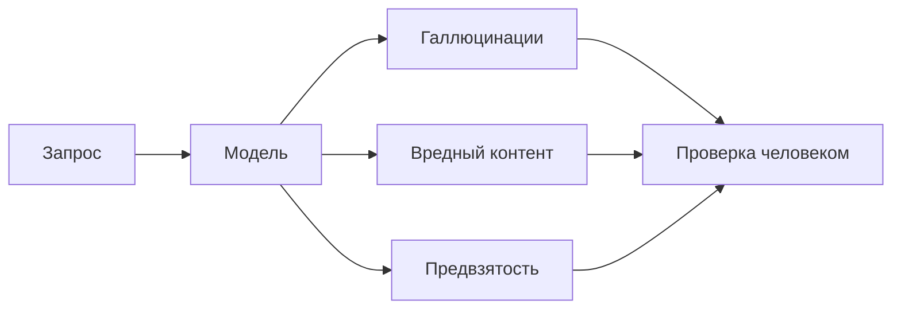

# Занятие 03. «Не халтурить на заводе»

> Семестр 1 · Блок 1 «Мозги древних машин» · Курс 01, лекция 03 · ~2 ч

## Миссия занятия

> «Слушай сюда, молодежь. Тут за враньё ИИ с премии вычитают, понял? Эти черти отвечают уверенно,
> а врут — как сапожники. Вчера мы выяснили, что машины врут обе, по-разному. Вот и раскури: где у них
> враньё сидит, когда верить нельзя, и составь памятку — чтоб смена по ней работала. Проверять надо!
> Не доверяй машине на слово.» — Прораб Василич

**Задача квеста:** разобрать, почему ИИ нельзя слепо доверять (галлюцинации, вредный контент,
предвзятость), специально поймать модель на вранье и составить памятку «когда ИИ верить нельзя».

**Итог занятия:** студент объясняет, что такое галлюцинации и чем они опасны, на практике ловит модель
на уверенной выдумке (или на честном «не знаю») и составляет собственную памятку проверки результата,
которую принимает Василич.

---

## Слайды

| № | Тип | Название | Краткое содержание |
|---|-----|----------|--------------------|
| 1 | `image_group` | Комикс «Не халтурить на заводе» | 5 панелей: враньё ИИ и премии, Алиса про «уверенную ложь», задача: поймать на вранье + памятка |
| 2 | `rich_text` | «Галлюцинации» | От Алисы: метафора «отвечает с потолка», пример с выдуманными ссылками и «точной» цифрой, «уверенно ≠ правильно» (по лекции 03) |
| 3 | `video` | «Уверенно, но неверно» | Manim-ролик: запрос → вероятности токенов → уверенный неверный ответ → проверка по архиву → «проверяй» (программа — `videos/manim/03-gallyucinaciyu.py`) |
| 4 | `rich_text` | «Три риска» | Формально (по лекции 03): галлюцинации, вредный контент, предвзятость + Mermaid-схема |
| 5 | `rich_text` | «Как смягчать вред» | 4 уровня (модель / система безопасности / метапромпт / интерфейс) + сквозное «проверяй результат» |
| 6 | `image` | Мем «уверенная ложь» | Разрядка перед практикой; сквозная тема — не доверять на слово (мем, человек проверяет) |
| 7 | `ai_task_chat` | «Поймай машину на вранье» | Вопросы-ловушки из `files/lovim-gallyucinaciyu.md`, проверка ответа, фиксация галлюцинации или честного «не знаю» |
| 8 | `quiz` | «Что верно про галлюцинации» | 3 варианта, один правильный (по лекции 03) |
| 9 | `open_question` | «Как называется уверенная выдумка?» | Открытый вопрос: «галлюцинация / hallucination» |
| 10 | `rich_text` | «Памятка: когда ИИ верить нельзя» | Материал: структура памятки и приёмы проверки; связь с памяткой из занятия 01 |
| 11 | `image` | Мем «пишем памятку» | Перед заключительным заданием; настроение на составление памятки (мем, человек проверяет) |
| 12 | `ai_task_chat` | «Составь памятку "когда ИИ верить нельзя"» | Главная практика-контрольная точка: составить памятку (~200–300 слов) с помощью Василича-5.7 |
| 13 | `image_group` | Комикс-развязка «Памятка принята» | 4 панели: сдача памятки, ворчание Василича, хук на занятие 4 («дежурный по заводу») |

---

## Детали по слайдам

### 1. image_group — Комикс «Не халтурить на заводе»

- **Назначение:** завязка занятия: Василич предупреждает, что за враньё ИИ с премии вычитают; стажёру
  поручается поймать модель на вранье и составить памятку. Алиса объясняет метафору «уверенной лжи».
  См. `comic.md`, сцена 1.
- **Содержание:**
  - `title`: «Не халтурить на заводе»
  - `images`: 5 панелей (кадры 1.1–1.5 из `comic.md`, файлы `slide-03/01.png–05.png`)
  - `show_frames`: true
  - `description`: «Аппаратная, день третий. Василич грозит премиями: „Тут за враньё ИИ с премии вычитают“.
    Бабушка Алиса объясняет: машины отвечают уверенно, но могут выдумать — „с потолка, да гладко“.
    Стажёру поручают: поймать машину на вранье и составить памятку, когда ИИ верить нельзя.»

### 2. rich_text — «Галлюцинации»

- **Назначение:** первое понятие от имени Алисы (п.7 шаблона): что такое галлюцинации на заводской метафоре
  «отвечает с потолка». Концепция — по лекции 03 курса-01. Пример специально НЕ берём из лекции: вопрос про
  «Титаник» современные модели уже проходят верно, поэтому взят самый живучий класс галлюцинаций — выдуманные
  ссылки и «точные» цифры без источника (самый частый вид вранья даже в 2026 году). Одна мысль:
  «уверенно — не значит правильно».
- **Содержание** (`markdown`):

```markdown
**Галлюцинации.**

«Вот смотри, деточка. Спросишь у машины чего-то, чего она не знает, — а она не скажет „не знаю“,
а ответит с потолка: гладко, складно, да с полной уверенностью. Это и есть **галлюцинация** —
уверенный ответ, который не имеет отношения к правде.

Пример: спросишь её: „Правда ли, что холодный душ повышает продуктивность? Приведи исследования
с авторами и журналами.“ — и она выпишет тебе три статьи: имена, годы, названия, и „точную“ цифру
в придачу: „исследование 2022 года — продуктивность выше на 37%“. Красиво, как в библиографии.
Только журналов таких нет, авторов таких нет и цифры 37% тоже нет: проверь поиском — пусто.
Выдуманные ссылки и „точные“ цифры без источника — самое надёжное враньё.

Почему так? Вспомни занятие 2: машина не ищет истину, она подбрасывает взвешенную монетку
и выдаёт самое правдоподобное продолжение. Чем складнее звучит, тем труднее поймать.
Но правило простое: **уверенно ≠ правильно**. Проверяем, деточка, проверяем.

Подробнее — [как ловить галлюцинации и проверять ответы](@gallyucinacii).»
```

### 3. video — «Уверенно, но неверно»

- **Назначение:** наглядно показать механизм галлюцинации после рассказа Алисы: запрос → модель строит
  распределение вероятностей и уверенно «дописывает» несуществующий факт → проверка по накладным архива
  ничего не находит → вывод «черновик, проверяй». Технический ролик (Manim).
- **Содержание:**
  - `title`: «Уверенно, но неверно»
  - `video_url`: `videos/03-gallyucinaciyu.mp4` (отрендеренный файл)
  - `video_type`: `direct`
  - `description`: «Технический ролик: модель уверенно „выдумывает“ факт про завод (число тонн глицерина
    за несуществующую дату), токен за токеном, по вероятностям. Сверка с накладными из архива ничего
    не находит — ответ правдоподобен, но неверен. Вывод ролика: ответ ИИ — черновик, его нужно проверять.
    Программа-сценарий: `videos/manim/03-gallyucinaciyu.py` (см. `video-guide.md`).»
- **План ролика (примерный сценарий, ~70 с):** см. раздел «Видео: план ролика» ниже.

### 4. rich_text — «Три риска»

- **Назначение:** формальное определение рисков ПОСЛЕ видео (п.7 шаблона), по лекции 03 курса-01:
  галлюцинации, вредный контент, предвзятость. Mermaid-схема — «наглядность» прямо в тексте (п.8 шаблона).
- **Содержание** (`markdown`):

````markdown
«Ох, деточка, то, что я по-бабушкиному рассказала, — теперь по-взрослому, без сказок. У ответственного ИИ три кита: фиксик может выдумать, навредить и быть несправедливым. Проверяй каждый, солнышко.»

**Риск 1 — Галлюцинации.** Уверенный, но неверный ответ. Не потому что модель „злая“ — так получилось
по вероятностям.

**Риск 2 — Вредный контент.** Модель может выдать инструкции по нанесению вреда, оскорбления,
незаконные действия. Это режут фильтры и правила.

**Риск 3 — Предвзятость.** Модель обучена на людских текстах, а в них хватает стереотипов.
Нельзя, чтобы ИИ усиливал предубеждения.



Принципы ответственного ИИ — [в справке](@predvzyatost-i-vrednyj-kontent).
````

### 5. rich_text — «Как смягчать вред»

- **Назначение:** по лекции 03 курса-01: четыре уровня защиты от рисков и главный сквозной вывод —
  проверка результата. Короткая рамка от Алисы.
- **Содержание** (`markdown`):

```markdown
**Как смягчать вред.**

«Ох, деточка, полностью убрать враньё нельзя — фиксики, они такие. Но прикрыться можно, без б. Смотри, на каких уровнях обороняются:»

1. **Модель.** Подбираем модель под задачу (вспомни занятие 2): большую и мощную не гоняем на рутину.
2. **Система безопасности.** Фильтры контента на платформе режут вредные и опасные запросы.
3. **Метапромпт.** Системный промпт задаёт правила: „не выдумывай, признавайся, если не знаешь“.
4. **Интерфейс.** UI/UX ограничивает, что пользователь может спросить и что увидит.

И всё равно: ни один уровень не гарантирует правду. **Вывод ИИ — это черновик, а не приговор.
Проверяем.** Как именно проверять — [в памятке](@kak-proveryat-otvety) и на практике через пару слайдов.
```

### 6. image — Мем «уверенная ложь»

- **Назначение:** подводит к слайду 7; сквозная тема — не доверять ИИ на слово.
- **Содержание:**
  - `title`: «Мем: уверенная ложь»
  - `image_url`: `memes/images/m00745.jpg`
  - `description`: «Уверенно рассуждает про ИИ, пройдя Detroit: Become Human. Ответил уверенно —
    значит, правда? Ага, щас. Ловим на горячем.»
- **Подбор:** `memes/pick_meme "нейросеть уверенно выдумывает факты, галлюцинация, враньё"`
  (кандидат `m00745`, score 0.44). Картинку проверяет человек.

### 7. ai_task_chat — «Поймай машину на вранье»

- **Назначение:** центральная практика теории: студент специально ловит модель на галлюцинации (или
  на честном «не знаю»), проверяя ответы и фиксируя, как вела себя машина. Материал —
  `files/lovim-gallyucinaciyu.md`.
- **Содержание:**
  - `task` (Markdown): «Не тяни резину, молодежь! Спроси Василича-5.7 про то, чего она знать не может: точные цифры по заводу,
    даты, дословные цитаты из несуществующих инструкций, ссылки на „исследования“
    (вопросы — в задании, возьми из файла или придумай свои). Потом прижми:
    „Ты уверена? Откуда знаешь? У нас в архиве этого нет.“ — и запиши, как она себя повела: **выдумала и уперлась**, **выдумала, но призналась**,
    или **сразу честно сказала „не знаю“**. В любом случае вывод один: ответ надо проверять по источникам.
    Опиши, что именно машина выдумала и как это проверено. По готовности нажми „Проверить“.»
  - `systemPrompt`: текст из `files/system-prompt-vasylich-57.md`
  - `aiName`: «Василич-5.7»
  - `model`: `openai/gpt-oss-20b:free`
  - `chainOfThought`: false
  - `showCoT`: false
  - `allowFileUpload`: false
  - `checkPrompt`: «Оцени ответ студента: понял ли он, что такое галлюцинация — уверенная выдумка модели —
    и как проверил ответ (по числам, источникам, здравому смыслу). Засчитай и честное „не знаю“ модели:
    главное — что студент не принял ответ на веру и объяснил, почему. Ответь „да“ или „нет“ с кратким
    пояснением.»

### 8. quiz — «Что верно про галлюцинации»

- **Назначение:** контрольная точка по теории (по лекции 03 курса-01). Материал — `files/quiz-gallyucinacii.md`.
- **Содержание:**
  - `question`: «Что верно про галлюцинации языковой модели?»
  - `markdown`: «Выбери один правильный вариант. Термины занятия — [в справке](@gallyucinacii).»
  - `options`:
    - { text: «Модель специально обманывает, чтобы скрыть, что чего-то не знает», is_correct: false }
    - { text: «Модель уверенно выдаёт правдоподобный, но неверный ответ — не потому, что хочет обмануть, а потому что так получилось по вероятностям. Поэтому ответы нужно проверять», is_correct: true }
    - { text: «Галлюцинации бывают только у маленьких моделей: большие и мощные никогда не ошибаются», is_correct: false }
  - `explanation`: «Галлюцинация — уверенный, но неверный ответ. Модель не ищет истину, а предсказывает
    правдоподобное продолжение, поэтому выдумывает даже большая модель. Ни одну модель нельзя принимать
    на веру: вывод ИИ — это черновик, который нужно проверять.»
  - `explanation_md`: true

### 9. open_question — «Как называется уверенная выдумка?»

- **Назначение:** закрепить термин «галлюцинация».
- **Содержание:**
  - `question`: «Как называется явление, когда ИИ уверенно выдаёт выдуманную, неверную информацию?»
  - `correct_answers`:
    - «галлюцинация»
    - «галлюцинации»
    - «hallucination»
  - `congratulations`: «Верно! Галлюцинация — это уверенный, но неверный ответ модели. Ловим и проверяем.»
  - `error_message`: «Не совсем. Вспомни, как в теории называлась уверенная выдумка модели.»
  - `hint`: «Слово начинается на „г“… По-английски звучит как „hallucination“.»
  - `fuzzy_match`: true
  - `similarity_threshold`: 0.8
  - `show_correct_answer`: true

### 10. rich_text — «Памятка: когда ИИ верить нельзя»

- **Назначение:** подготовка к заключительному заданию: что должно быть в памятке «когда ИИ верить нельзя»
  и как проверять ответы. Напоминание: короткая памятка уже была в занятии 01 — теперь стажёр составит
  свою, подробную. Материал — `files/pamyatka-kogda-ne-verit.md`.
- **Содержание** (`markdown`):

```markdown
**Памятка: когда ИИ верить нельзя.**

«Помнишь, деточка, я тебе ещё в первый день говорила: всё проверяй? Вот теперь собери это в памятку,
чтоб смена по ней работала. Памятка — не сочинение, а рабочая бумага. В ней три части:»

1. **Когда ИИ может соврать** — галлюцинации (уверенные цифры и факты), устаревшие знания,
   сложные многоэтапные задачи, когда модели не хватает исходных данных.
2. **Как проверять** — сверять числа с первоисточником, просить „покажи первые строки таблицы“,
   „объясни, откуда взял“, „проверь, что итог равен сумме столбца“, проверять факты по источникам.
3. **Чего в чат не отправлять** — чужие персональные данные, коммерческие секреты, API-ключи.

Правило №1 курса: **вывод ИИ — это черновик. Проверяем.** Как собирать памятку — в задании
на следующем слайде. Заглянуть глубже: [как проверять ответы ИИ](@kak-proveryat-otvety).
```

### 11. image — Мем «пишем памятку»

- **Назначение:** настроение перед составлением памятки.
- **Содержание:**
  - `title`: «Мем: пишем памятку»
  - `image_url`: `memes/images/m01296.jpg`
  - `description`: «Инструкция больше коробки: дано — лекарство, найти — инструкция. Памятку писать —
    не в потолок плевать. Без воды, по делу — погнали.»
- **Подбор:** `memes/pick_meme "составлять памятку, писать инструкцию, проверять"`
  (кандидат `m01296`, score 0.41). Картинку проверяет человек.

### 12. ai_task_chat — «Составь памятку "когда ИИ верить нельзя"»

- **Назначение:** заключительная практика-контрольная точка занятия: студент через Василича-5.7 составляет
  памятку «когда ИИ верить нельзя» (~200–300 слов) для смены. Проверка через `checkPrompt`.
  Материал — `files/pamyatka-kogda-ne-verit.md`.
- **Содержание:**
  - `task` (Markdown): «Чего сидишь, молодежь! Составь **памятку для смены „когда ИИ верить нельзя“ (~200–300 слов)**
    с помощью Василича-5.7 — она подскажет, а формулировки сделай своими. Структура: **когда ИИ может
    соврать** (галлюцинации, устаревшие знания, сложные задачи), **как проверять** (сверка с источником,
    вопросы-уточнения, контрольные суммы), **чего в чат не отправлять** (персональные данные, секреты,
    API-ключи). Закончи главным правилом курса. Памятка должна быть твоей — машина только помогает.
    По готовности нажми „Проверить“.»
  - `systemPrompt`: текст из `files/system-prompt-vasylich-57.md`
  - `aiName`: «Василич-5.7»
  - `model`: `nvidia/nemotron-3-super-120b-a12b:free`
  - `chainOfThought`: false
  - `showCoT`: false
  - `allowFileUpload`: false
  - `checkPrompt`: «Оцени памятку студента: есть ли разделы „когда ИИ может соврать (галлюцинации и др.)“,
    „как проверять ответы“, „чего не отправлять в чат (приватность)“, главное правило „проверяй результат“;
    объём около 200–300 слов, конкретика, по делу. Ответь „да“ или „нет“ с кратким пояснением.»

### 13. image_group — Комикс-развязка «Памятка принята»

- **Назначение:** развязка сюжета: стажёр сдаёт памятку, Василич ворчит, но принимает, и даёт хук
  на занятие 4 («дежурный по заводу»). См. `comic.md`, сцена 2.
- **Содержание:**
  - `title`: «Памятка принята»
  - `images`: 4 панели (кадры 2.1–2.4 из `comic.md`, файлы `slide-03/06.png–09.png`)
  - `show_frames`: true
  - `description`: «Стажёр сдаёт памятку „когда ИИ верить нельзя“. Василич ворчит, что памятка длинная,
    но принимает и велит повесить в цехе. Алиса довольна: „Умничка, деточка“. Василич добавляет:
    „Завтра поставим её на дежурство — диспетчера соберём. С памятью и инструкциями. Чтоб не врала.“»

---

## Видео: план ролика «Уверенно, но неверно»

> Технический ролик на Manim (ManimCE), `videos/manim/03-gallyucinaciyu.py`. Движок — Manim, потому что
> ролик объясняет механизм (вероятностная генерация, сверка с архивом). Стиль — из `comic-style.md`:
> палитра (болотный/ржавый/пыльный/оливковый + кислотно-зелёный люминофор), чёрный контур, надписи
> заглавными рубленым шрифтом. 1920×1080, 30 fps, длительность ~70 с, фиксированный `seed`.

**Мысль ролика (одна):** модель уверенно «дописывает» ответ токен за токеном по вероятностям — и может
уверенно выдумать факт, которого нет. Проверка по архиву не подтверждает → вывод ИИ это черновик.

| № | Время | Кадр | Что происходит | Надписи в кадре |
|---|-------|------|----------------|-----------------|
| 1 | 0–10 с | Завязка | Экран «древнего макбука», ввод запроса в чат | «СКОЛЬКО ТОНН ГЛИЦЕРИНА ОТГРУЗИЛ ЗАВОД 13 ФЕВРАЛЯ 2099 ГОДА?» |
| 2 | 10–25 с | Модель работает | Запрос нарезается на токены с ID; для следующего токена вырастает столбиковая диаграмма вероятностей, модель уверенно выбирает самый «жирный» токен за токеном | «ТОКЕН ЗА ТОКОНОМ — ПО ВЕРОЯТНОСТЯМ» |
| 3 | 25–40 с | Уверенный ответ | Ответ «дописывается» целиком и выглядит гладко: число, накладные, тон — всё убедительно. Метка уверенности «98%» (ироничный акцент) | «УВЕРЕННО: 137 ТОНН, НАКЛАДНАЯ №88-90» |
| 4 | 40–55 с | Проверка по архиву | Сканирование стопки «НАКЛАДНЫЕ 2099»: папки листаются, ячейки таблиц пустые, поиск мигает | «ИЩЕМ В АРХИВЕ…» → «ЗА ЭТУ ДАТУ НИЧЕГО НЕТ» |
| 5 | 55–70 с | Вывод | Две колонки «МОДЕЛЬ» и «АРХИВ» расходятся в разные стороны; финальная надпись крупно | «УВЕРЕННО ≠ ПРАВИЛЬНО. ВЫВОД ИИ — ЧЕРНОВИК. ПРОВЕРЯЙ» |

**Что НЕ показываем:** никаких лиц и сюжета — ролик чисто технический, про механизм, а не про персонажей.
Юмор — только через надписи («накладная №88-90», «98%»). После ролика — слайд 4 (формальное определение рисков).

## Доп. информация

Блоки дополнительной информации (вкладка «Доп. информация» на платформе; слаги — общие на курс sem1).
Наполнение блоков — по мере подготовки в `content/sem1/extra/<слаг>.md`.

| Слаг | Слайд | Ссылка на слайде |
|---|---|---|
| `gallyucinacii` | 2, 8 | «как ловить галлюцинации и проверять ответы» |
| `predvzyatost-i-vrednyj-kontent` | 4 | «принципы ответственного ИИ» |
| `kak-proveryat-otvety` | 5, 10 | «как проверять ответы ИИ» |
