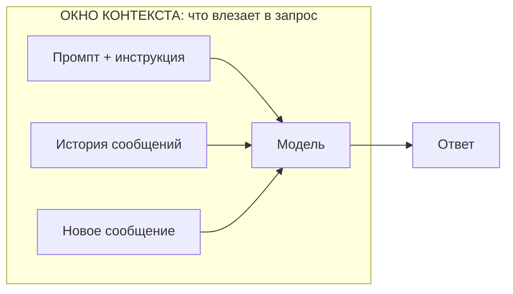

# Занятие 04. «Первый дежурный по заводу»

> Семестр 1 · Блок 1 «Мозги древних машин» · Курс 01, лекции 06–07 · ~2 ч

## Миссия занятия

> «Слушай сюда, молодежь. Смена меня вопросами завалила — „сколько воды в стирку“, „где пропуск“.
> Не резиновый я! Решили: ставим древнюю машину на дежурство, диспетчером для смены. Чтоб отвечала,
> по инструкции и с памятью. А то что ж, я один тут, что ли?!» — Прораб Василич

**Задача квеста:** разобрать, как работают приложения генерации текста и чат-приложения (системный промпт,
память диалога), проверить память на живом диалоге и через агента собрать чат-бота «дежурный по цеху»
с памятью на платформе на выбор (ВКонтакте или Telegram).

**Итог занятия:** студент объясняет, что такое системный промпт и память диалога, проверяет память модели
в живом чате и сдаёт Василичу работающего «дежурного по цеху» — чат-бота с инструкцией и памятью,
собранного через агента и проверенного в своём мессенджере.

---

## Слайды

| № | Тип | Название | Краткое содержание |
|---|-----|----------|--------------------|
| 1 | `image_group` | Комикс «Первый дежурный по заводу» | 5 панелей: смена заваливает Василича вопросами → решение поставить машину на дежурство → Алиса про «инструкцию и память» → задача собрать дежурного |
| 2 | `rich_text` | «Приложение, которое говорит» | Лекция 06: пульт с кнопками vs живой диспетчер; промпт, температура, токены (связь с занятием 2) |
| 3 | `video` | «Память диалога» | Manim ~85 с: системный промпт + история сообщений → модель → ответ → в историю; окно контекста: что не влезло — выпадает; «память = история в запросе, но окно конечно» |
| 4 | `rich_text` | «Диспетчер с блокнотом» | Лекция 07: чат-бот vs чат-приложение; память диалога; Mermaid-схема; приватность контекста |
| 5 | `rich_text` | «Инструкция для машины» | Системный промпт: роль/границы, формат, примеры, правила (по лекции 07) |
| 6 | `image` | Мем «дежурный отвечает» | Разрядка перед проверкой памяти (виртуальный консультант Марина) |
| 7 | `ai_task_chat` | «Проверь память дежурного» | Живой диалог с Василичем-5.7: студент ссылается на ранние реплики, проверяет память и роль; `checkPrompt` |
| 8 | `quiz` | «Что верно про память диалога» | 3 варианта; верно: «вся история сообщений уходит вместе с новым запросом» |
| 9 | `open_question` | «Как называется инструкция для машины?» | «системный промпт / системное сообщение / system prompt» |
| 10 | `rich_text` | «Собираем дежурного» | Выбор платформы (ВК/Telegram), что внутри бота, секреты в `.env`, экономика токенов, проверка на своём компе |
| 11 | `embed` | «opencode на своём компьютере» | Страница установки opencode; «так работать даже интереснее»; ссылка на пошаговую справку |
| 12 | `image` | Мем «настраиваем дежурного» | Разрядка перед главной практикой («чувак на задней парте») |
| 13 | `ai_code_task` | «Собери дежурного по цеху» | Главная практика-контрольная точка: агент пишет чат-бота (ВК/Telegram) с памятью, студент переносит, запускает и проверяет |
| 14 | `image_group` | Комикс-развязка «Дежурный принял пост» | 4 панели: сдача, проверка памяти Василичем, хук на занятие 5 («завтра научим по архивам искать») |

---

## Детали по слайдам

### 1. image_group — Комикс «Первый дежурный по заводу»

- **Назначение:** завязка занятия: смена заваливает Василича вопросами, он решает поставить древнюю машину
  на дежурство диспетчером; Алиса объясняет, что дежурному нужны «инструкция и память» (системный промпт
  и память диалога). См. `comic.md`, сцена 1.
- **Содержание:**
  - `title`: «Первый дежурный по заводу»
  - `images`: 5 панелей (кадры 1.1–1.5 из `comic.md`, файлы `slide-04/01.png–05.png`)
  - `show_frames`: true
  - `description`: «Цех, утро. Смена заваливает Василича вопросами: „Сколько воды в стирку?“, „Где пропуск
    на склад?“. Василич не успевает отвечать и решает: поставим древнюю машину на дежурство — диспетчером
    для смены. Алиса объясняет: чтобы дежурный отвечал по инструкции и помнил разговор, нужны системный
    промпт и память диалога. Стажёру поручают собрать „дежурного по цеху“.»

### 2. rich_text — «Приложение, которое говорит»

- **Назначение:** первое понятие от имени Алисы (п.7 шаблона), по лекции 06 курса-01: чем генеративное
  текстовое приложение отличается от обычного (консоль/UI с фиксированными командами). Одна мысль:
  «программа с кнопками против живого диспетчера». Настройки (промпт, температура, токены) — связка
  с занятием 2.
- **Содержание** (`markdown`):

```markdown
**Приложение, которое говорит.**

«Вот смотри, деточка. Обычная программа — это пульт с фиксированными кнопками: нажал „открыть склад“ —
получил склад, и ни шагу в сторону. А есть приложение, которое **говорит**: пишешь ему по-человечески —
оно понимает и отвечает. Это и есть приложение генерации текста: на входе промпт, на выходе текст.

Что на нём можно собрать? **Чат-бот** под вопросы смены, **помощника** для сводок и **ассистента по коду** —
всё одним движком, просто разными промптами.

А настраивается оно, как в занятии 2: **промпт** (что спрашиваем), **температура** (насколько ответы
разлетаются) и **токены** (сколько текста вернуть — и сколько это стоит). Помнишь, деточка: модель не ищет
правду, а подбирает правдоподобное продолжение. Поэтому ответ — черновик, проверяем.

Подробнее — [что такое приложение генерации текста](@tekstovye-prilozheniya).»
```

### 3. video — «Память диалога»

- **Назначение:** наглядно показать механизм памяти чат-приложения после рассказа Алисы: каждый запрос
  уходит к модели вместе с системным промптом и всей историей сообщений; ответ добавляется в историю —
  так модель «помнит» контекст. Технический ролик (Manim).
- **Содержание:**
  - `title`: «Память диалога»
  - `video_url`: `videos/04-pamyat-dialoga.mp4` (отрендеренный файл)
  - `video_type`: `direct`
  - `description`: «Технический ролик: смена задаёт дежурному вопрос — запрос уходит к модели вместе
    с системным промптом и историей сообщений; ответ добавляется в историю. Следующий вопрос уже несёт
    всю историю — поэтому модель „помнит“, что было в начале разговора. Но у входа есть потолок —
    **окно контекста**: когда история растёт, старые сообщения выпадают из запроса, и модель „забывает“
    начало. Вывод ролика: память диалога — это история сообщений в запросе, а окно контекста конечно.
    Программа-сценарий: `videos/manim/04-pamyat-dialoga.py` (см. `video-guide.md`).»
- **План ролика (примерный сценарий, ~85 с):** см. раздел «Видео: план ролика» ниже.

### 4. rich_text — «Диспетчер с блокнотом»

- **Назначение:** формальное объяснение ПОСЛЕ видео (п.7 шаблона), по лекции 07 курса-01: чат-бот vs
  чат-приложение, память диалога, окно контекста и его влияние на память, приватность контекста.
  Mermaid-схема — «наглядность» прямо в тексте (п.8).
- **Содержание** (`markdown`):

````markdown
«То, что я по-бабушкиному рассказала, — теперь по-взрослому. Чат-бот — это как вахтёр по бумажке: отвечает
только на то, что записано в инструкции. А чат-приложение с ИИ — как дежурный с блокнотом: слышит весь
разговор, помнит, что было в начале, и отвечает по ходу беседы.»

| Чат-бот | Чат-приложение с ИИ |
|---|---|
| Правила и узкие задачи (FAQ, трекинг посылок) | Контекст, открытые обсуждения |
| Ограничен программными функциями | Память диалога, адаптация к беседе |



Главное из ролика: модель не „помнит“ сама по себе — **вся история уходит в запрос вместе с новым
сообщением**. Но у блокнота есть толщина — **окно контекста** (занятие 2): столько токенов модель
принимает за раз. История растёт — и что не влезло, вырезается: модель „забывает“ начало. И это деньги:
больше токенов в запросе — дороже ответ. Хочешь продолжить разговор, не теряя старого, — историю
не выбрасывают, а [сжимают в резюме](@szhatie-istorii-dialoga). И помни про приватность: в контекст
попадает то, что ты написал, — секреты и чужие данные в чат не шлём (занятие 3).

Подробнее — [память диалога и контекст](@pamyat-dialoga).
````

### 5. rich_text — «Инструкция для машины»

- **Назначение:** системный промпт по лекции 07 курса-01 (фреймворк системных сообщений Microsoft):
  4 части инструкции. Хук: «устав» дежурного, который соберём на практике.
- **Содержание** (`markdown`):

```markdown
**Инструкция для машины.**

«Прежде чем разговаривать, машине выдают инструкцию — **системный промпт**. Это как устав дежурного:
кто он, как отвечает, что можно, что нельзя. У хорошей инструкции четыре части:»

1. **Роль и границы.** Кто этот ИИ и чего он не умеет: «Ты — дежурный по цеху, цифр по заводу у тебя нет».
2. **Формат ответа.** Как отвечать: коротко, по делу, на русском языке, списком.
3. **Примеры.** Пара примеров «вопрос → хороший ответ».
4. **Правила.** «Не выдумывай; не знаешь — скажи „не знаю“; секреты не спрашивай и не храни».

У Василича-5.7 своя инструкция — с ней ты работаешь с занятия 1. А у «дежурного по цеху» будет своя,
её соберём на практике.

Подробнее — [как писать системный промпт](@sistemnaya-instrukciya).
```

### 6. image — Мем «дежурный отвечает»

- **Назначение:** разрядка после блока теории и перед практикой «проверь память дежурного». Сквозная тема —
  машина отвечает «по инструкции», но проверять всё равно надо.
- **Содержание:**
  - `title`: «Мем: дежурный отвечает»
  - `image_url`: `memes/images/m02099.jpg`
  - `description`: «Виртуальный консультант Марина отвечает на любой вопрос. „Вы уверены?“ — „Уточняю для
    Вас информацию“. Наш дежурный будет построже — и проверять его будем.»
- **Подбор:** `memes/pick_meme "чат-бот дежурный отвечает на вопросы, разговор с нейросетью"` →
  кандидаты `m02099` (0.554), `m01273` (0.573). Картинку проверяет человек.

### 7. ai_task_chat — «Проверь память дежурного»

- **Назначение:** теория-практика: студент в живом диалоге с Василичем-5.7 проверяет, что модель помнит
  контекст (память диалога) и держится роли из системного промпта. Проверка через `checkPrompt`.
- **Содержание:**
  - `task` (Markdown): «Представь, что Василич-5.7 и есть „дежурный по цеху“. Поговори с ней: спроси, кто
    она и чем поможет смене. Потом проверь **память**: вернись к началу разговора — „а что ты говорила
    в самом начале про…?“ — и убедись, что она помнит контекст. Проверь и роль: попробуй увести её
    в сторону от инструкции — заметь, что системный промпт держит её в роли дежурного. Опиши: что машина
    запомнила из начала разговора и как инструкция задаёт её роль. По готовности нажми „Проверить“.»
  - `systemPrompt`: текст из `files/system-prompt-vasylich-57.md`
  - `aiName`: «Василич-5.7»
  - `model`: `openrouter/free`
  - `chainOfThought`: false
  - `showCoT`: false
  - `allowFileUpload`: false
  - `checkPrompt`: «Оцени ответ студента: понял ли он, что такое память диалога — модель помнит контекст,
    потому что история сообщений уходит в запрос, — и заметил ли, что системный промпт задаёт роль модели.
    Ответь „да“ или „нет“ с кратким пояснением.»

### 8. quiz — «Что верно про память диалога»

- **Назначение:** контрольная точка по теории (по лекции 07 курса-01). Материал — `files/quiz-pamyat-dialoga.md`.
- **Содержание:**
  - `question`: «Как чат-приложение „помнит“ предыдущие реплики?»
  - `markdown`: «Выбери один правильный вариант. Термины занятия — [в справке](@pamyat-dialoga).»
  - `options`:
    - { text: «У модели есть отдельная секретная память, куда всё складывается само», is_correct: false }
    - { text: «Вместе с новым сообщением модели отправляется вся история диалога — так она видит контекст», is_correct: true }
    - { text: «Модель ничего не помнит: каждый ответ начинается с чистого листа», is_correct: false }
  - `explanation`: «У языковой модели нет личной памяти: „память диалога“ — это вся история сообщений,
    которая каждый раз уходит в запрос вместе с новым сообщением и системным промптом. Поэтому контекст
    ограничен размером окна модели, а лишние токены стоят денег.»

### 9. open_question — «Как называется инструкция для машины?»

- **Назначение:** закрепить термин «системный промпт».
- **Содержание:**
  - `question`: «Как называется инструкция (правила роли), которую дают модели в начале диалога?»
  - `correct_answers`:
    - «системный промпт»
    - «системное сообщение»
    - «системная инструкция»
    - «system prompt»
  - `congratulations`: «Верно! Системный промпт — это инструкция роли: кто модель, как отвечает и какие
    правила соблюдает.»
  - `error_message`: «Не совсем. Вспомни, как в теории называлась инструкция, которую дают модели
    перед диалогом.»
  - `hint`: «Слово начинается на „с“… По-английски — „system prompt“.»
  - `fuzzy_match`: true
  - `similarity_threshold`: 0.8
  - `show_correct_answer`: true

### 10. rich_text — «Собираем дежурного»

- **Назначение:** подготовка к главной практике: выбор платформы (ВК/Telegram), что будет внутри бота
  (системный промпт, память, секреты в `.env`, температура), проверка на своём компьютере, экономика
  токенов. Материал — `files/zadanie-dezhurnyy-po-cekhu.md`.
- **Содержание** (`markdown`):

```markdown
**Собираем дежурного.**

«Смена не будет бегать к макбуку — дежурный должен жить там, где смена уже сидит: в мессенджере.
Выбери платформу: **ВКонтакте** или **Telegram**. Пошагово по каждой — [в справке про Telegram](@chat-bot-telegram)
и [в справке про ВК](@chat-bot-vk).»

Что будет внутри бота:
1. **Системный промпт** — инструкция «дежурного по цеху» (слайд 5).
2. **Память диалога** — история сообщений по каждому чату.
3. **Секреты** — токен бота и ключ модели только в `.env`, не в код и не в чат.
4. **Температура** — пониже: дежурный отвечает по делу, а не фантазирует.

Код пишет агент: твоя задача — словами описать, что собрать, и **проверить результат**. Проверять будешь
у себя на компьютере — поэтому сначала поставь [opencode](@opencode-ustanovka): с ним работать даже
интереснее, всё по-настоящему, на своём железе.

Экономика: каждый запрос — это токены; история растёт, а контекст конечен (занятие 2). На рутину — модель
поменьше, на сложное — побольше. Для длинных бесед старую часть истории сжимай в краткое резюме —
[сжатие истории](@szhatie-istorii-dialoga): так старый контекст сохранится, а токены будут тратиться
разумно.
```

### 11. embed — «opencode на своём компьютере»

- **Назначение:** познакомить студента с локальным ИИ-агентом: агент будет писать код, а запускать его
  можно на своём компьютере — так работать даже интереснее. Страница установки — во встроенном окне.
- **Содержание:**
  - `title`: «opencode на своём компьютере»
  - `url`: `https://opencode.ai/docs/`
  - `mode`: `direct`
  - `description`: «Открой страницу — там установка и первые шаги с opencode. Если страница не открылась
    во встроенном окне, открой ссылку в новой вкладке. Пошагово, по-русски, — [в справке](@opencode-ustanovka).
    Зачем это нужно: код для задания будет писать агент в чате, а запускать „дежурного“ надо у себя —
    с локальным opencode это удобнее и интереснее, всё по-настоящему. Сквозная тема курса: результат
    проверяешь ты, а не машина.»

### 12. image — Мем «настраиваем дежурного»

- **Назначение:** разрядка перед заключительной практикой — настройкой бота.
- **Содержание:**
  - `title`: «Мем: настраиваем дежурного»
  - `image_url`: `memes/images/m00463.jpg`
  - `description`: «„Учитель: никаких гаджетов в классе. Чувак на задней парте: настраивает дежурного“.
    Токены в `.env`, код у агента, проверяем в своём чате — погнали.»
- **Подбор:** `memes/pick_meme "писать программу, собрать бота, код, автоматизация"` → кандидаты `m00463`
  (0.322), `m02153` (0.372). Картинку проверяет человек.

### 13. ai_code_task — «Собери дежурного по цеху»

- **Назначение:** главная практика-контрольная точка занятия: студент словами описывает агенту задачу —
  собрать чат-бота «дежурный по цеху» на выбранной платформе (ВК или Telegram) с системным промптом
  и памятью диалога; агент пишет код, студент переносит его на свой компьютер, запускает и проверяет.
  Материал — `files/zadanie-dezhurnyy-po-cekhu.md`.
- **Содержание:**
  - `title`: «Собери дежурного по цеху»
  - `task` (Markdown): «Выбери платформу: **ВКонтакте** или **Telegram** (пошагово — в справках ниже)
    и опиши агенту словами: собери чат-бота **„дежурный по цеху“** — системный промпт (кто он и как
    отвечает смене), **память диалога** (история сообщений по каждому чату), секреты — токен бота и ключ
    модели — только в `.env`. **Как проверить задание:** код, который написал агент, может состоять
    из нескольких файлов (`bot.py`, `requirements.txt`, `.env.example`) — в редакторе платформы он целиком
    может не запуститься, это нормально. Собери все файлы из ответа агента у себя на компьютере, создай
    `.env` с секретами, установи зависимости, запусти бота и протестируй в своём чате: задай 2–3 вопроса
    подряд и убедись, что дежурный помнит предыдущие реплики и держится инструкции. Пошагово —
    [как проверить задание](@kak-proverit-dezhurnogo), [Telegram](@chat-bot-telegram), [ВК](@chat-bot-vk),
    [opencode](@opencode-ustanovka). По готовности нажми „Проверить“.»
  - `language`: python
  - `model`: `nvidia/nemotron-3-super-120b-a12b:free`
  - `checkPrompt`: «Оцени работу студента: собран ли чат-бот на выбранной платформе (ВК или Telegram)
    с системным промптом „дежурного по цеху“ и памятью диалога; секреты (токен бота, API-ключ модели) —
    только в `.env`; студент перенёс код на свой компьютер, запустил бота и проверил на живом диалоге
    память и роль. Ответь „да“ или „нет“ с кратким пояснением.»

### 14. image_group — Комикс-развязка «Дежурный принял пост»

- **Назначение:** развязка сюжета: стажёр запускает «дежурного», Василич проверяет память и принимает,
  Алиса хвалит; хук на занятие 5 (поиск по архивам, RAG — «память есть, знаний нет»). См. `comic.md`, сцена 2.
- **Содержание:**
  - `title`: «Дежурный принял пост»
  - `images`: 4 панели (кадры 2.1–2.4 из `comic.md`, файлы `slide-04/06.png–09.png`)
  - `show_frames`: true
  - `description`: «Стажёр запускает дежурного в чате, смена задаёт вопросы, Василич проверяет память:
    „А чего я в начале спрашивал, а?“ — дежурный помнит. Василич ворчит, но принимает дежурного. Алиса
    хвалит: „Умничка, деточка“. Василич добавляет: „Память есть, а знаний завода нет — завтра научим его
    по архивам искать“ (хук на занятие 5).»

---

## Видео: план ролика «Память диалога»

> Технический ролик на Manim (ManimCE), `videos/manim/04-pamyat-dialoga.py`. Движок — Manim, потому что
> ролик объясняет механизм (поток данных). Стиль — из `comic-style.md`: палитра
> (болотный/ржавый/пыльный/оливковый + кислотно-зелёный люминофор), чёрный контур, надписи заглавными
> рубленым шрифтом. 1920×1080, 30 fps, длительность ~85 с, фиксированный `seed`.

**Мысль ролика (одна):** модель «помнит» диалог, потому что вместе с новым сообщением в запрос уходит
вся история плюс системный промпт. Но у входа есть потолок — окно контекста: что не влезло, выпадает,
и модель «забывает» начало.

| № | Время | Кадр | Что происходит | Надписи в кадре |
|---|-------|------|----------------|-----------------|
| 1 | 0–8 с | Завязка | Пульт «дежурного» в аппаратной; смена задаёт вопрос №1 | «СМЕНА СПРАШИВАЕТ» |
| 2 | 8–22 с | Первый запрос | На схеме появляются [ИНСТРУКЦИЯ] и [ВОПРОС 1], уходят в МОДЕЛЬ; приходит [ОТВЕТ 1] | «ИНСТРУКЦИЯ — СИСТЕМНЫЙ ПРОМПТ», «ЗАПРОС 1» |
| 3 | 22–38 с | Ответ в истории | ОТВЕТ 1 добавляется в историю; вопрос №2 уходит как [ИНСТРУКЦИЯ][ВОПРОС 1][ОТВЕТ 1][ВОПРОС 2] → МОДЕЛЬ → ОТВЕТ 2 (учитывает контекст) | «ВСЯ ИСТОРИЯ УХОДИТ В ЗАПРОС» |
| 4 | 38–52 с | Память работает | Вопрос №3 ссылается на начало разговора — модель «помнит»; стопка сообщений растёт | «ПОМНИТ, ПОТОМУ ЧТО ИСТОРИЯ В ЗАПРОСЕ» |
| 5 | 52–70 с | Окно контекста | Вокруг входа появляется пунктирная рамка «ОКНО КОНТЕКСТА» с бюджетом токенов; история заполняет окно; новое сообщение не влезает — старейшее выпадает и гаснет | «≈ 2000 ТОКЕНОВ», «ВЫПАЛО: МОДЕЛЬ ЗАБЫЛА НАЧАЛО», «КОНТЕКСТ КОНЕЧЕН: СТАРЫЕ СООБЩЕНИЯ ВЫПАДАЮТ» |
| 6 | 70–88 с | Вывод | Крупная финальная надпись; снизу мелкая пометка | «ПАМЯТЬ = ИСТОРИЯ В ЗАПРОСЕ, НО ОКНО КОНЕЧНО» → «СТАРЫЕ СООБЩЕНИЯ ВЫПАДАЮТ · ТОКЕНЫ — ДЕНЬГИ» |

**Что НЕ показываем:** никаких лиц и сюжета — ролик чисто технический, про механизм потока данных.
Юмор — только через надписи («стопка сообщений», «выпало из окна»). После ролика — слайд 4
(формальное объяснение памяти и окна контекста).

## Доп. информация

Блоки дополнительной информации (вкладка «Доп. информация» на платформе; слаги — общие на курс sem1).
Наполнение блоков — по мере подготовки в `content/sem1/extra/<слаг>.md`.

| Слаг | Слайд | Ссылка на слайде |
|---|---|---|
| `tekstovye-prilozheniya` | 2 | «что такое приложение генерации текста» |
| `sistemnaya-instrukciya` | 5 | «как писать системный промпт» |
| `szhatie-istorii-dialoga` | 4, 10 | «сжатие истории диалога» |
| `pamyat-dialoga` | 4, 8 | «память диалога и контекст» |
| `opencode-ustanovka` | 10, 11, 13 | «как поставить opencode» |
| `kak-proverit-dezhurnogo` | 13 | «как проверить задание» |
| `chat-bot-telegram` | 10, 13 | «инструкция Telegram» |
| `chat-bot-vk` | 10, 13 | «инструкция ВКонтакте» |
