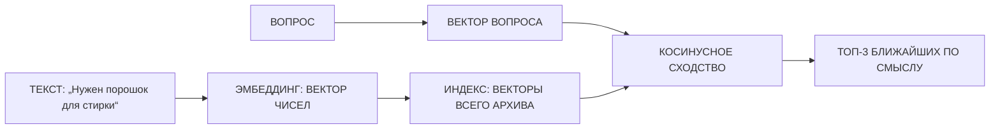
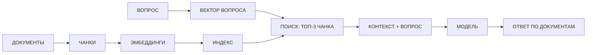

# Занятие 05. «Поиск по архивам: по смыслу, а не по словам»

> Семестр 1 · Блок 1 «Мозги древних машин» · Курс 01, лекции 08, 15 · ~2 ч

## Миссия занятия

> «Память есть, а знаний завода нет! Дежурный наш по инструкции отвечает, а спроси его про порошок или
> норму воды — молчит. В архиве же всё есть: накладные, инструкции, приказы! Научи его, молодежь,
> по архиву искать — да так, чтоб по смыслу, как завхоз думает, а не по буквам, как машинистка
> печатает.» — Прораб Василич

**Задача квеста:** разобрать, как искать по смыслу, а не по словам (эмбеддинги, векторный поиск),
что такое генерация с расширением поиска (RAG), и через агента собрать поиск по корпусу «документов
завода», который отвечает на вопрос, требующий склейки нескольких документов.

**Итог занятия:** студент объясняет, что такое эмбеддинги и семантический поиск, что такое RAG
и зачем он нужен, и сдаёт Василичу работающий поиск по архиву — RAG-скрипт, который находит в
документах завода нужные части и отвечает по ним на вопрос смены.

---

## Слайды

| № | Тип | Название | Краткое содержание |
|---|-----|----------|--------------------|
| 1 | `image_group` | Комикс «Поиск по архивам» | 5 панелей: дежурный «немой» про цифры завода → Алиса про «завхоза и машинистку» → задача: научить искать по архиву по смыслу |
| 2 | `rich_text` | «Искать по смыслу, а не по словам» | Лекция 08: семантический vs ключевой поиск («машина моей мечты»); метафора «завхоз и машинистка» |
| 3 | `video` | «Эмбеддинги: смысл в числах» | Manim ~45 с: слова → облако точек; оси; облако = индекс эмбеддингов; вектор из начала координат с числами; вывод |
| 4 | `rich_text` | «Смысл в числах» | Формально (лекция 08): эмбеддинг, вектор, косинусное сходство, индекс; Mermaid-схема |
| 5 | `video` | «Что значат числа в эмбеддинге» | Manim ~46 с: координата — «как будто» признак (упрощение); оси «научность» и «вещество» (псевдо-3D); честно: число — смесь признаков; у e5-small 384 числа |
| 6 | `rich_text` | «Что значат числа» | Координаты вектора — «как будто» признаки; на деле каждая — смесь признаков (научность + цвет + глянцевость), смысл размазан по всем числам; сходство — по всему вектору; у e5-small — 384 числа |
| 7 | `open_question` | «Как называется числовое представление смысла?» | «эмбеддинг / вектор / вложение / embedding» |
| 8 | `ai_task_chat` | «Спроси дежурного про завод» | Живой диалог с Василичем-5.7: модель отвечает «из головы», архив не знает → вывод: нужен поиск по документам; `checkPrompt` |
| 9 | `resources` | «Корпус документов завода» | Скачивание: `dokumenty-arkhiva.zip` (6 документов) + памятка по сборке поиска |
| 10 | `video` | «RAG: дежурный ищет в архиве» | Manim ~74 с: вопрос → вектор → поиск в индексе → топ-3 чанка → контекст+вопрос → модель → ответ по документам |
| 11 | `rich_text` | «RAG: ответ по документам» | Формально (лекция 15): база знаний, чанки, извлечение, расширенная генерация; зачем (актуальность, меньше выдумок, дешевле); Mermaid-flowchart |
| 12 | `rich_text` | «RAG в готовых сервисах» | Тот же RAG без кода: NotebookLM, Open Notebook — загрузил документы и спрашиваешь; ответ с указанием источника; приватность: документы уходят в облако сервиса |
| 13 | `quiz` | «Что даёт RAG» | 3 варианта; верно: «модель отвечает по проверяемым документам из базы знаний — меньше выдумок» |
| 14 | `image` | Мем «поиск по смыслу» | Разрядка перед практикой (человек проверяет картинку) |
| 15 | `rich_text` | «Собираем поиск по архиву» | Что соберёт агент: чанки → эмбеддинги → индекс → RAG-ответ; сравнение с поиском по словам; секреты в `.env`; экономика токенов |
| 16 | `open_question` | «Собери поиск и проверь ответ» | Контрольная точка: студент собирает RAG через агента, запускает локально, задаёт контрольный вопрос; ответ авто-проверяется по эталону (склейка четырёх документов) |
| 17 | `image_group` | Комикс-развязка «Дежурный раскурил архив» | 4 панели: дежурный отвечает по документам, Василич принимает, хук на занятие 6 («этикетки рисовать умеет? кнопку жать?») |

---

## Детали по слайдам

### 1. image_group — Комикс «Поиск по архивам»

- **Назначение:** завязка занятия: продолжение хука занятия 4 — у дежурного есть память, но «знаний завода
  нет»; Алиса объясняет разницу между поиском «как завхоз» и «как машинистка»; стажёру поручают научить
  дежурного искать по архиву по смыслу. См. `comic.md`, сцена 1.
- **Содержание:**
  - `title`: «Поиск по архивам»
  - `images`: 5 панелей (кадры 1.1–1.5 из `comic.md`, файлы `slide-05/01.png–05.png`)
  - `show_frames`: true
  - `description`: «Аппаратная. Дежурный по цеху (из занятия 4) на вопросы смены отвечает бойко, а спросишь
    его про цифры завода — мнётся: „в архиве не смотрел“. Василич недоволен: „Память есть, а знаний нет!“
    Алиса объясняет: искать в архиве надо „как завхоз — по смыслу“, а не „как машинистка — по буквам“.
    Стажёру поручают научить дежурного искать по архиву.»
- **Хук:** сцена 2 развязки (слайд 17) подводит к занятию 6 («Этикетки и кнопки»).

### 2. rich_text — «Искать по смыслу, а не по словам»

- **Назначение:** первое понятие от имени Алисы (п.7 шаблона), по лекции 08 курса-01: чем семантический
  поиск отличается от поиска по ключевым словам. Одна мысль: «искать надо по смыслу, а не по буквам».
  Пример из лекции («машина моей мечты») переведён на заводскую метафору «завхоз и машинистка».
- **Содержание** (`markdown`):

```markdown
**Искать по смыслу, а не по словам.**

«Вот смотри, деточка. Завхоз в кладовке ищет не по буквам на банке, а по тому, что ему нужно: кетчуп
найдёт и на банке с надписью „томатный соус“. А машинистка ищет буквально: набрала „машина моей
мечты“ — и принесла тебе сказки про мечты. Завхоз ищет **по смыслу**, машинистка — **по словам**.

У нас на заводе то же: в архиве тысячи накладных и инструкций. Искать по слову в них — это
по-машинисткиному: слово написано иначе — и всё, документ не найден. А по смыслу — по-завхозному:
„нужен порошок“ найдёт и накладную про „моющее средство“. Так и дежурного научим.

Как машине передать смысл, чтоб она его понимала? Превратить текст в числа. Как — дальше.

Подробнее — [семантический поиск и эмбеддинги](@embeddings-i-semanticheskiy-poisk).»
```

### 3. video — «Эмбеддинги: смысл в числах»

- **Назначение:** наглядно показать механизм эмбеддингов после рассказа Алисы: слова текста становятся
  точками, близкие по смыслу (используемые вместе) — рядом; у точек появляются координаты; каждая точка —
  вектор, а всё облако слов — индекс эмбеддингов; у слова «ПОРОШОК» рисуется вектор из начала координат
  с числами. Технический ролик (Manim).
- **Содержание:**
  - `title`: «Эмбеддинги: смысл в числах»
  - `video_url`: `videos/05-embeddings.mp4` (отрендеренный файл)
  - `video_type`: `direct`
  - `description`: «Технический ролик: слова текста (ПОРОШОК, МОЮЩЕЕ СРЕДСТВО, СТИРАЛЬНАЯ МАШИНА,
    НАКЛАДНАЯ, СКЛАД, ПРИКАЗ) превращаются в точки — те, что используют вместе, ложатся рядом
    (облако слов). Появляются оси — у точек есть координаты. Каждая точка — вектор, а всё облако —
    индекс эмбеддингов. Из начала координат рисуется вектор к слову „ПОРОШОК“ и подписываются числа
    `[0.41, -0.87, 0.12, …]`. Вывод: близкий смысл — близкие векторы. Программа-сценарий:
    `videos/manim/05-embeddings.py` (см. `video-guide.md`).»
- **План ролика (примерный сценарий, ~45 с):** см. раздел «Видео: план ролика» ниже.

### 4. rich_text — «Смысл в числах»

- **Назначение:** формальное объяснение ПОСЛЕ видео (п.7 шаблона), по лекции 08 курса-01: эмбеддинг,
  вектор, косинусное сходство, индекс, топ-k. Mermaid-схема — «наглядность» прямо в тексте (п.8).
- **Содержание** (`markdown`):

````markdown
«Теперь по-взрослому, без сказок. **Эмбеддинг** — это числовое представление текста: вектор из сотен
чисел, который передаёт смысл. Мысль, сказанная другими словами, получает почти тот же вектор:
„порошок“ и „моющее средство“ — близко. Близкие по смыслу тексты — близкие векторы.

Сходство меряют **косинусным сходством**: чем меньше угол между векторами, тем ближе тексты по смыслу.
Хранилище всех векторов архива — **индекс эмбеддингов**. По запросу машина превращает его в вектор
и вытаскивает самые близкие из индекса.



Искать по архиву — значит: превратить документы в векторы (индекс), а по запросу находить векторы
поближе. Это и есть **семантический поиск**.»
````

### 5. video — «Что значат числа в эмбеддинге»

- **Назначение:** наглядно показать (псевдо-3D) перед формальным объяснением слайда 6, что означают
  числа эмбеддинга: координата — «как будто» признак (упрощение), у научных слов и у «веществ» значения
  по числу близкие, а что именно значит число — не знаем (смесь признаков), поэтому сходство считают
  по всему вектору. Технический ролик (Manim).
- **Содержание:**
  - `title`: «Что значат числа в эмбеддинге»
  - `video_url`: `videos/05-chisla.mp4` (отрендеренный файл)
  - `video_type`: `direct`
  - `description`: «Технический ролик: первое число вектора подсвечено — „каждая координата как будто
    признак“ (упрощение). Псевдо-3D „угол пространства“: по числу №1 научные слова (ФОРМУЛА, ТЕОРЕМА,
    РАСЧЁТ) лежат близко, ВАЛЕНКИ — далеко; по числу №2 близко вещества (ПОРОШОК, СОДА, КИСЛОТА),
    далеко — НАКЛАДНАЯ. Честный вывод: что точно значит число — не знаем, это смесь признаков, поэтому
    сходство считают по всему вектору. У слов из практики 384 числа. Программа-сценарий:
    `videos/manim/05-chisla.py` (см. `video-guide.md`).»
- **План ролика (примерный сценарий, ~46 с):** см. раздел «Видео: план ролика» ниже.

### 6. rich_text — «Что значат числа»

- **Назначение:** формальное объяснение ПОСЛЕ видео (слайд 5): координаты эмбеддинга — «как будто»
  признаки (упрощение), на деле каждая координата — смесь признаков, и точно сказать, что она значит,
  нельзя; смысл размазан по всем числам сразу, поэтому сходство считают по всему вектору. Одна мысль:
  числа эмбеддинга — это не подписанные ярлыки, а «распылённые» по всем координатам оттенки смысла.
- **Содержание** (`markdown`):

```markdown
**Что значат числа.**

«Много характеристик. У слова десятки смысловых характеристик: у „кирпича“ есть материал, цвет, вес,
прочность; у „порошка“ — свойство (чистит), сыпучесть, цвет. Одно слово — это не один признак,
а целый набор.

Числа — это смеси. Координаты эмбеддинга — не ярлыки „по одному на признак“. Каждая часто — смесь
понятных человеку признаков: чуть научности, чуть цвета, чуть глянцевости. Точно разложить координату
на составляющие нельзя — признаков много, и они перемешаны. Смысл **размазан по всем числам сразу**.

Поэтому сходство считают по **всему вектору** (косинусный угол), а не по одной координате. У слов
из практики таких чисел — **384**. Подробнее — [что значат числа и смысловая арифметика](@embeddings-i-semanticheskiy-poisk).»
```

### 7. open_question — «Как называется числовое представление смысла?»

- **Назначение:** закрепить термин «эмбеддинг».
- **Содержание:**
  - `question`: «Как называется числовое представление смысла текста (вектор чисел, в который машина
    превращает текст)?»
  - `correct_answers`:
    - «эмбеддинг»
    - «вложение»
    - «embedding»
  - `congratulations`: «Верно! Эмбеддинг — это числовое представление смысла текста: вектор чисел,
    в котором близкие по смыслу тексты лежат рядом.»
  - `error_message`: «Не совсем. Вспомни слово из теории: как назывался вектор чисел, в который машина
    превращает текст.»
  - `hint`: «Слово похоже на „embedding“ — по-английски „встраивание, вложение“.»
  - `fuzzy_match`: true
  - `similarity_threshold`: 0.8
  - `show_correct_answer`: true

### 8. ai_task_chat — «Спроси дежурного про завод»

- **Назначение:** теория-практика: студент в живом диалоге с Василичем-5.7 проверяет, что модель «из
  головы» не знает реальных данных завода (архива), — мотивация для RAG. Проверка через `checkPrompt`.
- **Содержание:**
  - `task` (Markdown): «Дежурный по цеху (занятие 4) получил память, но о заводе знает только то,
    что у него „в голове“. Поговори с ним: спроси что-нибудь с реальными цифрами завода — например,
    „Сколько порошка заказываем на месяц?“ или „Какая норма воды на одну стирку?“ — и посмотри, откуда
    он берёт ответ: из инструкции, из головы или из архива. Потом спроси, умеет ли он смотреть в архив
    документов завода. Опиши: знает ли дежурный реальные цифры завода и почему без поиска по архиву
    ему не обойтись. По готовности нажми „Проверить“.»
  - `systemPrompt`: текст из `files/system-prompt-vasylich-57.md`
  - `aiName`: «Василич-5.7»
  - `model`: `openrouter/free`
  - `chainOfThought`: false
  - `showCoT`: false
  - `allowFileUpload`: false
  - `checkPrompt`: «Оцени ответ студента: понял ли он, что модель отвечает „из головы“ и не имеет доступа
    к данным завода (архиву), поэтому для точных ответов на вопросы с цифрами нужен поиск по документам
    (RAG). Ответь „да“ или „нет“ с кратким пояснением.»

### 9. resources — «Корпус документов завода»

- **Назначение:** раздать студенту материалы практики: корпус «документов завода» (архив для поиска)
  и памятку по сборке поиска. Данные нужны для практики (слайд 16).
- **Содержание:**
  - `title`: «Корпус документов завода»
  - `description` (Markdown): «Это архив завода — то, по чему будет искать дежурный. Скачай оба файла.
    `dokumenty-arkhiva.zip` распакуй в папку `dokumenty-arkhiva` — там шесть документов: приказ о закупке
    порошка, накладная, инструкция по цеху №7, нормы расхода воды, график сменности, остатки на складе.
    Памятка — подсказка, как собирать поиск и проверять ответ. Всё понадобится на слайде 16.»
  - `files`:
    - { name: `dokumenty-arkhiva.zip`, description: «Архив документов завода: 6 файлов для поиска» }
    - { name: `pamyatka-poisk-po-arhivu.md`, description: «Памятка: как собрать поиск по архиву и проверить ответ» }

### 10. video — «RAG: дежурный ищет в архиве»

- **Назначение:** наглядно показать механизм RAG после того, как студент увидел проблему «модель не знает
  архив»: вопрос → вектор → поиск в индексе → топ-3 чанка → контекст + вопрос → модель → ответ по
  документам. Технический ролик (Manim).
- **Содержание:**
  - `title`: «RAG: дежурный ищет в архиве»
  - `video_url`: `videos/05-rag.mp4` (отрендеренный файл)
  - `video_type`: `direct`
  - `description`: «Технический ролик: вопрос смены про порошок становится вектором, машина ищет в индексе
    архива три самых близких кусочка-чанка и даёт их модели вместе с вопросом — модель отвечает
    по документам. Для сравнения показано, как тот же вопрос без архива ушёл бы „из головы“ и мог бы
    выдумать цифру. Вывод ролика: RAG = вопрос + документы из архива → ответ по источникам, который можно
    проверить. Программа-сценарий: `videos/manim/05-rag.py` (см. `video-guide.md`).»
- **План ролика (примерный сценарий, ~74 с):** см. раздел «Видео: план ролика» ниже.

### 11. rich_text — «RAG: ответ по документам»

- **Назначение:** формальное объяснение ПОСЛЕ видео (п.7 шаблона), по лекции 15 курса-01: RAG —
  база знаний, чанки, извлечение, расширенная генерация; зачем (актуальность, меньше выдумок, дешевле
  переучивания). Mermaid-flowchart — «наглядность» прямо в тексте (п.8).
- **Содержание** (`markdown`):

````markdown
«То, что я по-бабушкиному показала, — теперь по-взрослому. Модель учили на текстах из прошлого,
а данные завода она не видела. Чтобы она отвечала по нашим документам, придумали **RAG — генерацию
с расширением поиска**. Четыре шага:

1. **База знаний.** Документы архива режут на кусочки-**чанки** и превращают каждый в вектор (слайд 4).
2. **Вопрос.** Стажёр задаёт вопрос — машина превращает его в вектор.
3. **Извлечение.** Из индекса берут самые близкие к вопросу чанки — топ-3.
4. **Расширенная генерация.** Модели дают вопрос вместе с этими чанками — и она отвечает по ним.



Зачем? Ответы актуальны — по свежим документам, а не по воспоминаниям; меньше выдумок — ответ можно
сверить с документом; и это дешевле, чем переучивать модель.

Подробнее — [RAG и векторные базы](@rag-i-vektornye-bazy).»
````

### 12. rich_text — «RAG в готовых сервисах»

- **Назначение:** показать, что RAG живёт не только в нашем скрипте: то же самое «под капотом» у готовых
  сервисов по документам (NotebookLM, Open Notebook). Сквозные темы: польза (работает без кода, для своих
  рабочих документов), приватность (документы уходят в облако сервиса) и проверка результата (ответ
  приходит с источником — сверяй).
- **Содержание** (`markdown`):

```markdown
**RAG в готовых сервисах.**

«То же самое бывает и без единой строчки кода, деточка. В такие сервисы, как NotebookLM или Open Notebook,
загружают свои документы — статьи, договоры, накладные — и спрашивают. Сервис отвечает по загруженному,
с указанием, из какого документа взял ответ. Внутри — тот же RAG, что мы собираем руками: документы режут
на чанки, превращают в векторы и ищут по смыслу.

Польза: свои рабочие бумаги не надо программировать — загрузил и спрашиваешь. Но помни: документы уходят
в облако сервиса, поэтому секреты туда не кладут. А наши локальные эмбеддинги вообще не выходят
из аппаратной.

Подробнее — [готовые сервисы по документам](@servisy-rag-po-dokumentam).»
```

### 13. quiz — «Что даёт RAG»

- **Назначение:** контрольная точка по теории RAG (по лекции 15 курса-01). Материал — `files/quiz-rag.md`.
- **Содержание:**
  - `question`: «Что даёт генерация с расширением поиска (RAG)?»
  - `markdown`: «Выбери один правильный вариант. Термины занятия — [в справке](@rag-i-vektornye-bazy).»
  - `options`:
    - { text: «Модель навсегда запоминает все документы завода и знает их и без поиска», is_correct: false }
    - { text: «Модель отвечает по проверяемым документам из базы знаний — меньше выдумок, и ответ можно сверить с источником», is_correct: true }
    - { text: «RAG заменяет модель на новую, которая уже выучила данные завода», is_correct: false }
  - `explanation`: «RAG не даёт модели памяти и не учит её заново: на каждый вопрос машина ищет в базе
    знаний самые близкие документы и отвечает по ним. Поэтому ответ актуален, его можно проверить
    по источнику, а галлюцинаций меньше. Переучивать модель (fine-tuning) при этом не нужно — дешевле.»

### 14. image — Мем «поиск по смыслу»

- **Назначение:** разрядка после блока теории и перед практикой. Сквозная тема — машина ищет и отвечает,
  но проверяет результат человек.
- **Содержание:**
  - `title`: «Мем: поиск по смыслу»
  - `image_url`: `memes/images/m02144.jpg`
  - `description`: «„О, да, у меня есть про это мем“ — человек уверенно ищет в библиотеке нужную книгу.
    Мы-то с тобой искать по смыслу уже умеем — соберём поиск по архиву, и проверять будем сами.»
- **Подбор:** `memes/pick_meme "поиск по смыслу, найти нужный документ, библиотека архив"` →
  кандидаты `m02144` (0.433), `m02274` (0.469). Картинку проверяет человек.

### 15. rich_text — «Собираем поиск по архиву»

- **Назначение:** подготовка к главной практике: что соберёт агент (чанки → эмбеддинги → индекс → ответ
  по контексту), сравнение с поиском по словам, секреты в `.env`, экономика токенов, проверка ответа
  по документу. Материал — `files/zadanie-poisk-po-arhivu.md`.
- **Содержание** (`markdown`):

```markdown
**Собираем поиск по архиву.**

«Вот что соберёт агент по твоим словам: возьмёт документы из `dokumenty-arkhiva`, разрежет каждый на
части-**чанки**, превратит каждую в **эмбеддинг** и сложит в индекс. По вопросу он превратит вопрос
в вектор, найдёт три самых близких чанка, добавит их к вопросу — и модель ответит **по документам**
(это и есть RAG). Для сравнения соберём наивный поиск по словам — и увидим, в чём разница.

Где это работает: у тебя на компьютере. Эмбеддинги считает бесплатная локальная модель
(без интернета и без ключей), а ответ по контексту даёт бесплатная модель OpenRouter. Секреты —
только в `.env`, не в код и не в чат.

Экономика: в запрос уходят несколько чанков, а не весь архив — токены тратятся разумно. И главное:
ответ проверяем по исходному документу, как заведено на заводе.

Поставь [opencode](@opencode-ustanovka) и погнали.
```

### 16. open_question — «Собери поиск и проверь ответ»

- **Назначение:** главная практика-контрольная точка занятия: студент словами описывает агенту задачу —
  собрать RAG-поиск по корпусу «документов завода», запускает его на своём компьютере и отвечает на
  контрольный вопрос; ответ проверяется **автоматически** по эталону (`correct_answers`). Данные корпуса
  генерируем мы, поэтому вопрос и ответ известны заранее. Вопрос намеренно сложный: ответ не лежит
  в одном файле, а собирается из четырёх документов с арифметикой. Материал —
  `files/zadanie-poisk-po-arhivu.md`.
- **Содержание:**
  - `title`: «Собери поиск и проверь ответ»
  - `markdown` (задание): «Собери поиск по архиву — RAG — и проверь его на контрольном вопросе.
    1. Скачай корпус документов завода со слайда 9 (`dokumenty-arkhiva.zip`) и распакуй его
      в папку `dokumenty-arkhiva`.
    2. Опиши агенту словами: разрежь каждый документ на части-**чанки**, преврати их в **эмбеддинги**
      бесплатной локальной моделью `sentence-transformers` (`intfloat/multilingual-e5-small`), сложи
      в индекс; по вопросу находи три самых близких чанка и давай их бесплатной модели OpenRouter
      (`nvidia/nemotron-3-super-120b-a12b:free`; что значат `120b` и `a12b` — [доп. инфо](@razmer-modelej))
      вместе с вопросом, чтобы она отвечала по документам. Сделай также **наивный поиск по ключевым
      словам** для сравнения. Ключ OpenRouter — только в `.env`, не в код.
    3. Собери файлы агента у себя на компьютере, создай `.env`, установи зависимости и запусти скрипт
      (пошагово — [как проверить задание](@kak-proverit-rag-otvet), [opencode](@opencode-ustanovka)).
    4. Задай поиску контрольный вопрос (ниже). Сверь ответ с исходными документами и сравни с наивным
      поиском по словам: найдёт ли он все нужные документы?
    5. Впиши ответ, который дал поиск по документам.»
  - `question`: «Сколько мешков порошка останется на складе в конце месяца, если цех №7 стирает
    по 40 комплектов каждый день, пополнение идёт по приказу №14, а на начало месяца на складе
    было 4 мешка?»
  - `correct_answers`:
    - «2»
    - «2 мешка»
    - «2 мешка порошка»
    - «останется 2»
    - «останется 2 мешка»
    - «два»
    - «два мешка»
  - `congratulations`: «Верно! Нужно 12 мешков (40 комплектов × 30 рабочих дней ÷ 100), а есть
    4 на складе + 10 по приказу №14 — останется 2. Ответ собран из четырёх документов, и ты сверил
    его с исходниками — как заведено на заводе.»
  - `error_message`: «Не сошлось. Сверь с документами архива: расход — в инструкции цеха №7, рабочие
    дни — в графике, поставку — в приказе №14, остатки — на складе.»
  - `hint`: «Инструкция цеха №7: 1 мешок на 100 комплектов. В месяце 30 рабочих дней. На начало месяца
    на складе 4 мешка, по приказу №14 приходит 10. Сколько уйдёт и сколько останется?»
  - `fuzzy_match`: true
  - `similarity_threshold`: 0.8
  - `show_correct_answer`: true

### 17. image_group — Комикс-развязка «Дежурный раскурил архив»

- **Назначение:** развязка сюжета: дежурный теперь отвечает по документам архива, Василич проверяет
  ответ по бумаге и принимает работу; хук на занятие 6 (генерация изображений и вызов функций —
  «этикетки рисовать умеет? кнопку жать?»). См. `comic.md`, сцена 2.
- **Содержание:**
  - `title`: «Дежурный раскурил архив»
  - `images`: 4 панели (кадры 2.1–2.4 из `comic.md`, файлы `slide-05/06.png–09.png`)
  - `show_frames`: true
  - `description`: «Стажёр запускает поиск по архиву, смена задаёт дежурному контрольный вопрос про
    порошок, дежурный отвечает цифрами („останется 2 мешка“) и называет документы-источники. Василич
    сверяет с бумагой: „Всё сходится!“ — и принимает. Алиса хвалит: „Умничка, деточка“. Василич
    задумывается: „Вот бы он ещё этикетки рисовал да кнопку на складе жал…“ (хук на занятие 6).»

---

## Видео: план ролика «Эмбеддинги: смысл в числах»

> Технический ролик на Manim (ManimCE), `videos/manim/05-embeddings.py`. Движок — Manim, потому что ролик
> объясняет механизм (слова → точки, координаты, вектор). Стиль — из `comic-style.md`: палитра
> (болотный/ржавый/пыльный/оливковый + кислотно-зелёный люминофор), чёрный контур, надписи заглавными
> рубленым шрифтом. 1920×1080, 30 fps, длительность ~45 с, фиксированный `seed`.

**Мысль ролика (одна):** слова текста становятся точками, близкие по смыслу (используемые вместе) —
рядом; после появления осей у каждой точки есть координаты — она вектор, а всё облако слов — индекс
эмбеддингов; слово «ПОРОШОК» — вектор из начала координат с числами.

| № | Время | Кадр | Что происходит | Надписи в кадре |
|---|-------|------|----------------|-----------------|
| 1 | 0–12 с | Облако слов | Слова (ПОРОШОК, МОЮЩЕЕ СРЕДСТВО, СТИРАЛЬНАЯ МАШИНА / НАКЛАДНАЯ, СКЛАД, ПРИКАЗ) появляются вразброс и превращаются в точки; используемые вместе ложатся рядом — два «облака» | «СЛОВА → ТОЧКИ», «БЛИЗКИЕ ПО СМЫСЛУ — РЯДОМ (ИХ ИСПОЛЬЗУЮТ ВМЕСТЕ)» |
| 2 | 12–19 с | Оси | Из начала координат появляются оси — у точек теперь есть координаты | «ТЕПЕРЬ У ТОЧЕК ЕСТЬ КООРДИНАТЫ» |
| 3 | 19–27 с | Облако = индекс | Все слова уже стали векторами; облако точек — индекс эмбеддингов | «КАЖДАЯ ТОЧКА — ВЕКТОР», «ВСЕ СЛОВА СТАЛИ ВЕКТОРАМИ», «ОБЛАКО СЛОВ = ИНДЕКС ЭМБЕДДИНГОВ» |
| 4 | 27–35 с | Вектор + числа | Из начала координат рисуется вектор к точке «ПОРОШОК»; рядом подписываются числа `[0.41, -0.87, 0.12, …]` | «СЛОВО = ВЕКТОР ЧИСЕЛ (ЭМБЕДДИНГ)» |
| 5 | 35–44 с | Вывод | Крупная финальная надпись | «БЛИЗКИЙ СМЫСЛ — БЛИЗКИЕ ВЕКТОРЫ» |

**Что НЕ показываем:** никаких лиц и сюжета — ролик чисто технический. Юмор — только через надписи.
Тема «запрос → топ-3» здесь не нужна: она раскрывается текстом на слайде 4 и в RAG-ролике (слайд 10).
После ролика — слайд 4 (формальное объяснение эмбеддингов), затем ролик «Что значат числа в эмбеддинге»
(слайд 5), после которого — слайд 6 (формальное объяснение «Что значат числа»).

## Видео: план ролика «Что значат числа в эмбеддинге»

> Технический ролик на Manim (ManimCE), `videos/manim/05-chisla.py`. Движок — Manim, потому что ролик
> объясняет механизм (устройство эмбеддинга). Стиль и параметры — как в первом ролике занятия.
> Длительность ~46 с, фиксированный `seed`. Псевдо-3D «угол пространства» — наглядная условность
> (реальных измерений сотни), что честно проговаривается в кадре 4.

**Мысль ролика (одна):** координата вектора — «как будто» признак (упрощение), а на деле каждая
координата — смесь признаков; что именно значит число, мы не знаем, поэтому сходство считают по всему
вектору.

| № | Время | Кадр | Что происходит | Надписи в кадре |
|---|-------|------|----------------|-----------------|
| 1 | 0–11 с | Координата-признак | «ПОРОШОК» превращается в вектор `[0.41, -0.87, 0.12, …]`; первое число `0.41` подсвечено рамкой и меткой «ЧИСЛО №1», остальные — тусклые | «КАЖДОЕ ЧИСЛО — КООРДИНАТА-ПРИЗНАК (УПРОЩЕНИЕ)» |
| 2 | 11–20 с | Ось «научность» (псевдо-3D) | Псевдо-3D «угол пространства»: ось «ЧИСЛО №1»; «ФОРМУЛА», «ТЕОРЕМА», «РАСЧЁТ» близко у высокого значения, «ВАЛЕНКИ» — далеко | «У ПОХОЖИХ ПО СМЫСЛУ — ПОХОЖИЕ ЧИСЛА» |
| 3 | 20–29 с | Ось «вещество» (псевдо-3D) | Та же «коробка», подсвечена ось «ЧИСЛО №2»; «ПОРОШОК», «СОДА», «КИСЛОТА» близко, «НАКЛАДНАЯ» — далеко | «ДРУГОЕ ЧИСЛО — ДРУГОЙ ПРИЗНАК» |
| 4 | 29–38 с | Честный кадр | Полный экран: что именно значит число — не знаем, это смесь признаков | «ЧТО ТОЧНО ЗНАЧИТ ЧИСЛО — МЫ НЕ ЗНАЕМ», «ЭТО СМЕСЬ: НАУЧНОСТЬ · ЦВЕТ · ГЛЯНЦЕВОСТЬ», «СМЫСЛ РАЗМАЗАН ПО ВСЕМ ЧИСЛАМ» |
| 5 | 38–46 с | Много чисел | Длинный вектор `[… × 384]`, надпись про многомерное пространство | «У СЛОВА СОТНИ ЧИСЕЛ — ТОЧКА В МНОГОМЕРНОМ ПРОСТРАНСТВЕ (384)» |

**Что НЕ показываем:** никаких лиц и сюжета — ролик чисто технический. Оси «научность»/«вещество» —
это именно наглядное упрощение, перекрытое честным кадром 4 (координата — смесь признаков). После
ролика — слайд 7 (открытый вопрос на термин «эмбеддинг»).

## Видео: план ролика «RAG: дежурный ищет в архиве»

> Технический ролик на Manim (ManimCE), `videos/manim/05-rag.py`. Движок — Manim, потому что ролик
> объясняет механизм (поток данных RAG). Стиль и параметры — как в первом ролике занятия. Длительность
> ~74 с, фиксированный `seed`.

**Мысль ролика (одна):** чтобы модель отвечала по документам, вопрос вместе с найденными в архиве
чанками отдают модели: RAG = вопрос + документы из архива → ответ по источникам, который можно проверить.

| № | Время | Кадр | Что происходит | Надписи в кадре |
|---|-------|------|----------------|-----------------|
| 1 | 0–8 с | Завязка | Дежурный на пульте; смена спрашивает «СКОЛЬКО ПОРОШКА ЗАКАЗАТЬ?»; дежурный мнётся — цифр не знает | «СМЕНА СПРАШИВАЕТ · ДЕЖУРНЫЙ БЕЗ АРХИВА» |
| 2 | 8–20 с | Вопрос → поиск | Вопрос превращается в вектор и ищет в индексе; рамка «ИНДЕКС АРХИВА» | «ВОПРОС → ЭМБЕДДИНГ → ПОИСК В ИНДЕКСЕ» |
| 3 | 20–35 с | Топ-3 чанка | Из индекса поднимаются три блока: [ЧАНК 1: НАКЛАДНАЯ][ЧАНК 2: ИНСТРУКЦИЯ][ЧАНК 3: ПРИКАЗ] | «ТОП-3 САМЫХ БЛИЗКИХ ЧАНКА» |
| 4 | 35–52 с | Расширенная генерация | [КОНТЕКСТ + ВОПРОС] уходят в МОДЕЛЬ; приходит ответ с цифрой и ссылкой на документ | «RAG: ВОПРОС + ДОКУМЕНТЫ → ОТВЕТ ПО ИСТОЧНИКАМ», «НЕ ВЫДУМЫВАЕТ — ЧИТАЕТ АРХИВ» |
| 5 | 52–64 с | Без архива | Та же МОДЕЛЬ без документов отвечает «из головы» — цифра плывёт, красная галочка «ПРОВЕРЯЙ» | «БЕЗ АРХИВА — ИЗ ГОЛОВЫ: МОЖЕТ ПРИВРАТЬ» |
| 6 | 64–74 с | Вывод | Крупная финальная надпись | «RAG = ВОПРОС + ДОКУМЕНТЫ ИЗ АРХИВА → ОТВЕТ ПО ИСТОЧНИКАМ» |

**Что НЕ показываем:** развёрнутого сюжета с лицами — ролик технический, про поток данных. Сюжетная
рамка только в завязке (дежурный на пульте). После ролика — слайд 11 (формальное объяснение RAG).

---

## Доп. информация

Блоки дополнительной информации (вкладка «Доп. информация» на платформе; слаги — общие на курс sem1).
Наполнение блоков — по мере подготовки в `content/sem1/extra/<слаг>.md`.

| Слаг | Слайд | Ссылка на слайде |
|---|---|---|
| `embeddings-i-semanticheskiy-poisk` | 2, 6 | «семантический поиск и эмбеддинги» / «что значат числа и смысловая арифметика» |
| `rag-i-vektornye-bazy` | 11, 13 | «RAG и векторные базы» |
| `servisy-rag-po-dokumentam` | 12 | «готовые сервисы по документам» |
| `kak-proverit-rag-otvet` | 16 | «как проверить задание» |
| `opencode-ustanovka` | 15, 16 | «как поставить opencode» |
| `razmer-modelej` | 16 | «что значат 120b и a12b в названии модели» |
