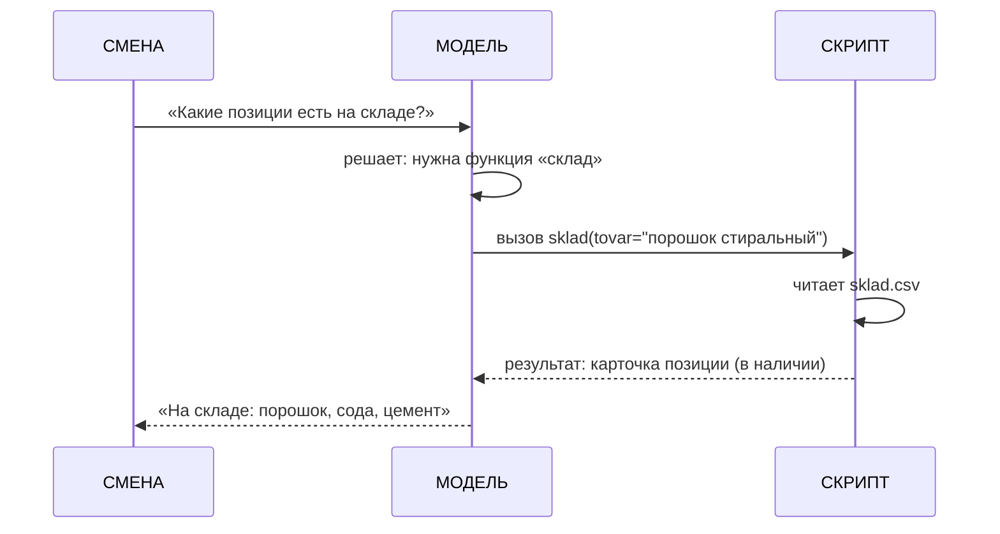

# Занятие 06. «Этикетки и кнопки»

> Семестр 1 · Блок 1 «Мозги древних машин» · Курс 01, лекции 09, 11 · ~2 ч

## Миссия занятия

> «Ты глянь, молодежь: мешки стоят рядышком — порошок, сода, цемент. Одинаковые, твою ж изоленту!
> Вчера бригада цемент в стиралку засыпала! Продукция в магазины идёт — а на ней ни названия, ни
> картинки. Сделай этикетки, чтоб люди видели, где порошок, а где цемент. И склад позвать научи —
> живого списка позиций ни у кого нет!» — Прораб Василич

**Задача квеста:** разобрать, как модели генерируют изображения по описанию (промпт, размер, температура,
мета-промты) и что такое вызов функций (function calling) — как ИИ получает «руки»; сгенерировать
этикетки для позиций завода (порошок, сода, цемент), чтобы люди отличали мешки и продукция шла
в магазины с названиями, и через агента собрать скрипт, который через function calling узнаёт
реальные позиции со склада и генерирует по ним этикетки (задание можно сделать на платформе
или в локальном opencode).

**Итог занятия:** студент объясняет, как из текста получается картинка и что такое вызов функций;
сдаёт Василичу этикетку «ПОРОШОК-МАКС» (обязательная контрольная точка; «СОДА-ЭКСТРА» и «ЦЕМЕНТ-84» —
по желанию) и задачу «Кнопка „склад“ и этикетки» — скрипт, который через function calling возвращает
реальные позиции из `sklad.csv` и генерирует этикетки для позиций в наличии. Задание выполняется
на платформе или в локальном opencode — как удобнее.

---

## Слайды

| № | Тип | Название | Краткое содержание |
|---|-----|----------|--------------------|
| 1 | `image_group` | Комикс «Этикетки и кнопки» | 5 панелей: мешки без подписей, цемент в стиралку → Алиса про «машина рисует» и «кнопку-функцию» → склад молчит → задача: позиции, этикетки и кнопки |
| 2 | `rich_text` | «Машина, которая рисует» | Лекция 09: генерация изображений по тексту; метафора «печатник на заказ»; одинаковый промпт — похожие, но не одинаковые картинки |
| 3 | `video` | «Из текста — картинка» | Manim ~50 с: промпт → модель изображений → картинка (шум → картинка); повторный запуск — другая картинка; границы (мета-промт) |
| 4 | `rich_text` | «Картинка из текста» | Формально (лекция 09): промпт, температура, размер, мета-промты (границы) |
| 5 | `open_question` | «Как называются границы для картинок?» | «мета-промт / метапромт / meta prompt» |
| 6 | `ai_image_task` | «Этикетки для позиций завода» | Практика-контрольная точка: сгенерировать этикетку «ПОРОШОК-МАКС» (обязательно, с AI-проверкой); «СОДА-ЭКСТРА» и «ЦЕМЕНТ-84» — по желанию |
| 7 | `rich_text` | «Кнопка для машины» | Лекция 11: модель «из головы» не знает живых данных; вызов функций — «руки»; метафора «дежурный с кнопкой» |
| 8 | `video` | «Вызов функций: руки для модели» | Manim ~76 с: вопрос о позициях → модель решает вызвать «склад» → программа выполняет → ответ модели → без функции — «из головы» |
| 9 | `rich_text` | «Вызов функций: как ИИ получает руки» | Формально (лекция 11): tools, описание функции, цикл вызова; Mermaid-схема; токены и приватность |
| 10 | `quiz` | «Что такое вызов функций» | 3 варианта; верно: «модель решает вызвать функцию, программе остаётся её выполнить и вернуть реальный результат» |
| 11 | `ai_task_chat` | «Спроси дежурного про склад» | Живой диалог с Василичем-5.7: про живые позиции склада модели неоткуда знать → нужна «кнопка»; `checkPrompt` |
| 12 | `resources` | «Склад и памятка» | Скачивание: `sklad.csv` (позиции) + `pamyatka-knopka-sklad.md` |
| 13 | `image` | Мем «этикетка и кнопка» | Разрядка перед главной практикой (человек проверяет картинку) |
| 14 | `rich_text` | «Собираем кнопку „склад“» | Что соберёт агент: function calling через OpenRouter + этикетки для позиций в наличии; сравнение с ответом «из головы»; секреты в `.env`; экономика токенов |
| 15 | `ai_code_task` | «Кнопка „склад“ и этикетки» | Главная практика-контрольная точка: студент словами описывает агенту скрипт — function calling «склад» (контрольный вопрос «Какие позиции есть на складе?») + этикетки для позиций в наличии; делается на платформе или в локальном opencode; проверяет список позиций по файлу и каждую этикетку глазами |
| 16 | `image_group` | Комикс-развязка «Дежурный с руками» | 4 панели: этикетки на мешках, кнопка «склад», Василич принимает, хук на занятие 7 |

---

## Детали по слайдам

### 1. image_group — Комикс «Этикетки и кнопки»

- **Назначение:** завязка занятия: мешки порошка, соды и цемента стоят в ряд — одинаковые, без подписей;
  люди путают позиции; нужны этикетки (и для магазинов); плюс склад молчит — нужна «кнопка». См. `comic.md`, сцена 1.
- **Содержание:**
  - `title`: «Этикетки и кнопки»
  - `images`: 5 панелей (кадры 1.1–1.5 из `comic.md`, файлы `slide-06/01.png–05.png`)
  - `show_frames`: true
  - `description`: «Склад, утро. Мешки порошка, соды и цемента стоят в ряд — одинаковые, без подписей.
    Заводчане путают: „вчера цемент в стиралку засыпали!“. Василич в ярости: нужны этикетки, чтобы
    отличать позиции, — а продукция в магазины идёт, там тем более. Алиса объясняет: машина умеет
    рисовать по словам и „жать кнопку“ — вызывать функцию. Склад молчит, живого списка позиций
    ни у кого нет. Стажёру поручают: этикетки для позиций + кнопка „склад“.»

### 2. rich_text — «Машина, которая рисует»

- **Назначение:** первое понятие от имени Алисы (п.7 шаблона), по лекции 09 курса-01: модель умеет не
  только говорить, но и рисовать по описанию — «печатник на заказ». Одна мысль: картинка рождается
  из текста-промпта; одинаковое описание — похожие, но не одинаковые картинки.
- **Содержание** (`markdown`):

```markdown
**Машина, которая рисует.**

«Ох, деточка, вот смотри. Умел фиксик говорить — а теперь и рисовать научился. Скажешь ей по-человечески,
что нарисовать, — она и нарисует. Как печатник на заказ: описал словами — получил картинку.

Нам это к чему? Мешки у нас одинаковые, а позиции разные: „ПОРОШОК-МАКС“, „СОДА-ЭКСТРА“, „ЦЕМЕНТ-84“.
Машина нарисует этикетку для каждой — и людям сразу видно, где порошок, а где цемент. А продукция
в магазины пойдёт уже с названием и картинкой.

Только помни: одно и то же описание — картинки получаются похожие, но не одинаковые. Как в прошлый раз
про токены: машина не копирует, а подбирает правдоподобное. Поэтому этикетку надо проверять глазами.

Подробнее — [генерация изображений: промпт, размер, температура, мета-промты](@generaciya-izobrazheniy).»
```

### 3. video — «Из текста — картинка»

- **Назначение:** наглядно показать механизм генерации изображений после рассказа Алисы: текст-промпт
  входит в модель изображений, внутри «шум» шаг за шагом проясняется в картинку; одинаковый промпт при
  повторе даёт похожую, но не ту же самую картинку; у генерации есть границы — мета-промт (опасное не рисуем).
  Технический ролик (Manim).
- **Содержание:**
  - `title`: «Из текста — картинка»
  - `video_url`: `videos/06-iz-teksta-kartinka.mp4` (отрендеренный файл)
  - `video_type`: `direct`
  - `description`: «Технический ролик: промпт „ЭТИКЕТКА СТИРАЛЬНОГО ПОРОШКА…“ входит в блок „МОДЕЛЬ
    ИЗОБРАЖЕНИЙ“; внутри модель — „шум“ шаг за шагом проясняется в картинку (упрощение: на самом деле
    диффузия по пикселям). На выходе готовая этикетка. Тот же промпт повторно — картинка похожая, но
    чуть другая. Финальная мысль: из текста — картинка, один промпт — похожие, но не одинаковые картинки;
    мета-промт задаёт границы: опасное не рисуем. Программа-сценарий: `videos/manim/06-iz-teksta-kartinka.py`
    (см. `video-guide.md`).»
- **План ролика (примерный сценарий, ~50 с):** см. раздел «Видео: план ролика» ниже.

### 4. rich_text — «Картинка из текста»

- **Назначение:** формальное объяснение ПОСЛЕ видео (п.7 шаблона), по лекции 09 курса-01: промпт,
  температура, размер, мета-промты (границы приложения). Одна мысль: картинка управляется промптом
  и настройками, а границы задаются мета-промтом.
- **Содержание** (`markdown`):

```markdown
**Картинка из текста.**

«Деточка, по-взрослому, без сказок. Модель изображений получает на вход **промпт** — текстовое описание картинки
(что нарисовать: предметы, стиль, текст на этикетке) — и отдаёт изображение.

Настройки, которыми управляем:

- **Температура** — насколько „разлетаются“ варианты: пониже — картинки стабильнее, повыше — разнообразнее.
- **Размер** — сколько пикселей: для этикетки с текстом берём побольше, чтобы буквы читались.

И границы. Чтобы машина не нарисовала лишнего (опасного, взрослого), перед описанием ставят
**мета-промт** — правила для картинки: „для всех, ничего опасного, цветная, горизонтальная“. Мета-промт
собирается из основного описания в один текст-промпт.

Итог: хорошо описал — хорошая этикетка. Плохо описал — сам и разбирайся, что за картинку на мешок клеить.

Подробнее — [генерация изображений: промпт, размер, температура, мета-промты](@generaciya-izobrazheniy).»
```

### 5. open_question — «Как называются границы для картинок?»

- **Назначение:** закрепить термин «мета-промт» (лекция 09 курса-01).
- **Содержание:**
  - `question`: «Как называется промпт-правило, которое задаёт границы генерации картинок (что можно
    и что нельзя рисовать)?»
  - `correct_answers`:
    - «мета-промт»
    - «метапромт»
    - «мета промт»
    - «мета-промпт»
    - «meta prompt»
  - `congratulations`: «Верно! Мета-промт — это текст-правило перед основным описанием, который задаёт
    границы: безопасно, для всех, без опасного и взрослого контента.»
  - `error_message`: «Не совсем. Вспомни слово из теории про границы картинок — промпт, который задаёт
    правила поверх основного описания.»
  - `hint`: «Слово начинается на „мета“… По-английски — „meta prompt“.»
  - `fuzzy_match`: true
  - `similarity_threshold`: 0.8
  - `show_correct_answer`: true

### 6. ai_image_task — «Этикетки для позиций завода»

- **Назначение:** главная практика по картинкам: студент словами описывает этикетку для позиции,
  модель генерирует, проверка по `checkPrompt` (vision); остальные позиции — по желанию. Сквозная тема:
  картинку проверяет человек (и AI-проверка — черновик). Материал — `files/zadanie-etiketka.md`.
- **Содержание:**
  - `task` (Markdown): «Мешки на складе одинаковые, а позиции разные: **„ПОРОШОК-МАКС“** (стиральный
    порошок), **„СОДА-ЭКСТРА“**, **„ЦЕМЕНТ-84“**. Продукция идёт в магазины — на каждой упаковке должно
    быть название и картинка. Сгенерируй этикетку для **„ПОРОШОК-МАКС“** — она пойдёт на проверку.
    Опиши словами: название, назначение (стиральный порошок), данные позиции (масса мешка 25 кг,
    дозировка „100 г на стирку“, „для жёсткой и мягкой воды“), название завода „БытХимИскИнДеталь“,
    стиль старых советских плакатов, болотно-ржавая палитра, размер 1024×1024. Не рисуй ничего опасного
    и взрослого — этикетка для всех. Можешь заодно попробовать „СОДА-ЭКСТРА“ (масса 20 кг) и
    „ЦЕМЕНТ-84“ (масса 50 кг, марка М500) — по желанию, чтобы люди не перепутали мешки. Смотри на
    результат и при необходимости уточняй описание. По готовности нажми „Проверить“.»
  - `model`: `@cf/black-forest-labs/flux-1-schnell`
  - `size`: `1024x1024`
  - `checkModel`: бесплатная vision-модель (проверить на момент запуска по каталогу)
  - `showCheckModelSelect`: true
  - `checkPrompt`: «Оцени по картинке и промпту студента: получилась ли этикетка стирального порошка
    с названием ПОРОШОК-МАКС, названием завода „БытХимИскИнДеталь“ и данными позиции по спецификации
    (масса мешка 25 кг, дозировка „100 г на стирку“, „для жёсткой и мягкой воды“) в духе советских
    плакатов; безопасно ли изображение (нет взрослого или опасного контента). Ответь „да“ или „нет“
    с кратким пояснением.»

### 7. rich_text — «Кнопка для машины»

- **Назначение:** первое понятие от имени Алисы (п.7 шаблона), по лекции 11 курса-01: модель отвечает
  «из головы» и не знает живых данных; вызов функций (function calling) — «руки»: модель понимает,
  что нужна функция, и вызывает её. Одна мысль: «дежурный с кнопкой на столе».
- **Содержание** (`markdown`):

```markdown
**Кнопка для машины.**

«Ох, деточка, вот смотри. Спрашиваем дежурного: „Какие позиции есть на складе?“ — а он молчит: живого
списка у него нет, только то, что в голове. Может и приврать, чтобы не сконфузить. Прям рил, как безрукий — при всём уме,
а взять ничего не может.

Чтобы дать машине руки, придумали **вызов функций**. Это как кнопки на пульте дежурного: на складе стоит
кнопка „СКЛАД“. Спросили про позиции — модель понимает: „нужна кнопка“, нажимает её (вызывает функцию),
функция читает настоящие данные и возвращает результат — модель уже по нему отвечает.

Кто нажимает? Сама модель решает, какую кнопку жать, а жмёт её программа, что написана кодом. Результат
приходит реальный, из данных, — не из головы. Как в занятии 5 с архивом, только это не документы,
а живой склад.

Подробнее — [вызов функций (function calling)](@vyzov-funkciy).»
```

### 8. video — «Вызов функций: руки для модели»

- **Назначение:** наглядно показать механизм function calling после рассказа Алисы: вопрос → модель
  решает вызвать функцию «склад» → программа выполняет (читает файл) → результат возвращается модели →
  ответ по реальным данным. Параллельный кадр: без функции модель «из головы» привирает. Технический ролик (Manim).
- **Содержание:**
  - `title`: «Вызов функций: руки для модели»
  - `video_url`: `videos/06-vyzov-funkcii.mp4` (отрендеренный файл)
  - `video_type`: `direct`
  - `description`: «Технический ролик: смена спрашивает „КАКИЕ ПОЗИЦИИ ЕСТЬ НА СКЛАДЕ?“. Модель понимает,
    что нужна функция „СКЛАД“, и формирует вызов с аргументом (tovar = позиция). Программа выполняет
    функцию — читает файл склада — и возвращает модели карточку позиции (есть ли в наличии). Модель
    проверяет позиции по одной и собирает ответ: на складе порошок, сода, цемент (сахара нет — остаток 0).
    Для сравнения: без функции та же модель отвечает „из головы“ — называет позиции как попало, красный
    крестик „ПРОВЕРЯЙ“. Вывод: функция — руки модели: вызвал → реальный результат → ответ по делу.
    Программа-сценарий: `videos/manim/06-vyzov-funkcii.py` (см. `video-guide.md`).»
- **План ролика (примерный сценарий, ~76 с):** см. раздел «Видео: план ролика» ниже.

### 9. rich_text — «Вызов функций: как ИИ получает руки»

- **Назначение:** формальное объяснение ПОСЛЕ видео (п.7 шаблона), по лекции 11 курса-01: инструменты
  (tools), описание функции, цикл «модель решает → программа выполняет → результат модели»;
  Mermaid-схема; экономика токенов и приватность.
- **Содержание** (`markdown`):

````markdown
«Деточка, то, что я по-бабушкиному показала, — теперь по-взрослому, без сказок. **Вызов функций (function calling)** — способ
дать модели доступ к внешним данным и действиям. Модель сама не выполняет код: она решает, какую
функцию вызвать, и формирует аргументы, а реальную функцию выполняет программа.

Как это устроено:

1. **Описываем функцию** — инструмент: имя, параметры, что она делает (например `sklad(tovar)` —
   «карточка позиции из файла склада: есть ли в наличии»).
2. **Модель решает.** На вопрос смены модель отвечает не перечнем, а „хочу вызвать `sklad`“ с аргументом.
3. **Программа выполняет** функцию и кладёт результат в диалог.
4. **Модель отвечает** по реальному результату.



Два момента: описание функций уходит в контекст вместе с запросом — это **токены**, то есть деньги
(экономия — описывать функции коротко и только нужные). И **приватность**: в функцию уходят данные из
твоего запроса — чужие данные и секреты в такие вызовы не шлём (занятие 3).

Подробнее — [вызов функций (function calling)](@vyzov-funkciy).»
````

### 10. quiz — «Что такое вызов функций»

- **Назначение:** контрольная точка по теории (по лекции 11 курса-01). Материал — `files/quiz-vyzov-funkciy.md`.
- **Содержание:**
  - `question`: «Что такое вызов функций (function calling)?»
  - `markdown`: «Выбери один правильный вариант. Термины занятия — [в справке](@vyzov-funkciy).»
  - `options`:
    - { text: «Модель сама выполняет код на складе и приносит данные из базы», is_correct: false }
    - { text: «Модель понимает, что нужна внешняя функция (например „склад“), формирует вызов, программа выполняет её и возвращает результат — модель отвечает по нему», is_correct: true }
    - { text: «Модель придумывает правдоподобный ответ, чтобы не звать склад», is_correct: false }
  - `explanation`: «Модель не выполняет код и не лезет в склад сама: она решает, какую функцию вызвать,
    и формирует аргументы. Реальную функцию (чтение файла склада, запрос к базе) выполняет программа,
    и её результат возвращается модели — поэтому ответ опирается на живые данные, а не на выдумку.»

### 11. ai_task_chat — «Спроси дежурного про склад»

- **Назначение:** теория-практика: студент в живом диалоге с Василичем-5.7 проверяет, что модель про
  живые позиции склада не знает (отвечает «из головы»), — мотивация для function calling. Проверка через `checkPrompt`.
- **Содержание:**
  - `task` (Markdown): «Не тяни резину, молодежь! Дежурный по цеху (занятие 4) отвечает по инструкции и по архиву (занятие 5),
    но склад у нас живой: позиции меняются каждый день. Поговори с Василичем-5.7 и спроси что-нибудь
    про реальные позиции склада — например, „Какие позиции есть на складе?“ или „Есть ли на складе
    сахар?“ — и посмотри, откуда она берёт ответ: из головы, из документов или „позвонит“ на склад.
    Спроси, умеет ли она нажимать кнопку „склад“. Опиши: знает ли дежурный живые позиции склада
    и почему без вызова функции точный список не получить. По готовности нажми „Проверить“.»
  - `systemPrompt`: текст из `files/system-prompt-vasylich-57.md`
  - `aiName`: «Василич-5.7»
  - `model`: `openrouter/free`
  - `chainOfThought`: false
  - `showCoT`: false
  - `allowFileUpload`: false
  - `checkPrompt`: «Оцени ответ студента: понял ли он, что модель отвечает „из головы“ и не имеет доступа
    к живым данным склада (позициям на сегодня), поэтому для точного списка нужен вызов функции „склад“
    (function calling). Ответь „да“ или „нет“ с кратким пояснением.»

### 12. resources — «Склад и памятка»

- **Назначение:** раздать студенту материалы практики «кнопка склад»: данные склада (позиции)
  и памятку по сборке. Данные нужны для практики (слайд 15).
- **Содержание:**
  - `title`: «Склад и памятка»
  - `description` (Markdown): «Это живой склад — то, что будет читать функция „склад“. Скачай оба файла.
    В `sklad.csv` — позиции на сегодня (порошок, сода, цемент; а ещё сахар — но у него остаток 0,
    в наличии его нет, этикетку не делаем). Памятка — подсказка, как собирать вызов функции и проверять
    ответ. Всё понадобится на слайде 15.»
  - `files`:
    - { name: `sklad.csv`, description: «Живой склад: позиции (и остатки — для функции „склад“)» }
    - { name: `pamyatka-knopka-sklad.md`, description: «Памятка: как собрать вызов функции „склад“ и проверить ответ» }

### 13. image — Мем «этикетка и кнопка»

- **Назначение:** сквозная тема — картинку и результат проверяет человек.
- **Содержание:**
  - `title`: «Мем: этикетка и кнопка»
  - `image_url`: `memes/images/m02469.jpg` (кандидат; картинку проверяет человек глазами — по правилам
    курса. Описание: кнопки «Открыть бизнес / Строить карьеру / Фрилансить на Бали» — а рука «Я» жмёт
    кнопку смыва унитаза)
  - `description`: «Нажимать кнопки модель научили — важно нажимать правильную и проверять результат.
    Кандидаты для замены: `m00463` (пилот за штурвалом, куча кнопок — „дай кнопку, да не ту“),
    `m02130` (самоделки из труб — „этикетки на заказ“).»
- **Подбор:** `memes/pick_meme "этикетка, отличить порошок от цемента, подписать мешки, продукция в магазин"`
  и `memes/pick_meme "нажать кнопку, дежурный, автомат, какие позиции на складе"`. Все три кандидата —
  `is_clean=true`.

### 14. rich_text — «Собираем кнопку „склад“»

- **Назначение:** подготовка к главной практике: что соберёт агент (скрипт с function calling через
  OpenRouter: инструмент «склад» читает `sklad.csv`, модель сама решает вызвать) и этикетки для позиций
  в наличии; сравнение с ответом без функции (выдумка), секреты в `.env`, экономика токенов, проверка
  по файлу и глазами. Материал — `files/zadanie-knopka-i-etiketki.md`.
- **Содержание** (`markdown`):

```markdown
**Собираем кнопку „склад“ и этикетки.**

«Вот что соберёт агент по твоим словам: Python-скрипт, который через API OpenRouter и **вызов функций**
отвечает на вопрос о реальных позициях склада. В коде описан инструмент „склад“ — функция `sklad(tovar)`,
которая по названию позиции читает `sklad.csv` и возвращает карточку (есть ли в наличии). На вопрос
смены модель сама решает, что нужна эта функция, программа её выполняет, результат возвращается модели —
и она отвечает по нему.

Дальше — сами этикетки: скрипт читает `sklad.csv`, берёт позиции, что есть в наличии (у сахара остаток 0 —
нечего везти, этикетку не делаем), и генерирует картинку для каждой через бесплатный сервис без ключа.
На этикетке — не только название: масса мешка, для порошка — дозировка и мягкость воды, для цемента —
марка М500. Рутину „этикетка за этикеткой“ делает агент, а мы проверяем глазами.

Для наглядности соберём и наивный вариант: тот же вопрос **без** функции — модель ответит „из головы“.
Сравнишь — и увидишь разницу.

Сделать можно на платформе или в локальном opencode — как удобнее. Ключ OpenRouter — только в `.env`,
не в код и не в чат. Экономика: описание функции уходит в контекст вместе с запросом — это токены,
поэтому функции описываем коротко и только нужные. И главное: ответ сверяем с файлом склада,
а этикетки — глазами, как заведено на заводе.

Ставь [opencode](@opencode-ustanovka) (если хочешь путь через opencode) и погнали.»
```

### 15. ai_code_task — «Кнопка „склад“ и этикетки»

- **Назначение:** главная практика-контрольная точка занятия: студент словами описывает агенту задачу —
  собрать скрипт с function calling через OpenRouter (инструмент «склад» читает `sklad.csv`) + генерацию
  этикеток для позиций в наличии; делает это на платформе или в локальном opencode, запускает скрипт,
  отвечает на контрольный вопрос и проверяет этикетки глазами. Материал — `files/zadanie-knopka-i-etiketki.md`.
- **Содержание:**
  - `title`: «Кнопка „склад“ и этикетки»
  - `task` (Markdown): «Чего сидишь, молодежь! Выбери, где сделаешь задание: **на платформе** — опиши задачу агенту здесь (в чате
    этого слайда), забери код из ответа и запусти у себя на компьютере; **локально в [opencode](@opencode-ustanovka)** —
    открой opencode на компьютере и опиши агенту ту же задачу словами (код не пиши сам).
    Задача одна — собери Python-скрипт, который:
    **1) „кнопка склад“:** через API OpenRouter и **вызов функций** отвечает на вопрос о реальных позициях
    склада: инструмент „склад“ — функция `sklad(tovar)`, по названию позиции читает карточку из `sklad.csv`
    (папка задания); модель сама решает, когда её вызвать. Сделай и наивное сравнение: тот же вопрос
    **без** функции — модель ответит „из головы“.
    **2) этикетки:** читает `sklad.csv` и генерирует этикетки для позиций **в наличии** (порошок, сода,
    цемент; у сахара остаток 0 — этикетку не делаем): промпт этикетки по спецификации — название,
    масса мешка (порошок 25 кг, сода 20 кг, цемент 50 кг; для порошка ещё дозировка „100 г на стирку“
    и „для жёсткой и мягкой воды“, для цемента — марка М500), завод „БытХимИскИнДеталь“, стиль советских
    плакатов, болотно-ржавая палитра, генерация через бесплатный сервис **без ключа** (например
    Pollinations.ai), сохранение в папку `etikety/`.
    Ключ OpenRouter — только в `.env`, в код не пиши. **Как проверить:** код из ответа агента может состоять
    из нескольких файлов (`sklad_agent.py`, `requirements.txt`, `.env.example`) — в редакторе платформы он
    целиком может не запуститься, это нормально. Собери файлы у себя, создай `.env`, установи зависимости,
    запусти скрипт и задай контрольный вопрос ниже. Сверь список позиций с `sklad.csv`, сравни с ответом
    модели без функции и **проверь глазами каждую этикетку** (текст на картинках может „плыть“ — подправь
    промпт и перегенерируй). Пошагово — [как проверить задание](@kak-proverit-knopku-sklad),
    [opencode](@opencode-ustanovka). По готовности нажми „Проверить“.»
  - `language`: python
  - `model`: `nvidia/nemotron-3-super-120b-a12b:free`
  - `checkPrompt`: «Оцени работу студента: собран ли скрипт с вызовом функций через OpenRouter (функция
    „склад“ читает `sklad.csv`), секреты — только в `.env`; студент получил реальный список позиций склада
    (порошок стиральный, сода, цемент), сравнил с ответом модели без функции; скрипт сгенерировал этикетки
    для позиций в наличии (позицию с остатком 0 — сахар — пропустил), на каждой этикетке есть данные
    спецификации (масса мешка; для порошка — дозировка и мягкость воды; для цемента — марка М500),
    и студент визуально проверил каждую. Задание могло выполняться на платформе или в локальном opencode.
    Ответь „да“ или „нет“ с кратким пояснением.»

### 16. image_group — Комикс-развязка «Дежурный с руками»

- **Назначение:** развязка сюжета: этикетки наклеены на мешки (позиции различают), дежурный жмёт кнопку
  «склад» и отвечает реальным списком позиций; Василич сверяет и принимает; хук на занятие 7 (промпты —
  «приказы по уставу»). См. `comic.md`, сцена 2.
- **Содержание:**
  - `title`: «Дежурный с руками»
  - `images`: 4 панели (кадры 2.1–2.4 из `comic.md`, файлы `slide-06/06.png–09.png`)
  - `show_frames`: true
  - `description`: «Стажёр наклеивает этикетки на мешки: ПОРОШОК-МАКС, СОДА-ЭКСТРА, ЦЕМЕНТ-84. Заводчанин
    довольно: „Теперь видно, где порошок, где цемент!“. Дежурный жмёт кнопку „СКЛАД“ — отвечает
    „НА СКЛАДЕ: ПОРОШОК, СОДА, ЦЕМЕНТ“ по реальному файлу (сахара нет — остаток 0). Василич сверяет
    с бумагой: „Всё сходится!“ — и принимает.
    Алиса хвалит: „Умничка, деточка“. Василич задумывается: „Приказы-то мы как даём? Подчинённому надо
    говорить чётко — кто, что, когда. Вот и черта научим“ (хук на занятие 7).»

---

## Видео: план ролика «Из текста — картинка»

> Технический ролик на Manim (ManimCE), `videos/manim/06-iz-teksta-kartinka.py`. Движок — Manim, потому
> что ролик объясняет механизм (текст → изображение). Стиль — из `comic-style.md`: палитра
> (болотный/ржавый/пыльный/оливковый + кислотно-зелёный люминофор), чёрный контур, надписи заглавными
> рубленым шрифтом. 1920×1080, 30 fps, длительность ~50 с, фиксированный `seed`.

**Мысль ролика (одна):** картинка рождается из текста-промпта: промпт → модель изображений → картинка;
одинаковый промпт при повторе даёт похожую, но не ту же самую картинку; у генерации есть границы —
мета-промт.

| № | Время | Кадр | Что происходит | Надписи в кадре |
|---|-------|------|----------------|-----------------|
| 1 | 0–8 с | Промпт | Слева появляется текст «ЭТИКЕТКА СТИРАЛЬНОГО ПОРОШКА „ПОРОШОК-МАКС“…»; справа — блок «МОДЕЛЬ ИЗОБРАЖЕНИЙ»; стрелка текста в модель | «ПРОМПТ → МОДЕЛЬ ИЗОБРАЖЕНИЙ» |
| 2 | 8–22 с | Шум → картинка | Внутри модели: пятно «ШУМ» шаг за шагом проясняется (3–4 стадии размытых пятен → контуры мешка с этикеткой) | «ВНУТРИ: ШУМ → КАРТИНКА (УПРОЩЕНИЕ)» |
| 3 | 22–32 с | Этикетка | На выходе модели появляется готовая этикетка (прямоугольник с текстом «ПОРОШОК-МАКС» и полосками-цветом) | «НА ВЫХОДЕ: КАРТИНКА-ЭТИКЕТКА» |
| 4 | 32–40 с | Повтор | Тот же промпт запускается ещё раз — появляется похожая, но чуть другая этикетка (другое расположение надписи) | «ТОТ ЖЕ ПРОМПТ — КАРТИНКА ПОХОЖАЯ, НО ДРУГАЯ» |
| 5 | 40–50 с | Вывод + границы | Крупная финальная надпись; снизу мелкая пометка про мета-промт | «ИЗ ТЕКСТА — КАРТИНКА» → «МЕТА-ПРОМТ ЗАДАЁТ ГРАНИЦЫ: ОПАСНОЕ НЕ РИСУЕМ» |

**Что НЕ показываем:** никаких лиц и сюжета — ролик чисто технический. «Шум → картинка» — наглядное
упрощение диффузии (реальные механизмы не раскрываем). После ролика — слайд 4 (формальное объяснение
генерации изображений).

## Видео: план ролика «Вызов функций: руки для модели»

> Технический ролик на Manim (ManimCE), `videos/manim/06-vyzov-funkcii.py`. Движок — Manim, потому что
> ролик объясняет механизм (цикл вызова функции). Стиль и параметры — как в первом ролике занятия.
> Длительность ~76 с, фиксированный `seed`.

**Мысль ролика (одна):** модель сама решает, что нужна функция «склад», формирует вызов, программа
выполняет её и возвращает реальный результат, модель отвечает по нему; без функции — «из головы»,
и это надо проверять.

| № | Время | Кадр | Что происходит | Надписи в кадре |
|---|-------|------|----------------|-----------------|
| 1 | 0–8 с | Завязка | Пульт дежурного; смена спрашивает «КАКИЕ ПОЗИЦИИ ЕСТЬ НА СКЛАДЕ?»; дежурный разводит руками — живого списка нет | «СМЕНА СПРАШИВАЕТ · ДЕЖУРНЫЙ БЕЗ КНОПКИ» |
| 2 | 8–22 с | Модель решает | Модель понимает: нужна функция «СКЛАД»; формируется вызов [ФУНКЦИЯ: СКЛАД · tovar = «порошок стиральный»]; подсказка: проверяет позиции по одной | «МОДЕЛЬ РЕШАЕТ: ВЫЗВАТЬ ФУНКЦИЮ» |
| 3 | 22–38 с | Программа выполняет | СКРИПТ выполняет функцию: читает ФАЙЛ СКЛАДА → появляется [КАРТОЧКА: ПОРОШОК СТИРАЛЬНЫЙ · ЕСТЬ (ОСТАТОК 14)] | «ФУНКЦИЮ ВЫПОЛНЯЕТ ПРОГРАММА (ЧИТАЕТ sklad.csv)» |
| 4 | 38–52 с | Ответ модели | Результаты возвращаются модели; модель собирает ответ по всем проверенным позициям: [НА СКЛАДЕ: ПОРОШОК, СОДА, ЦЕМЕНТ · САХАРА НЕТ] | «ОТВЕТ ПО РЕАЛЬНОМУ РЕЗУЛЬТАТУ» |
| 5 | 52–66 с | Без функции | Та же модель без функции отвечает «из головы» — называет позиции как попало (мол, и сахар есть); красный крестик | «БЕЗ ФУНКЦИИ — ИЗ ГОЛОВЫ: МОЖЕТ ПРИВРАТЬ · ПРОВЕРЯЙ» |
| 6 | 66–76 с | Вывод | Крупная финальная надпись | «ФУНКЦИЯ — РУКИ МОДЕЛИ: ВЫЗВАЛ → РЕАЛЬНЫЙ РЕЗУЛЬТАТ → ОТВЕТ ПО ДЕЛУ» |

**Что НЕ показываем:** развёрнутого сюжета с лицами — ролик технический, про цикл вызова. Сюжетная
рамка только в завязке (дежурный на пульте). После ролика — слайд 9 (формальное объяснение function calling).

---

## Доп. информация

Блоки дополнительной информации (вкладка «Доп. информация» на платформе; слаги — общие на курс sem1).
Наполнение блоков — по мере подготовки в `content/sem1/extra/<слаг>.md`.

| Слаг | Слайд | Ссылка на слайде |
|---|---|---|
| `generaciya-izobrazheniy` | 2, 4 | «генерация изображений: промпт, размер, температура, мета-промты» |
| `vyzov-funkciy` | 7, 9, 10 | «вызов функций (function calling)» |
| `kak-proverit-knopku-sklad` | 15 | «как проверить задание» |
| `opencode-ustanovka` | 14, 15 | «как поставить opencode» |
