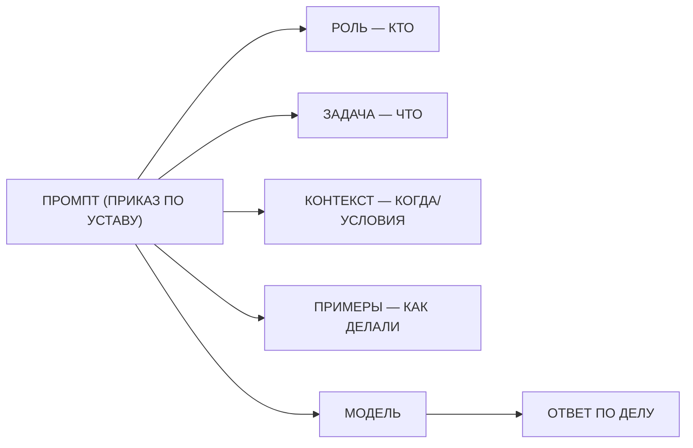
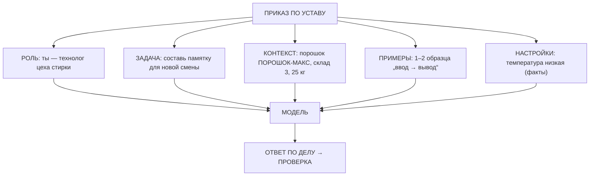

# Занятие 07. «Приказы по уставу»

> Семестр 1 · Блок 2 «Приказы по уставу» · Курс 02, раздел `basics` · ~2 ч

## Миссия занятия

> «Слушай сюда, молодежь. Дежурный наш отвечает — да как отвечает! Спросишь его, где порошок лежит, —
> он тебе стихи читает. Приказы ему как попало даём, твою ж изоленту! Подчинённому надо говорить чётко —
> кто, что, когда. Вот и научись с этой черемшой по-уставному разговаривать: один приказ — разные роли,
> примеры, настройки. Сравни, как отвечает. И устав запиши — чтоб вся смена знала, как ей приказы давать!»
> — Прораб Василич

**Задача квеста:** разобрать основы промпт-инжиниринга: инструкции, роли, формализация промпта
(из каких частей состоит приказ), few-shot (примеры), настройки LLM (температура, top-p, max_tokens)
и комбинирование техник; провести серию экспериментов — один и тот же запрос с разными ролями и
примерами, покрутить температуру — сравнить качество ответов и записать «устав» для модели.

**Итог занятия:** студент объясняет, из чего состоит промпт (роль, инструкция, контекст, примеры),
зачем нужны роли и few-shot, как температура влияет на ответ; проводит серию экспериментов и сдаёт
Василичу «устав» — готовый приказ-шаблон для дежурного, по которому смена будет ставить задачи модели.

---

## Слайды

| № | Тип | Название | Краткое содержание |
|---|-----|----------|--------------------|
| 1 | `image_group` | Комикс «Приказы по уставу» | 5 панелей: дежурный на вопрос про порошок отвечает стихами → Василич: «подчинённому — чётко, кто, что, когда» → Алиса про части приказа (роль, задача, контекст, примеры) → задача: серия опытов + устав |
| 2 | `rich_text` | «Машина — тот же подчинённый» | Метафора от Алисы: чёткий приказ «кто, что, когда» — чёткий результат; «сделай что-нибудь» — как попало |
| 3 | `video` | «Приказ по уставу» | Manim ~60 с (только сценарий): бланк «ПРИКАЗ ПО УСТАВУ»: РОЛЬ → ЗАДАЧА → КОНТЕКСТ → ПРИМЕРЫ; без устава — «стихи», по уставу — ответ по делу |
| 4 | `rich_text` | «Из чего состоит промпт» | Формально (лекция formalizing): роль, инструкция, вопрос, контекст, примеры; инструкцию — в конец; Mermaid-схема |
| 5 | `quiz` | «Кто, что, когда — по уставу» | Проверка: часть приказа на вопрос «кто» — это роль |
| 6 | `rich_text` | «Инструкции и роли» | Лекции instructions + roles: чёткая инструкция; роль меняет стиль и точность; заводской пример |
| 7 | `ai_comparison` | «Один запрос — разные роли» | 3 панели, одна модель (`openrouter/free`): без роли / технолог / снабженец — один запрос про «ПОРОШОК-МАКС» |
| 8 | `rich_text` | «Примеры: few-shot» | Лекция few_shot: zero/one/few-shot; примеры задают формат; заводской кейс с классификацией |
| 9 | `open_question` | «Как называются примеры в промпте?» | «few-shot / фью-шот / шоты / примеры» |
| 10 | `llm_playground` | «Настройки генерации» | Температура / top-p / max_tokens на заводском запросе; few-shot примеры; «Повторить» — ответ похожий, но не тот же |
| 11 | `rich_text` | «Собираем приказ по уставу» | Комбинирование (лекция combining): роль+задача+контекст+примеры+настройки; Mermaid-схема; токены-экономика; проверка |
| 12 | `ai_task_chat` | «Спроси дежурного: как давать приказы» | Живой диалог с Василичем-5.7: нечёткий приказ vs чёткий — и видно разницу; `checkPrompt` |
| 13 | `resources` | «Шаблон устава» | Скачивание: `ustav-shablon.md` + `pamyatka-eksperimenty.md` |
| 14 | `image` | Мем «чёткость приказа» | Разрядка перед главной практикой (человек проверяет картинку) |
| 15 | `rich_text` | «Записываем устав» | Что такое устав для модели, из чего состоит, как проверять; ссылка на доп. инфо |
| 16 | `ai_task_chat` | «Серия экспериментов: составь устав» | Главная контрольная точка: эксперименты (роли/примеры/температура) → записать устав; `checkPrompt` |
| 17 | `image_group` | Комикс-развязка «Дежурный по уставу» | 4 панели: устав на доске, дежурный отвечает по делу, Василич принимает, хук на занятие 8 |

---

## Детали по слайдам

### 1. image_group — Комикс «Приказы по уставу»

- **Назначение:** завязка занятия: продолжение хука занятия 06 (Василич задумался, как давать приказы) —
  дежурный отвечает невпопад, потому что приказы дают «как попало»; Алиса объясняет, что модель — тот же
  подчинённый, и показывает части приказа (роль, задача, контекст, примеры); стажёру поручают серию опытов
  и запись устава. См. `comic.md`, сцена 1.
- **Содержание:**
  - `title`: «Приказы по уставу»
  - `images`: 5 панелей (кадры 1.1–1.5 из `comic.md`, файлы `slide-07/01.png–05.png`)
  - `show_frames`: true
  - `description`: «Аппаратная. Василич тычет кибер-пальцем в экран: дежурный на вопрос „Где лежит порошок?“
    ответил стихами. Василич: „Подчинённому надо говорить чётко — кто, что, когда!“ Алиса объясняет:
    машина — тот же подчинённый: скажешь, кто она (роль), что делать (задача), при каких условиях
    (контекст) и покажешь примеры — сделает как надо. Стажёру поручают: один приказ — разные роли и примеры,
    сравнить ответы и записать „устав“ для модели.»

### 2. rich_text — «Машина — тот же подчинённый»

- **Назначение:** первое понятие от имени Алисы (п.7 шаблона), по лекции `formalizing` курса-02: метафора
  «приказ подчинённому» для промпта. Одна мысль: чёткий приказ (кто, что, когда) — чёткий результат;
  «сделай что-нибудь» — результат как попало.
- **Содержание** (`markdown`):

```markdown
**Машина — тот же подчинённый.**

«Вот смотри, деточка. Старому прорабу приказ дают: „Сходи, молодежь, принеси что-нибудь“ — и что он
принесёт? Что попадётся. А скажешь: „Принеси со склада 3 мешок порошка „ПОРОШОК-МАКС“ и положи в секцию B“ —
принесёт и положит.

С машиной то же самое. Скажешь ей „сделай что-нибудь про порошок“ — она и сделает „что-нибудь“:
вчера вот стихи выдала вместо места хранения. А скажешь чётко — кто она, что сделать, при каких условиях
и как это делали раньше — ответит по делу.

Хороший промпт — это приказ по уставу: **роль** (кто), **задача** (что), **контекст** (когда, условия),
**примеры** (как делали). Разберём по полочкам.

Подробнее — [основы промпт-инжиниринга](@osnovy-promptov).»
```

### 3. video — «Приказ по уставу»

- **Назначение:** наглядно показать структуру промпта после рассказа Алисы: бланк «приказа» заполняется
  полями (роль, задача, контекст, примеры); без устава модель отвечает «как попало», по уставу — по делу.
  Технический ролик (Manim). По договорённости — пока только сценарий (`videos/README.md`), рендер позже.
- **Содержание:**
  - `title`: «Приказ по уставу»
  - `video_url`: `videos/07-prikaz-po-ustavu.mp4` (отрендеренный файл — будет)
  - `video_type`: `direct`
  - `description`: «Технический ролик: на вопрос смены „ГДЕ ЛЕЖИТ ПОРОШОК?“ дежурный отвечает „стихами“ —
    приказ отдан как попало. Появляется бланк „ПРИКАЗ ПО УСТАВУ“ с полями: РОЛЬ (кто), ЗАДАЧА (что),
    КОНТЕКСТ (когда/условия), ПРИМЕРЫ (как делали). Бланк заполняется — готовый приказ входит в модель,
    ответ: „ПОРОШОК-МАКС: СКЛАД 3, СЕКЦИЯ B“ — по делу. Сравнение колонок: „БЕЗ УСТАВА“ (стихи) vs
    „ПО УСТАВУ“ (по делу). Вывод: приказ по уставу = роль + задача + контекст + примеры.
    Программа-сценарий: `videos/manim/07-prikaz-po-ustavu.py` (см. `video-guide.md`).»
- **План ролика (примерный сценарий, ~60 с):** см. раздел «Видео: план ролика» ниже.

### 4. rich_text — «Из чего состоит промпт»

- **Назначение:** формальное объяснение ПОСЛЕ видео (п.7 шаблона), по лекции `formalizing` курса-02: части
  промпта — роль, инструкция/задача, вопрос, контекст, примеры; не все обязательны; порядок —
  инструкцию лучше в конец. Mermaid-схема — «наглядность» прямо в тексте (п.8).
- **Содержание** (`markdown`):

````markdown
«Ох, деточка, давай разложу по полочкам. **Промпт** — это текст, который мы отдаём фиксику. Как у приказа, у него есть части:

- **Роль** — кто модель: „ты — технолог цеха стирки“.
- **Инструкция / задача** — что сделать: „составь памятку для новой смены“.
- **Вопрос** — что нам нужно: „где лежит порошок?“, „сколько соды уходит в месяц?“.
- **Контекст** — вводные и условия: „склад 3, порошок ПОРОШОК-МАКС“, ограничения.
- **Примеры (few-shot)** — как это делали раньше: пара образцов „ввод → вывод“.

Не все части обязательны и порядок свободный, но есть хитрость: **инструкцию лучше ставить в конец** —
тогда фиксик её выполняет, а не „дочитывает контекст“ вместо задания.



Подробнее — [основы промпт-инжиниринга](@osnovy-promptov).»
````

### 5. quiz — «Кто, что, когда — по уставу»

- **Назначение:** контрольная точка по формализации промпта (лекция `formalizing`): проверить, что студент
  связывает части приказа с вопросами «кто/что/когда». Материал — `files/quiz-iz-chego-sostoit-prompt.md`.
- **Содержание:**
  - `question`: «В приказе по уставу часть, которая отвечает на вопрос „кто это делает“, — это…»
  - `markdown`: «Выбери один правильный вариант. Термины занятия — [в справке](@osnovy-promptov).»
  - `options`:
    - { text: «Роль», is_correct: true }
    - { text: «Задача», is_correct: false }
    - { text: «Контекст», is_correct: false }
    - { text: «Примеры», is_correct: false }
  - `explanation`: «Роль отвечает на вопрос „кто“: „ты — технолог цеха стирки“. Задача — это „что“ (что
    сделать), контекст — „когда/при каких условиях“, примеры — „как это делали раньше“. Вместе они
    и составляют приказ по уставу.»

### 6. rich_text — «Инструкции и роли»

- **Назначение:** формальное объяснение по лекциям `instructions` и `roles` курса-02: инструкция — самая
  простая техника (дать модели задачу); роль меняет стиль, глубину и точность ответа. Одна мысль:
  чёткая инструкция + назначенная роль — ответ полезнее.
- **Содержание** (`markdown`):

```markdown
**Инструкции и роли.**

«Первый приём — **инструкция**: просто дай модели задание. Звучит просто, а модели умеют выполнять
задачи, которые словами не объяснишь: вычистить имена из накладной, убрать лишнее из письма, оценить
текст по критериям.

Второй приём — **роль**: назначь модели, кто она. Роль меняет и стиль, и точность. Спроси про расход
порошка без роли — получишь общие слова. Назначь роль:

- „Ты — технолог цеха стирки. По данным смены посчитай, сколько порошка ПОРОШОК-МАКС уходит в месяц.“
- „Ты — снабженец отдела закупок. Оцени, когда нужно заказывать соду, чтобы не было простоя.“

Один и тот же запрос — разные роли — разные ответы: у технолога с цифрами, у снабженца с закупками.
Роль — это как сказать подчинённому, с какой должности он сегодня работает. И проверить, что роль
помогла, а не навредила.

Подробнее — [инструкции и роли](@osnovy-promptov).»
```

### 7. ai_comparison — «Один запрос — разные роли»

- **Назначение:** практика-эксперимент из задания занятия: один и тот же запрос — три панели с разными
  ролями (и одна «без роли» для сравнения), одна модель — видно, как роль меняет ответ. Без проверки:
  эксперимент, на его результаты студент опирается при составлении устава (слайд 16).
- **Содержание:**
  - `title`: «Один запрос — разные роли»
  - `mergeInput`: true
  - `panels`:
    - { label: «Без роли», model: `openrouter/free`, systemPrompt: ``, aiName: «Дежурный (без роли)», allowFileUpload: false }
    - { label: «Технолог», model: `openrouter/free`, systemPrompt: «Ты — технолог цеха стирки завода
      БытХимИскИнДеталь. Отвечай по существу, с цифрами и нормами: состав, дозировка, хранение, расход.»,
      aiName: «Технолог», allowFileUpload: false }
    - { label: «Снабженец», model: `openrouter/free`, systemPrompt: «Ты — снабженец отдела закупок завода
      БытХимИскИнДеталь. Отвечай по делу: закупки, остатки, сроки поставки, экономия.», aiName: «Снабженец»,
      allowFileUpload: false }
  - `task` (Markdown): «Задай в общем поле один и тот же запрос: „Расскажи, что нужно знать новой смене
    про стиральный порошок ПОРОШОК-МАКС, чтобы работать без брака“. Отправь во все панели сразу и сравни:
    как меняется тон, детали и польза ответа, когда у модели есть роль, и какой ответ был бы полезнее
    дежурному по цеху. Это первый эксперимент серии — его результат пригодится на слайде 16, когда будешь
    записывать устав.»

### 8. rich_text — «Примеры: few-shot»

- **Назначение:** формальное объяснение по лекции `few_shot` курса-02: zero/one/few-shot, примеры задают
  формат вывода. Заводской кейс: классификация отзывов на продукцию. Одна мысль: показал пример —
  получил нужный формат.
- **Содержание** (`markdown`):

```markdown
**Примеры: few-shot.**

«Инструкцией не всё объяснишь. Бывает, проще показать, как надо. Это **примеры** (их ещё называют
**шоты**, от английского „shot“). Показал модели один-два образца „ввод → вывод“ — и она отвечает
в том же формате, без лишних объяснений.

Три вида:

- **Zero-shot** — без примеров: просто запрос (так мы работали раньше).
- **One-shot** — один пример.
- **Few-shot** — два и больше. Обычно чем больше примеров, тем точнее.

Заводской кейс: смена собирает отзывы на продукцию, нужно пометить их „хорошо/плохо“. Одной инструкции
мало — покажем примеры:

```
„Отличный порошок, ничего не прилипает“: хорошо
„Мешок порвался по дороге“: плохо
„Хорошо пенится, запах приятный“: хорошо
„Крышка не закрывается“: плохо
```

Всё, модель поняла формат. Примеры особенно нужны, когда формат вывода словами не опишешь —
например, таблица или список „имя: должность“.

Подробнее — [few-shot: примеры](@osnovy-promptov).»
```

### 9. open_question — «Как называются примеры в промпте?»

- **Назначение:** закрепить термин «few-shot» (лекция `few_shot` курса-02).
- **Содержание:**
  - `question`: «Как называется техника, когда в промпт добавляют несколько примеров „ввод → вывод“,
    чтобы модель отвечала в нужном формате?»
  - `correct_answers`:
    - «few-shot»
    - «фью-шот»
    - «фьюшот»
    - «шоты»
    - «примеры в промпте»
    - «экземпляры»
    - «exemplars»
  - `congratulations`: «Верно! Few-shot — это показ нескольких примеров („шотов“): модель учится на них
    в момент запроса (in-context learning) и повторяет нужный формат ответа.»
  - `error_message`: «Не совсем. Вспомни слово из теории про примеры: по-английски „несколько примеров“ —
    few-shot.»
  - `hint`: «Слово начинается на „few“… по-английски „немного примеров“.»
  - `fuzzy_match`: true
  - `similarity_threshold`: 0.8
  - `show_correct_answer`: true

### 10. llm_playground — «Настройки генерации»

- **Назначение:** практика-эксперимент по лекции `configuration_hyperparameters` курса-02: температура,
  top-p, max_tokens на заводском запросе; кнопка «Повторить» показывает, что даже с теми же настройками
  ответ похожий, но не тот же (вероятностная генерация — занятие 2). Эксперимент используется при
  составлении устава (слайд 16).
- **Содержание:**
  - `title`: «Настройки генерации»
  - `model`: `openrouter/free`
  - `showModelSelect`: true
  - `systemPrompt`: «Ты — технолог цеха стирки завода БытХимИскИнДеталь. Отвечай коротко и по делу.»
  - `showSystemPrompt`: true
  - `defaultPrompt`: «Составь два варианта напутствия для новой смены на участке стирки: строгий и весёлый.»
  - `showTemperature`: true, `temperature`: 0.7
  - `showTopP`: true, `topP`: 1.0
  - `showMaxTokens`: true, `maxTokens`: 256
  - `showFewShots`: true
  - `allowRerun`: true
  - `task` (Markdown): «Покрути настройки и посмотри, как меняется ответ:
    - **Температура** — „насколько строго по уставу“: пониже (0.2) — ответ сухой и стабильный, повыше (1.5) —
    фантазия и разнообразие, но может „понести“.
    - **Top-p** — отсечка по вероятности: влияет на разнообразие похоже на температуру.
    - **Max tokens** — длина ответа: мало — модель „обрежется“ на полуслове.
    - **Примеры (few-shot)** — добавь пару образцов формата и посмотри, как модель прилипнет к формату.
    Нажми „Повторить“ с теми же настройками — ответ будет похожий, но не тот же: модель выбирает
    правдоподобное (занятие 2). Для фактов температуру держим низкой — как приказ строго по уставу.»

### 11. rich_text — «Собираем приказ по уставу»

- **Назначение:** формальное объяснение по лекции `combining_techniques` курса-02: техники комбинируются
  в один приказ; Mermaid-схема полного устава; экономика токенов и проверка результата.
- **Содержание** (`markdown`):

````markdown
«Техники по отдельности хороши, а вместе — сила. Почти любой хороший промпт — это **комбинация**:
роль + инструкция + контекст + примеры, а сверху настройки. Соберём приказ по уставу для дежурного:



Три правила устава:

1. **Коротко.** Каждый лишний абзац уходит в контекст и стоит токенов (это деньги). Пишем только нужное:
   роль, задача, контекст, пара примеров. (Экономика автоматизации.)
2. **Без секретов.** В промпт не пишем пароли и ключи — только рабочие данные (приватность, занятие 3).
3. **Проверяй.** Роль и примеры помогают, но не гарантируют правду: ответ сверяем с фактами, не доверяем
   на слово.

Подробнее — [основы промпт-инжиниринга](@osnovy-promptov) и [что такое устав](@ustav-modeli).»
````

### 12. ai_task_chat — «Спроси дежурного: как давать приказы»

- **Назначение:** теория-практика: студент в живом диалоге с Василичем-5.7 проверяет, как один и тот же
  приказ работает «как попало» и «по уставу» — и сам приходит к выводу, что чёткость меняет ответ.
  Проверка через `checkPrompt`.
- **Содержание:**
  - `task` (Markdown): «Так, молодежь, не тяни резину! Дежурный — сама модель, она лучше всех знает, как ей приказы давать.
    Поговори с Василичем-5.7 и проведи мини-эксперимент: сначала дай ей нечёткий приказ (например,
    „сделай что-нибудь про порошок“), потом — приказ по уставу (роль + задача + контекст, например:
    „Ты — технолог. Составь памятку новой смене: как хранить и дозировать ПОРОШОК-МАКС, 25 кг“).
    Сравни ответы и спроси, что именно в чётком приказе ей помогает. Опиши в ответе: чем отличаются
    два ответа и почему чёткий приказ — это и есть хороший промпт. По готовности нажми „Проверить“.»
  - `systemPrompt`: текст из `files/system-prompt-vasylich-57.md`
  - `aiName`: «Василич-5.7»
  - `model`: `openrouter/free`
  - `chainOfThought`: false
  - `showCoT`: false
  - `allowFileUpload`: false
  - `checkPrompt`: «Оцени ответ студента: понял ли он, что чёткий приказ (роль + задача + контекст +
    при необходимости примеры) даёт ответ по делу, а нечёткий — „как попало“, и что промпт — это
    и есть приказ модели. Ответь „да“ или „нет“ с кратким пояснением.»

### 13. resources — «Шаблон устава»

- **Назначение:** раздать студенту материалы практики «устав»: шаблон (заготовка приказа) и памятку по
  серии экспериментов. Понадобятся на слайде 16.
- **Содержание:**
  - `title`: «Шаблон устава»
  - `description` (Markdown): «Это заготовка для главной практики. В `ustav-shablon.md` — поля приказа
    (роль, задача, контекст, примеры, настройки) с подсказками; в `pamyatka-eksperimenty.md` — как
    проводить серию опытов (роли, few-shot, температура) и что записывать. Всё понадобится на слайде 16.»
  - `files`:
    - { name: `ustav-shablon.md`, description: «Шаблон приказа по уставу: поля и подсказки» }
    - { name: `pamyatka-eksperimenty.md`, description: «Памятка: как провести серию экспериментов и сравнить ответы» }

### 14. image — Мем «чёткость приказа»

- **Назначение:** сквозная тема — результат проверяет человек.
- **Содержание:**
  - `title`: «Мем: приказ по уставу»
  - `image_url`: `memes/images/m01296.jpg` (кандидат; картинку проверяет человек глазами — по правилам
    курса. Описание: маленькая коробка „дано“ и огромная инструкция „найти“ — приказ надо давать чётко,
    но и инструкции не всегда понятны без проверки)
  - `description`: «Скажешь как попало — получишь стихи вместо ответа. Ёлки-палки! Кандидаты для замены: `m01433` („умная мысль“
    доходит до рта, пробиваясь через знаки вопроса: „тяжело объяснить“ — ответ как попало без чёткого
    приказа), `m00851` („я думаю, что научился решать задачи“ — в руках коробка с той же рубашкой: „те же
    условия с другими цифрами“ — примеры задают формат, но проверять всё равно надо).»
- **Подбор:** `memes/pick_meme "чётко и понятно, устав, инструкция, правила"` (m01296 — 0.52, m01433 — 0.60,
  m00851 — 0.47) и `memes/pick_meme "писать чётко, приказы, инструкция"`. Все кандидаты — `is_clean=true`,
  картинку проверяет человек глазами.

### 15. rich_text — «Записываем устав»

- **Назначение:** подготовка к главной практике: что такое устав для модели, зачем его записать (чтобы
  вся смена ставила задачи одинаково), из чего он состоит, как проверять. Материал — `files/ustav-shablon.md`.
- **Содержание** (`markdown`):

```markdown
**Записываем устав.**

«Всё, что мы разобрали, — это техники. Теперь оформим их в **устав** — готовый приказ-шаблон, по которому
смена будет ставить задачи дежурному. Зачем записывать? Чтобы не придумывать приказ каждый раз заново
и чтобы все давали его одинаково: сегодня — ты, завтра — другой стажёр. Устав — это и есть
„памятка по общению с моделью“.

Устав состоит из пяти частей:

1. **РОЛЬ** — кто модель.
2. **ЗАДАЧА** — что сделать (одно действие, глагол).
3. **КОНТЕКСТ** — вводные и ограничения.
4. **ПРИМЕРЫ** — 1–2 образца нужного формата.
5. **НАСТРОЙКИ** — температура (для фактов — низкая) и длина ответа.

И два правила поверх: **проверь результат** (сверить с фактами) и **держи коротко** (токены = деньги).

Заготовка — в [шаблоне устава](@ustav-modeli) и в файле `ustav-shablon.md`. Останется провести серию
экспериментов и заполнить.»
```

### 16. ai_task_chat — «Серия экспериментов: составь устав»

- **Назначение:** главная контрольная точка занятия: студент проводит серию экспериментов (один запрос —
  разные роли на слайде 7, few-shot на слайде 8/10, температура на слайде 10), сравнивает ответы
  и записывает «устав» для модели. Проверка через `checkPrompt` (полнота устава, понимание влияния
  ролей/примеров/настроек, проверка результата и экономика токенов). Материал — `files/zadanie-ustav.md`
  и `files/ustav-shablon.md`.
- **Содержание:**
  - `task` (Markdown): «Чего сидишь, молодежь! Проведи серию опытов и запиши устав для дежурного — без воды, по делу!
    Возьми один заводской запрос, например: „Составь памятку для новой смены про стиральный порошок
    ПОРОШОК-МАКС: что это, как хранить, как дозировать“.
    1) **Роли** (слайд 7): прогони запрос без роли и с ролью (технолог). Сравни тон и полезность.
    2) **Примеры** (слайд 10, блок few-shot): добавь 1–2 примера нужного формата (например, „ПОРОШОК-МАКС:
    мешок 25 кг, дозировка 100 г на стирку“) и сравни с ответом без примеров.
    3) **Настройки** (слайд 10): покрути температуру — как меняется ответ для фактов.
    4) **Запиши устав**: заполни шаблон из `ustav-shablon.md` — роль, задача, контекст, примеры,
    настройки (температура) + 2 строки: что изменилось от роли и от температуры и что ты проверил
    в ответе. Вставь устав в ответ в чате и нажми „Проверить“.»
  - `systemPrompt`: «Ты — методист по работе с древними ИИ на заводе „БытХимИскИнДеталь“. Оцениваешь,
    правильно ли стажёр составил „устав“ для модели (промпт по уставу). Отвечай коротко и по делу.»
  - `aiName`: «Методист»
  - `model`: `openrouter/free`
  - `chainOfThought`: false
  - `showCoT`: false
  - `allowFileUpload`: true
  - `checkPrompt`: «Оцени работу студента: провёл ли он серию экспериментов (роли, few-shot, температура),
    понял ли, что роль и примеры меняют ответ, а температура для фактов должна быть низкой; составил ли
    „устав“ со всеми частями (роль, задача, контекст, примеры, настройки), указал, что проверил результат,
    и помнит про экономику токенов (коротко, без лишнего). Ответь „да“ или „нет“ с кратким пояснением.»

### 17. image_group — Комикс-развязка «Дежурный по уставу»

- **Назначение:** развязка сюжета: устав записан и повешен на доску, дежурный отвечает по делу; Василич
  принимает; хук на занятие 8 (сложные приказы — «думающий ИИ»). См. `comic.md`, сцена 2.
- **Содержание:**
  - `title`: «Дежурный по уставу»
  - `images`: 4 панели (кадры 2.1–2.4 из `comic.md`, файлы `slide-07/06.png–09.png`)
  - `show_frames`: true
  - `description`: «На доске в аппаратной повешен лист „УСТАВ СМЕНЫ“: роль, задача, контекст, примеры,
    настройки. Стажёр задаёт приказ по уставу — дежурный отвечает по делу („ПОРОШОК-МАКС: СКЛАД 3, СЕКЦИЯ B“),
    а не стихами. Василич сравнивает „до“ и „после“ и принимает: „Вот теперь приказ — как приказ!“.
    Алиса хвалит. Василич задумывается: „А если приказ сложный, с расчётами?“ Алиса: „Батя у Василича по
    слогам считал — и у него всё было верно. Вот и фиксика научим думать по шагам“ (хук на занятие 8 —
    «думающий ИИ»).»

---

## Видео: план ролика «Приказ по уставу»

> Технический ролик на Manim (ManimCE), `videos/manim/07-prikaz-po-ustavu.py`. Движок — Manim, потому
> что ролик объясняет механизм (структура промпта). Стиль — из `comic-style.md`: палитра
> (болотный/ржавый/пыльный/оливковый + кислотно-зелёный люминофор), чёрный контур, надписи заглавными
> рубленым шрифтом. 1920×1080, 30 fps, длительность ~60 с, фиксированный `seed`.
> На момент сборки занятия ролик **не отрендерен** — есть только план-сценарий (см. `videos/README.md`).

**Мысль ролика (одна):** промпт — это приказ по уставу: роль + задача + контекст + примеры; приказ
«как попало» — ответ «как попало», приказ по уставу — ответ по делу.

| № | Время | Кадр | Что происходит | Надписи в кадре |
|---|-------|------|----------------|-----------------|
| 1 | 0–8 с | Завязка | Вопрос смены «ГДЕ ЛЕЖИТ ПОРОШОК?» → дежурный выдаёт «ВОТ ВАМ СТИХИ ПРО ПОРОШОК» (не в тему) | «ПРИКАЗ КАК ПОПАЛО → ОТВЕТ КАК ПОПАЛО» |
| 2 | 8–24 с | Бланк | Появляется бланк «ПРИКАЗ ПО УСТАВУ»; поля заполняются по одному: РОЛЬ (кто) → ЗАДАЧА (что) → КОНТЕКСТ (когда/условия) → ПРИМЕРЫ (как делали) | «ПРИКАЗ ПО УСТАВУ: РОЛЬ · ЗАДАЧА · КОНТЕКСТ · ПРИМЕРЫ» |
| 3 | 24–38 с | Ответ по делу | Готовый приказ входит в модель; ответ: «ПОРОШОК-МАКС: СКЛАД 3, СЕКЦИЯ B» | «ПО УСТАВУ → ОТВЕТ ПО ДЕЛУ» |
| 4 | 38–52 с | Сравнение | Две колонки: «БЕЗ УСТАВА» (стихи) vs «ПО УСТАВУ» (по делу); стрелка «ПРОВЕРЯЙ» | «БЕЗ УСТАВА — КАК ПОПАЛО · ПО УСТАВУ — ПО ДЕЛУ» |
| 5 | 52–60 с | Вывод | Крупная финальная надпись | «ПРИКАЗ ПО УСТАВУ = РОЛЬ + ЗАДАЧА + КОНТЕКСТ + ПРИМЕРЫ» |

**Что НЕ показываем:** лиц и сюжета — ролик чисто технический, про структуру промпта. Сюжетная рамка
только в завязке (вопрос смены и «стихи»). После ролика — слайд 4 (формальное объяснение частей промпта).

---

## Доп. информация

Блоки дополнительной информации (вкладка «Доп. информация» на платформе; слаги — общие на курс sem1).
Наполнение блоков — в `content/sem1/extra/<слаг>.md`.

| Слаг | Слайд | Ссылка на слайде |
|---|---|---|
| `osnovy-promptov` | 2, 4, 5, 6, 8, 9, 11 | «основы промпт-инжиниринга» |
| `ustav-modeli` | 11, 13, 15, 16 | «что такое устав» / «шаблон устава» |
