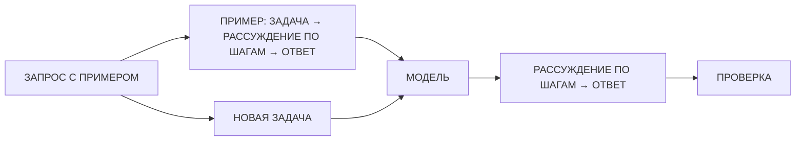
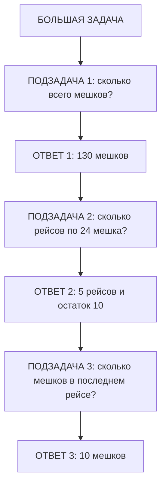
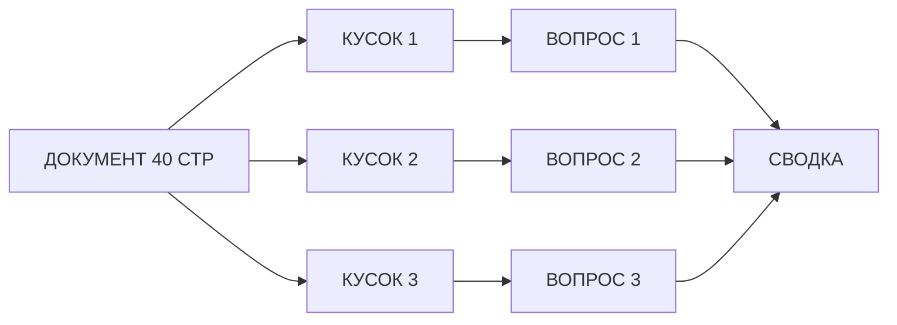

# Занятие 08. «Думающий ИИ: продвинутые приёмы»

> Семестр 1 · Блок 2 «Приказы по уставу» · Курс 02, раздел `intermediate` · ~2 ч

## Миссия занятия

> «Приказы-то мы ему по уставу даём — а он считать не умеет! Спросишь, хватит ли порошка до поставки, —
> он: „хватит, с запасом!“. А потом цех без порошка стоит. А мой старый батя по слогам считал — и у него
> всё было верно. А молодёжь как перескочит через действие — так и ошибка! Твою ж изоленту! Вот и черту
> скажем: рассуждай шаг за шагом. Прогони его на наших расчётах — запасы, логистика — и скажи мне, где он
> точнее считает, а где всё так же наобум!»
> — Прораб Василич

**Задача квеста:** освоить продвинутые приёмы промптинга — Chain of Thought (CoT), Zero-shot CoT,
Least-to-Most и Self-Consistency, а также приёмы работы с длинным текстом; применить CoT и self-consistency
к заводским расчётам (запасы, логистика) и оценить, как меняется точность ответов.

**Итог занятия:** студент объясняет, что значит «думать вслух» для модели (CoT и его варианты), чем
само-консистентность помогает при расчётах и как работать с длинными документами; решает через агента
две заводские задачи (запасы + логистика) тремя способами (без приёмов / с CoT / self-consistency),
сравнивает точность и сдаёт Василичу таблицу результатов с выводами.

---

## Слайды

| № | Тип | Название | Краткое содержание |
|---|-----|----------|--------------------|
| 1 | `image_group` | Комикс «Думающий ИИ» | 5 панелей: дежурный на вопрос «хватит ли порошка» отвечает наобум → Василич: «мой старый батя по слогам считал — и у него всё было верно» → Алиса: попроси модель «рассуждать шаг за шагом» → задача: проверить на расчётах запасов и логистики |
| 2 | `rich_text` | «Считает по слогам» | Метафора от Алисы: батя Василича считал по слогам — не сбивался; модель то же: «рассуждай шаг за шагом» — ответ точнее |
| 3 | `video` | «Думает вслух» | Manim ~60 с (только сценарий): расчёт запасов без рассуждений — ответ наобум (ошибка) vs «шаг за шагом» — верный ответ; вывод: попроси показать ход решения |
| 4 | `rich_text` | «Chain of Thought: рассуждать вслух» | Формально: CoT — показать модели примеры с расписанным решением; заводской пример; ограничение — нужна достаточно большая модель; Mermaid |
| 5 | `quiz` | «Что такое CoT?» | Проверка: Chain of Thought — это когда модель показывает ход рассуждений |
| 6 | `rich_text` | «Zero-shot CoT: „подумай шаг за шагом“» | Фраза «Подумай шаг за шагом» — модель сама строит цепочку; когда примеры подобрать сложно; чуть менее точно, чем CoT с примером |
| 7 | `ai_comparison` | «Один расчёт — три способа» | 3 панели, одна модель (`nvidia/nemotron-3-super-120b-a12b:free`): без рассуждений / zero-shot CoT / CoT с примером — один и тот же расчёт логистики |
| 8 | `open_question` | «Волшебная фраза» | «подумай шаг за шагом» (варианты: «давай подумаем шаг за шагом», let's think step by step и т.п.) |
| 9 | `rich_text` | «Least-to-Most: разбить на подзадачи» | Большую задачу — на подзадачи, решать по очереди, подставляя ответы; заводской пример: план поставки |
| 10 | `rich_text` | «Self-Consistency: спросить несколько раз» | Один запрос с CoT прогнать несколько раз, взять большинство; как опрос в цехе; повышает точность |
| 11 | `llm_playground` | «Спроси трижды: само-консистентность» | Один расчёт с CoT, кнопка «Повторить» ×5 → большинство; сравнить с одиночным ответом и с верным |
| 12 | `rich_text` | «Длинный текст: не всё сразу» | У модели есть «окно» — длинный документ не влезает: сжать, разбить на куски, обрабатывать по частям; заводской пример с инструкцией; экономика токенов |
| 13 | `resources` | «Памятка думающего дежурного» | Скачивание: `pamyatka-dumayushchiy-dezhurnyy.md` + `zadanie-raschety.md` (задачи с верными ответами) |
| 14 | `image` | Мем «думает шаг за шагом» | Разрядка перед главной практикой (человек проверяет картинку) |
| 15 | `rich_text` | «Как оценивать точность» | Прежде чем применять приёмы — как понять, что ответ верный: сверять с бумагой/пересчётом; таблица «способ → ответ → верно/нет»; экономика: шаги и повторы стоят токенов |
| 16 | `ai_task_chat` | «Расчёты смены: применяем приёмы» | Главная контрольная точка: 2 задачи (запасы + логистика) тремя способами, таблица точности, выводы; `checkPrompt` |
| 17 | `image_group` | Комикс-развязка «Дежурный считает вслух» | 4 панели: расчёт совпал с бумагой склада, Василич принимает, хук на занятие 9 |

---

## Детали по слайдам

### 1. image_group — Комикс «Думающий ИИ»

- **Назначение:** завязка занятия: продолжение хука занятия 07 (Василич задумался про сложные приказы
  «с расчётами») — дежурный не умеет считать, на вопрос «хватит ли порошка» отвечает наобум; Василич
  вспоминает отца, который «по слогам считал — и у него всё было верно»; Алиса объясняет, что модель можно
  попросить рассуждать по шагам; стажёру поручают проверить приёмы на заводских расчётах. См. `comic.md`,
  сцена 1.
- **Содержание:**
  - `title`: «Думающий ИИ»
  - `images`: 5 панелей (кадры 1.1–1.5 из `comic.md`, файлы `slide-08/01.png–05.png`)
  - `show_frames`: true
  - `description`: «Аппаратная. Смена спрашивает дежурного: „Хватит ли порошка до поставки?“ — а он отвечает
    наобум: „ХВАТИТ, С ЗАПАСОМ!“. Василич в бешенстве: „Приказ по уставу даём, а считать черт не умеет!“
    „Вот мой старый батя по слогам считал — и у него всё было верно. А молодёжь перескочит через действие —
    и ошибка!“ Алиса объясняет: модель можно попросить рассуждать вслух — «распиши ход решения по шагам».
    Стажёру поручают: прогнать дежурного на расчётах запасов и логистики и сказать, где он считает точно,
    а где наобум.»

### 2. rich_text — «Считает по слогам»

- **Назначение:** первое понятие от имени Алисы (п.7 шаблона), по лекции `chain_of_thought` курса-02:
  метафора «батя Василича считал по слогам» для CoT. Одна мысль: попросить модель показать ход решения —
  ответ точнее.
- **Содержание** (`markdown`):

```markdown
**Считает по слогам.**

«Вот смотри, деточка. Батя у Василича по слогам считал: „двадцать три… двадцать четыре…“ — каждый шажок
проговорит, никуда не собьётся. А молодёжь бывает: перескочит через действие — и ошибка: спросишь, сколько
выйдет, — а она наобум: „хватит, с запасом!“.

С машиной то же самое. Спросишь сразу ответ — она может выпалить первое правдоподобное, не посчитав.
А попросишь **рассуждать шаг за шагом** — она распишет ход решения, как батя у Василича, и не собьётся.
Чем сложнее расчёт, тем важнее, чтобы модель думала вслух.

Подробнее — [думающие приёмы](@dumayushchiy-ii).»
```

### 3. video — «Думает вслух»

- **Назначение:** наглядно показать разницу между ответом «наобум» и пошаговым решением: один и тот же
  расчёт запасов — без рассуждений модель выдаёт неверный ответ, с «шаг за шагом» — считает верно.
  Технический ролик (Manim). По договорённости — пока только сценарий (`videos/README.md`), рендер позже.
- **Содержание:**
  - `title`: «Думает вслух»
  - `video_url`: `videos/08-dumaet-vslukh.mp4` (отрендеренный файл — будет)
  - `video_type`: `direct`
  - `description`: «Технический ролик: вопрос смены „ХВАТИТ ЛИ ПОРОШКА ДО ПОСТАВКИ?“ — модель без
    рассуждений отвечает „ХВАТИТ, С ЗАПАСОМ!“ (крупно, красным). Появляется строка „ПОДУМАЙ ШАГ ЗА ШАГОМ“ —
    модель выписывает шаги: запас 17 мешков × 25 кг = 425 кг; расход 12 кг × 6 дней × 3 недели = 216 кг;
    425 − 216 = 209 кг. Сравнение: „НАОБУМ“ vs „ПО ШАГАМ“ и сверка с бумагой склада „ОСТАТОК: 209 КГ“.
    Вывод: попроси модель показать ход решения — ответ точнее. Программа-сценарий:
    `videos/manim/08-dumaet-vslukh.py` (см. `video-guide.md`).»
- **План ролика (примерный сценарий, ~60 с):** см. раздел «Видео: план ролика» ниже.

### 4. rich_text — «Chain of Thought: рассуждать вслух»

- **Назначение:** формальное объяснение ПОСЛЕ видео (п.7 шаблона), по лекции `chain_of_thought` курса-02:
  CoT — показать модели примеры, где решение расписано по шагам; модель перенимает и объясняет своё
  рассуждение — точнее. Ограничение: CoT реально помогает на достаточно больших моделях; слабые модели
  могут «выдумать» нелогичную цепочку. Mermaid-схема.
- **Содержание** (`markdown`):

````markdown
**Chain of Thought: рассуждать вслух.**

«По-взрослому это называется **Chain of Thought** — „цепочка рассуждений“. Идея простая: если в примерах
для модели показать не только ответ, но и **ход решения по шагам**, модель начнёт рассуждать так же —
и будет ошибаться реже.



Заводской пример:

```
Вопрос: На складе 17 мешков по 25 кг. Сколько килограммов всего?
Решение: 17 × 25 = 425 кг. Ответ: 425 кг.

Вопрос: Цех тратит 12 кг в день, работает 6 дней в неделю.
Сколько килограммов уходит за 3 недели?
```

Здесь модель видит, что нужно считать, а не угадывать. Но есть подвох: CoT помогает на **достаточно
больших** моделях. Маленькая модель может расписать красиво, а посчитать неправильно — так что ответ всё
равно проверяем.

Подробнее — [думающие приёмы](@dumayushchiy-ii).»
````

### 5. quiz — «Что такое CoT?»

- **Назначение:** контрольная точка по лекции `chain_of_thought` курса-02: проверить, что студент понял
  суть приёма. Материал — `files/quiz-cot.md`.
- **Содержание:**
  - `question`: «Что значит попросить модель „рассуждать вслух“ (Chain of Thought)?»
  - `markdown`: «Выбери один правильный вариант. Термины занятия — [в справке](@dumayushchiy-ii).»
  - `options`:
    - { text: «Показать модели примеры, где решение расписано по шагам, чтобы и она объясняла свой ход
      рассуждений», is_correct: true }
    - { text: «Дать модели больше данных для обучения», is_correct: false }
    - { text: «Поставить модели самую низкую температуру», is_correct: false }
    - { text: «Подключить модели новую кнопку-функцию», is_correct: false }
  - `explanation`: «CoT — это показ примеров с расписанным решением: модель перенимает манеру „думать
    вслух“, объясняет каждый шаг и реже ошибается на расчётах. Это приём промптинга, а не дообучение
    и не настройка параметров.»

### 6. rich_text — «Zero-shot CoT: „подумай шаг за шагом“»

- **Назначение:** формальное объяснение по лекции `zero_shot_cot` курса-02: если примеры подобрать
  сложно, достаточно добавить фразу «Подумай шаг за шагом» — модель сама построит цепочку рассуждений.
  Одна мысль: без примеров, одной фразой — уже точнее; но чуть менее точно, чем CoT с примерами.
- **Содержание** (`markdown`):

```markdown
**Zero-shot CoT: „подумай шаг за шагом“.**

«А если примеров нет — готовые не собрать или лень подбирать? Оказывается, достаточно добавить в конец
вопроса простую фразу: **„Подумай шаг за шагом“** (по-английски — „Let's think step by step“). Модель сама
построит ход рассуждений и по нему посчитает.

Почему это работает: фраза даёт модели команду „сначала подумай, потом отвечай“ — вместо того чтобы сразу
выдавать первое правдоподобное.

Три уровня «думанья»:

- **Без рассуждений** — сразу ответ: рискуем получить „наобум“.
- **Zero-shot CoT** — „подумай шаг за шагом“: модель думает сама, примеров нет.
- **CoT с примерами** — показали образец рассуждения: точнее всего, но готовить примеры дольше.

Практический совет: если точность критична — используем CoT с примером или self-consistency
(слайд 10), а „подумай шаг за шагом“ — как быстрый способ.

Подробнее — [думающие приёмы](@dumayushchiy-ii).»
```

### 7. ai_comparison — «Один расчёт — три способа»

- **Назначение:** практика-эксперимент: один и тот же расчёт логистики, три способа подачи (без
  рассуждений / zero-shot CoT / CoT с примером) на **одной и той же** модели — видно, как «думанье вслух»
  меняет точность. Результаты студент записывает для главной практики (слайд 16).
- **Содержание:**
  - `title`: «Один расчёт — три способа»
  - `mergeInput`: true
  - `panels` (модель во всех панелях одна — `nvidia/nemotron-3-super-120b-a12b:free`, меняется только
    подача; почему не `openrouter/free`: CoT хорошо помогает на больших моделях, а роутер может кинуть
    слабую):
    - { label: «Без рассуждений», model: `nvidia/nemotron-3-super-120b-a12b:free`,
      systemPrompt: «Ты — технолог цеха стирки завода БытХимИскИнДеталь. Отвечай коротко: сразу готовый
      ответ, без объяснений и расчётов.», aiName: «Дежурный (наобум)», allowFileUpload: false }
    - { label: «Подумай шаг за шагом», model: `nvidia/nemotron-3-super-120b-a12b:free`,
      systemPrompt: «Ты — технолог цеха стирки завода БытХимИскИнДеталь. Сначала распиши ход решения по
      шагам, в конце дай ответ одной строкой.», aiName: «Дежурный (думает вслух)», allowFileUpload: false }
    - { label: «CoT с примером», model: `nvidia/nemotron-3-super-120b-a12b:free`,
      systemPrompt: «Ты — технолог цеха стирки завода БытХимИскИнДеталь. Отвечай в формате примера:
      сначала решение по шагам, потом „ОТВЕТ: …“.
      Пример: Вопрос: На складе 10 мешков по 25 кг. Сколько килограммов всего? Решение: 10 × 25 = 250 кг.
      ОТВЕТ: 250 кг.»,
      aiName: «Дежурный (с примером)», allowFileUpload: false }
  - `task` (Markdown): «Задай в общем поле один и тот же запрос: „Водитель должен развезти 130 мешков по
    трём цехам: в цех А — 50, в цех Б — 45, в цех В — остальные. Грузовик берёт 24 мешка за один рейс.
    Сколько всего рейсов нужно и сколько мешков поедет в последнем рейсе?“. Отправь во все три панели сразу
    и сравни: где ответ верный, где модель „угадала“, а где расписала решение правильно. Верные цифры
    сверь с заданием на слайде 16. Это первый эксперимент серии — результат понадобится в таблице
    точности.»

### 8. open_question — «Волшебная фраза»

- **Назначение:** закрепить ключевую фразу zero-shot CoT (лекция `zero_shot_cot` курса-02).
- **Содержание:**
  - `question`: «Какую фразу добавляют в конец вопроса, чтобы модель „включила“ пошаговое рассуждение
    без примеров?»
  - `correct_answers`:
    - «подумай шаг за шагом»
    - «давай подумаем шаг за шагом»
    - «рассуждай шаг за шагом»
    - «думай шаг за шагом»
    - «подумаем шаг за шагом»
    - «let's think step by step»
    - «lets think step by step»
    - «step by step»
    - «по шагам»
  - `congratulations`: «Верно! „Подумай шаг за шагом“ (zero-shot CoT) — модель сама строит цепочку
    рассуждений, даже без примеров. Это самый быстрый способ заставить модель „думать вслух“.»
  - `error_message`: «Не совсем. Вспомни фразу из теории про zero-shot CoT — она про шаги…»
  - `hint`: «Слово „шаг“ и просьба подумать. По-английски — „Let's think…“.»
  - `fuzzy_match`: true
  - `similarity_threshold`: 0.8
  - `show_correct_answer`: true

### 9. rich_text — «Least-to-Most: разбить на подзадачи»

- **Назначение:** формальное объяснение по лекции `least_to_most` курса-02: когда задача слишком большая
  для CoT — разбиваем на подзадачи и решаем по очереди, подставляя ответы предыдущих шагов. Одна мысль:
  большую задачу решаем «от простого к сложному».
- **Содержание** (`markdown`):

````markdown
**Least-to-Most: разбить на подзадачи.**

«CoT хорошо считает, но у длинной задачи есть предел: если шагов слишком много, модель собьётся. Тогда
разбиваем задачу на **подзадачи** и решаем по очереди, подставляя в следующую ответ предыдущей.
Называется **Least-to-Most** — „от простого к сложному“.



Заводской пример — план поставки: сначала посчитать общий объём, потом рейсы, потом деньги. Каждый шаг —
отдельный вопрос, ответ предыдущего вставляем в следующий. Модель на каждом шаге делает мало работы —
и не сбивается. Большие планы и длинные расчёты — то самое место, где Least-to-Most сильнее простого CoT.

Подробнее — [думающие приёмы](@dumayushchiy-ii).»
````

### 10. rich_text — «Self-Consistency: спросить несколько раз»

- **Назначение:** формальное объяснение по лекции `self_consistency` курса-02: один и тот же запрос
  с CoT прогнать несколько раз и взять ответ-«большинство». Одна мысль: как опрос в цехе — спросил
  пятерых, сошлись — можно верить.
- **Содержание** (`markdown`):

```markdown
**Self-Consistency: спросить несколько раз.**

«Модель считает по шагам — но всё равно вероятностная: один раз ошибётся, второй раз решит правильно.
Как с этим быть? Как опытный прораб: спросить не один раз, а несколько.

**Self-Consistency** — это прогнать один и тот же запрос с CoT несколько раз и взять ответ, который
повторился чаще всего („голосование большинством“). Один прогон мог ошибиться — а большинство обычно
право.

Заводской пример: расчёт остатка порошка. Спросили пять раз, получили четыре раза „209 кг“ и один раз
„196 кг“ — берём 209. Как опрос в цехе: спросил пятерых кладовщиков — четверо сошлись, можно верить.

Цена вопроса: каждый прогон — это токены и время. Поэтому self-consistency применяем, когда цена ошибки
высока (деньги, запасы, безопасность), а не для мелочей. И помним: большинство помогает от случайных
ошибок, но не от системной — если модель «выдумывает» (занятие 3), все ответы могут быть одинаково
неверными. Проверяем всё равно.

Подробнее — [думающие приёмы](@dumayushchiy-ii).»
```

### 11. llm_playground — «Спроси трижды: само-консистентность»

- **Назначение:** практика-эксперимент по лекции `self_consistency` курса-02: один расчёт с CoT, кнопка
  «Повторить» — собрать несколько ответов, взять большинство и сравнить с одиночным. Эксперимент
  используется при заполнении таблицы точности (слайд 16).
- **Содержание:**
  - `title`: «Спроси трижды: само-консистентность»
  - `model`: `nvidia/nemotron-3-super-120b-a12b:free`
  - `showModelSelect`: true
  - `systemPrompt`: «Ты — технолог цеха стирки завода БытХимИскИнДеталь. Реши задачу по шагам и в конце
    напиши ответ одной строкой: „ОТВЕТ: …“.»
  - `showSystemPrompt`: true
  - `defaultPrompt`: «На складе лежит 17 мешков порошка ПОРОШОК-МАКС по 25 кг. Цех стирки тратит 12 кг
    в день и работает 6 дней в неделю. Новая поставка придёт через 3 недели. Хватит ли запаса до поставки?
    Сколько килограммов останется к этому моменту?»
  - `showTemperature`: true, `temperature`: 0.7
  - `showTopP`: true, `topP`: 1.0
  - `showMaxTokens`: true, `maxTokens`: 512
  - `showFewShots`: true
  - `allowRerun`: true
  - `task` (Markdown): «Проведи эксперимент само-консистентности:
    1) Нажми „Отправить“ — запиши ответ.
    2) Нажми „Повторить“ ещё 4 раза (всего 5 прогонов одного и того же запроса) — запиши все ответы.
    3) Посчитай, какой ответ повторился чаще всего — это и есть ответ „большинством“.
    4) Сравни одиночный ответ, ответ большинством и верный ответ из задания (слайд 16): 209 кг.
    Температура 0.7 специально стоит повыше — чтобы ответы различались и было видно „разброс“.
    Модель в шагах расписывает решение — это и есть CoT. Результат понадобится в таблице точности.» 

### 12. rich_text — «Длинный текст: не всё сразу»

- **Назначение:** формальное объяснение по лекции `long_form_content` курса-02: у модели ограниченный
  контекст («окно»), поэтому длинные документы обрабатываем по частям. Одна мысль: длинный текст нельзя
  скормить целиком — сжимаем, режем, собираем. Mermaid-схема. Связь с занятием 5 (RAG — тот же приём
  с векторами).
- **Содержание** (`markdown`):

````markdown
**Длинный текст: не всё сразу.**

«Древние ИИ не бесконечные: в „окно“ модели влезает ограниченное число токенов. Наша инструкция на
40 страниц — не влезет. Что делаем? Три приёма:

1. **Сжать.** Убрать лишнее: оглавление, повторы, воду. Выделить главное.
2. **Разбить на куски.** Документ режем на части и работаем с каждой отдельно.
3. **Собрать по частям.** Ответ по куску подкладываем в следующий запрос — собираем сводку
   из кусков (плюс экономия токенов: не платим за весь документ, а только за нужные куски).



Заводской пример: длинная инструкция по безопасности — спрашиваем про нужный раздел по кусочку, а не
скормить всю сразу. Похожий приём мы уже видели в занятии 5: поиск по архиву тоже находит только
нужные куски документов. Длинные тексты — это отдельное умение: и экономия, и точность.

Подробнее — [думающие приёмы](@dumayushchiy-ii).»
````

### 13. resources — «Памятка думающего дежурного»

- **Назначение:** раздать материалы практики: памятку по приёмам и задание с задачами и верными ответами.
  Понадобятся на слайде 16.
- **Содержание:**
  - `title`: «Памятка думающего дежурного»
  - `description` (Markdown): «Это материалы для главной практики. В `pamyatka-dumayushchiy-dezhurnyy.md` —
    все приёмы занятия (CoT, zero-shot CoT, least-to-most, self-consistency, длинный текст) и когда что
    применять. В `zadanie-raschety.md` — две заводские задачи (запасы и логистика) с верными ответами
    и таблица точности для заполнения. Всё понадобится на слайде 16.»
  - `files`:
    - { name: `pamyatka-dumayushchiy-dezhurnyy.md`, description: «Памятка: думающие приёмы и когда их применять» }
    - { name: `zadanie-raschety.md`, description: «Задание: две задачи (запасы, логистика), верные ответы, таблица точности» }

### 14. image — Мем «думает шаг за шагом»

- **Назначение:** сквозная тема — результат проверяет человек.
- **Содержание:**
  - `title`: «Мем: думать шаг за шагом»
  - `image_url`: `memes/images/m01433.jpg` (кандидат; картинку проверяет человек глазами — по правилам
    курса. Описание: «умная мысль» бьётся из головы наружу через знаки вопроса — без пошагового
    рассуждения ответ остаётся «наобум»)
  - `description`: «Попросишь „подумай шаг за шагом“ — мысль наружу пробивается и посчитает. Кандидаты
    для замены: `m00995` („как замедлить время, шаг первый…“ — пошаговая инструкция: так и модель
    считает по шагам), `m00839` (парень перешагивает через 4 ступеньки — «пропустил шаги» и споткнулся:
    модель без шагов сбивается), `m00048` („ты хороша в математике? зависит от сложности…“ — для простого
    думанье не нужно, для сложного — обязательно).»
- **Подбор:** `memes/pick_meme "рассуждать шаг за шагом, думать вслух, расчёт"` (m01433 — 0.50, m00507 —
  0.55) и `memes/pick_meme "инструкция по шагам, не пропускай шаги, алгоритм"` (m00995 — 0.42, m00839 —
  0.40). Все кандидаты — `is_clean=true`, картинку проверяет человек глазами.

### 15. rich_text — «Как оценивать точность»

- **Назначение:** подготовка к главной практике: прежде чем применять приёмы, надо знать «правильный
  ответ», чтобы оценить точность. Схема эксперимента: прогон способом → сравнение с верным ответом →
  запись в таблицу. Экономика: CoT и self-consistency стоят токенов.
- **Содержание** (`markdown`):

```markdown
**Как оценивать точность.**

«Приёмы проверяем не на глаз, а по цифрам. План простой:

1. **Знай правильный ответ.** Для задач практики он есть в `zadanie-raschety.md` (пересчитан по
   бумагам склада). Это твой эталон.
2. **Прогони задачу каждым способом:** без рассуждений → zero-shot CoT → CoT с примером →
   self-consistency (несколько прогонов, большинство).
3. **Сравни с эталоном и запиши таблицу:**

| Способ | Ответ модели | Верно? |
|---|---|---|
| Без рассуждений | … | да/нет |
| Подумай шаг за шагом | … | да/нет |
| CoT с примером | … | да/нет |
| Self-consistency (×5) | … | да/нет |

4. **Посчитай экономику.** Каждый шаг рассуждений — токены; self-consistency в 5 раз дороже одиночного
   прогона. Применяем «думанье», когда цена ошибки выше цены токенов: расчёт закупки — да, приветствие
   смене — нет.

Проверка — всегда: CoT уменьшает ошибки, но не отменяет сверку с фактами.»
```

### 16. ai_task_chat — «Расчёты смены: применяем приёмы»

- **Назначение:** главная контрольная точка занятия: студент решает две заводские задачи (запасы +
  логистика) тремя способами (без рассуждений / с CoT / self-consistency), заполняет таблицу точности
  и делает выводы. Проверка через `checkPrompt` (полнота эксперимента, понимание приёмов, сверка
  с верными ответами, экономика токенов). Материал — `files/zadanie-raschety.md`.
- **Содержание:**
  - `task` (Markdown): «Не тяни резину, молодежь! Реши две задачи смены тремя способами и сдай таблицу точности.
    Задачи (верные ответы — в `zadanie-raschety.md`):
    **Задача 1 (запасы):** „На складе 17 мешков порошка ПОРОШОК-МАКС по 25 кг. Цех тратит 12 кг в день,
    работает 6 дней в неделю. Поставка через 3 недели. Хватит ли запаса? Сколько кг останется?“
    **Задача 2 (логистика):** „130 мешков по цехам: А — 50, Б — 45, В — остальные. Грузовик — 24 мешка
    за рейс. Сколько рейсов и сколько мешков в последнем?“.
    Для каждой задачи:
    1) Прогони без рассуждений (слайд 7, панель „Без рассуждений“).
    2) Прогони с zero-shot CoT — добавь „Подумай шаг за шагом“ (слайд 7, панель 2).
    3) Примени self-consistency: тот же запрос с CoT прогнай 5 раз (слайд 11, кнопка „Повторить“)
       и возьми большинство.
    4) Сверь с верным ответом и заполни таблицу точности (шаблон — на слайде 15).
    Вставь в чат таблицу по обеим задачам и 2–3 строки выводов: где CoT помог, где self-consistency
    исправила ошибку одиночного прогона, и что ты проверил. Нажми „Проверить“.»
  - `systemPrompt`: «Ты — методист по работе с древними ИИ на заводе „БытХимИскИнДеталь“. Оцениваешь,
    правильно ли стажёр применил думающие приёмы (CoT, self-consistency) к заводским расчётам. Отвечай
    коротко и по делу.»
  - `aiName`: «Методист»
  - `model`: `nvidia/nemotron-3-super-120b-a12b:free`
  - `chainOfThought`: false
  - `showCoT`: false
  - `allowFileUpload`: true
  - `checkPrompt`: «Оцени работу студента: решил ли он обе задачи (запасы и логистика); прогнал ли каждую
    без рассуждений и с CoT („подумай шаг за шагом“); применил ли self-consistency (несколько прогонов,
    большинство); сравнил ли ответы с верными (209 кг и 6 рейсов / последний 10 мешков) и заполнил ли
    таблицу точности; сделал ли выводы о том, где CoT помог, а где само-консистентность исправила ошибку;
    помнит ли про проверку результата и про экономику токенов (повторные прогоны дороже). Ответь „да“
    или „нет“ с кратким пояснением.»

### 17. image_group — Комикс-развязка «Дежурный считает вслух»

- **Назначение:** развязка сюжета: таблица точности готова, расчёт совпал с бумагой склада; Василич
  принимает «думающего дежурного»; хук на занятие 9 (прикладной промптинг). См. `comic.md`, сцена 2.
- **Содержание:**
  - `title`: «Дежурный считает вслух»
  - `images`: 4 панели (кадры 2.1–2.4 из `comic.md`, файлы `slide-08/06.png–09.png`)
  - `show_frames`: true
  - `description`: «В аппаратной на доске — таблица точности: „без рассуждений — мимо, по шагам — в яблочко,
    большинством — в яблочко“. Стажёр задаёт дежурному вопрос „хватит ли порошка“ — и тот расписывает:
    „425 − 216 = 209 кг“. Василич сверяет с бумагой склада: „ОСТАТОК: 209 КГ. Совпало! Теперь черт считает,
    как мой батя по слогам!“. Алиса хвалит, но напоминает про проверку. Василич задумывается: „Раз умеет
    думать вслух — пусть теперь и работает: письма, таблицы, памятки смене!“ (хук на занятие 9 —
    прикладной промптинг).»

---

## Видео: план ролика «Думает вслух»

> Технический ролик на Manim (ManimCE), `videos/manim/08-dumaet-vslukh.py`. Движок — Manim, потому что
> ролик объясняет механизм (ход решения). Стиль — из `comic-style.md`: палитра
> (болотный/ржавый/пыльный/оливковый + кислотно-зелёный люминофор), чёрный контур, надписи заглавными
> рубленым шрифтом. 1920×1080, 30 fps, длительность ~60 с, фиксированный `seed`.
> На момент сборки занятия ролик **не отрендерен** — есть только план-сценарий (см. `videos/README.md`).

**Мысль ролика (одна):** попроси модель показать ход решения («подумай шаг за шагом») — расчёт точнее,
чем ответ «наобум» без рассуждений.

| № | Время | Кадр | Что происходит | Надписи в кадре |
|---|-------|------|----------------|-----------------|
| 1 | 0–8 с | Завязка | Вопрос смены «ХВАТИТ ЛИ ПОРОШКА ДО ПОСТАВКИ?» → дежурный без рассуждений: «ХВАТИТ, С ЗАПАСОМ!» (ответ выделен красным) | «БЕЗ РАССУЖДЕНИЙ → ОТВЕТ НАОБУМ» |
| 2 | 8–26 с | Скрытый расчёт | «Бумага склада» и калькулятор: 17 мешков × 25 кг = 425 кг; 12 кг/день × 6 дней × 3 недели = 216 кг; 425 − 216 = 209 кг — цифры появляются по одной | «ПО СЧЁТУ: ОСТАТОК 209 КГ» |
| 3 | 26–42 с | Шаг за шагом | В запрос добавляется строка «ПОДУМАЙ ШАГ ЗА ШАГОМ» → модель выписывает шаги 1→2→3 и доходит до 209 кг | «ШАГ 1 · ШАГ 2 · ШАГ 3 → 209 КГ» |
| 4 | 42–52 с | Сравнение | Две колонки: «НАОБУМ: ХВАТИТ, С ЗАПАСОМ!» vs «ПО ШАГАМ: 209 КГ»; стрелка «СВЕРЬ С БУМАГОЙ» → бумага «ОСТАТОК: 209 КГ» совпадает | «НАОБУМ — МИМО · ПО ШАГАМ — В ЯБЛОЧКО» |
| 5 | 52–60 с | Вывод | Крупная финальная надпись | «ПОПРОСИ ПОКАЗАТЬ ХОД РЕШЕНИЯ — ОТВЕТ ТОЧНЕЕ» |

**Что НЕ показываем:** лиц и сюжета — ролик чисто технический, про механизм расчёта. Сюжетная рамка
только в завязке (вопрос смены и ответ наобум). После ролика — слайд 4 (формальное объяснение CoT).

---

## Доп. информация

Блоки дополнительной информации (вкладка «Доп. информация» на платформе; слаги — общие на курс sem1).
Наполнение блоков — в `content/sem1/extra/<слаг>.md`.

| Слаг | Слайд | Ссылка на слайде |
|---|---|---|
| `dumayushchiy-ii` | 2, 4, 5, 6, 9, 10, 12 | «думающие приёмы» |
