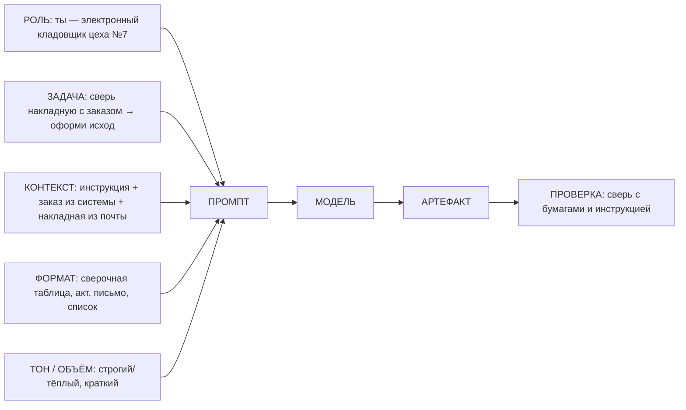
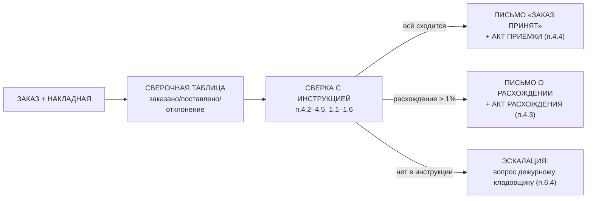
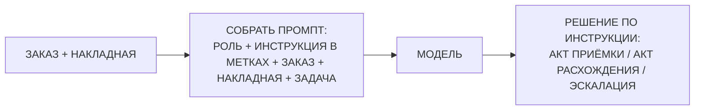

# Занятие 09. «Электронный кладовщик»

> Семестр 1 · Блок 2 «Приказы по уставу» · Курс 02, разделы `basic_applications` + `applied_prompting` · ~2 ч

## Миссия занятия

> «Твою ж изоленту! В системе заказы разложены по полочкам — ХимСнабу №214, СодаТресту №88, — а по почте приходят накладные простынёй, всё в одну строчку! Кладовщик-зумер тонет: сверять каждую поставку с заказом некогда! Собери ему помощника, молодежь: пусть сам кладёт накладную рядом с заказом, сверяет по строкам и оформляет исход — где всё чисто, где недосдача, а где излишки накатили! И по инструкции цеха отвечает, а не с потолка! Каждую цифру сверь — не доверяй черту на слово!»
> — Прораб Василич

**Задача квеста:** собрать прикладного агента — электронного кладовщика — как сквозной конвейер: заказ из системы + накладная реальной поставки из почты → сверочная таблица (заказано/поставлено/отклонение, с ИТОГО и контрольными суммами) → сверка с инструкцией цеха → ветвление исходов: полное соответствие — письмо «заказ принят» + акт приёмки (закрывающий документ); недосдача или излишки больше 1% — письмо поставщику о расхождении; вопрос вне инструкции — эскалация дежурному кладовщику. На двух поставщиках («ХимСнаб» №214 и «СодаТрест» №88) показать, что один и тот же рецепт промпта даёт разные артефакты.

**Итог занятия:** студент через агента принимает две поставки: ХимСнаб №214 сходится с заказом по всем строкам (108 900 = 108 900 руб) → письмо «заказ принят» + акт приёмки (п.4.4 инструкции); СодаТрест №88 расходится (заказ 73 000 против накладной 71 300: недосдача по соде кальцинированной −20%, излишек соли ≈+11%) → письмо о расхождении (п.4.3, излишки по п.4.5); кейс вне инструкции — честное «нет в инструкции» + передача вопроса дежурному кладовщику (п.6.4). Кладовщик остаётся на складе до конца семестра (занятия 11–13, 15–16).

---

## Слайды

| № | Тип | Название | Краткое содержание |
|---|-----|----------|--------------------|
| 1 | `image_group` | Комикс «Завал на складе» | 5 панелей: стол кладовщика-зумера в накладных-простынях, рядом система заказов → Василич: «сверяйте поставку с заказом!» → Алиса: «прикладной промптинг — поручение с точным ТЗ, один конвейер» → задача в камеру |
| 2 | `rich_text` | «Поручение с ТЗ» | Метафора Алисы: ИИ — новый сотрудник; «разбери бумажку» → вода; поручение с ТЗ (кому/что/контекст/формат/тон) → готово; миссия кладовщика |
| 3 | `rich_text` | «Рецепт кладовщика» | 5 ингредиентов: роль + задача + контекст (инструкция + заказ + накладная) + формат вывода + тон/объём; плюс проверка; Mermaid — конвейер с ветвлением `сходится → акт / расхождение → письмо / нет в бумагах → эскалация` |
| 4 | `rich_text` | «Письма: тон и структура» | Письмо-ответ по ТЗ: тип ответа («заказ принят»/«расхождение»), тон (деловой/строгий/тёплый), структура, объём; шаблон промпта кладовщика |
| 5 | `ai_comparison` | «Одно письмо — три тона» | Демо без проверки: 3 панели, одна модель (`openrouter/free`): строгое / деловое / тёплое письмо ХимСнабу о приёмке заказа №214; сравнить и выбрать тон |
| 6 | `rich_text` | «Таблицы: сырое в структуру» | Накладная-простыня + заказ → сверочная таблица (наименование/заказано/поставлено/отклонение/сумма); контрольные суммы; задел на з.11–12 (там pandas из готовых таблиц, здесь LLM из сырых бумаг) |
| 7 | `rich_text` | «Кладовщик по инструкции» | Три бумаги в промпте (инструкция + заказ + накладная в метках START/END CONTEXT): ответы только по документам; расхождение >1% → акт; вне инструкции — не выдумка, а эскалация дежурному (п.6.4); уточняющий вопрос; Mermaid; приватность |
| 8 | `quiz` | «Что в промпте у кладовщика?» | Из чего собирается промпт кладовщика (роль+заказ+накладная+инструкция в метках+задача) |
| 9 | `resources` | «Материалы смены» | Скачивание: памятка кладовщика, инструкция цеха, выписка заказов из системы, две накладных поставщиков, задание главной практики |
| 10 | `image` | Мем «инструкция и коробка» | Разрядка перед главной практикой (человек проверяет картинку) |
| 11 | `rich_text` | «Как проверять кладовщика» | Сверка таблиц с обеими бумагами (контрольные суммы), сверка акта и письма с инструкцией, эскалация вместо выдумки, экономика токенов (три дока, не база), приватность |
| 12 | `ai_task_chat` | «Кладовщик на смену» | Главная КТ: принять две поставки (ХимСнаб №214 — сошлось → акт приёмки; СодаТрест №88 — расхождения → письмо) через конвейер; кейс вне инструкции — эскалация; `checkPrompt` |
| 13 | `image_group` | Комикс-развязка «Кладовщик принял смену» | 4 панели: кладовщик-зумер с таблицами, актом и письмом, Василич принимает, доска «КЛАДОВЩИК v1.0»; врывается бухгалтерша: «Всё пропало!» → хук на з.10 (инъекция в письме) |

---

## Детали по слайдам

### 1. image_group — Комикс «Завал на складе»

- **Назначение:** завязка: продолжение хука занятия 08 («раз умеет думать — пусть работает»). В системе заказы разложены, но по почте приходят накладные простынёй, и их надо сверять с заказами; кладовщик-зумер не справляется; Василич поручает в камеру собрать электронного кладовщика; Алиса объясняет суть конвейера. См. `comic.md`, сцена 1.
- **Содержание:**
  - `title`: «Завал на складе»
  - `images`: 5 панелей (кадры 1.1–1.5 из `comic.md`, файлы `slide-01/01.png–05.png`)
  - `show_frames`: true
  - `description`: «Склад. Стол кладовщика-зумера (худи „СКЛАД №2“, карго, бакетхет) завален накладными-простынями от „ХИМСНАБ“ и „СОДАТРЕСТ“, на экране ноутбука — аккуратная система заказов. Василич с кибер-руками: „В системе всё лежит, а поставку с заказом сверять некому!“ Алиса с кружкой объясняет: прикладной промптинг — поручение с точным ТЗ, а кладовщик — один конвейер: заказ+накладная→таблица→сверка→акт или письмо. Стажёру поручают в камеру собрать электронного помощника, который останется на складе до конца семестра.»

### 2. rich_text — «Поручение с ТЗ»

- **Назначение:** первое понятие от Алисы, ввод в прикладной промптинг по `basic_applications`. Одна мысль: модель — как новый сотрудник, без ТЗ — вода, с ТЗ — готовый артефакт.
- **Содержание** (`markdown`):

```markdown
**Поручение с ТЗ.**

«Ох, деточка, представь: в цех пришёл новый сотрудник — толковый, но опыта ноль. Скажешь ему: „разбери бумажки“ — он набросает что-нибудь наугад. А дашь приказ с ТЗ: „ты — электронный кладовщик цеха №7: сверь накладную СодаТреста с заказом №88 по строкам, посчитай отклонения в штуках и рублях, сверь с инструкцией и оформи: где сходится — акт, где нет — письмо поставщику деловым тоном в три абзаца“ — сделает как надо.

С древним ИИ то же самое. Простая просьба даёт „воду“ и „наобум“. А **поручение с ТЗ** — роли, формата, тона, объёма — даёт рабочий результат: сверочную таблицу, чек-лист, акт, письмо-ответ. Это и есть **прикладной промптинг**: не „поговорить“, а получить готовый артефакт для дела.

Мы уже научили фиксика говорить по уставу (занятие 7) и думать вслух (занятие 8). Теперь соберём ему первое рабочее место: электронный кладовщик будет принимать поставки от двух поставщиков — сверять накладные с заказами и оформлять бумаги.

Подробнее — [прикладной промптинг](@prikladnoy-prompting).»
```

### 3. rich_text — «Рецепт кладовщика»

- **Назначение:** формальное объяснение ПОСЛЕ ввода: универсальный рецепт прикладного промпта кладовщика + его конвейер с ветвлением. Mermaid-схема.
- **Содержание** (`markdown`):

````markdown
**Рецепт кладовщика.**

«Любое поручение кладовщика собирается из пяти ингредиентов. Как коктейль — заменишь один, и вкус другой.



Конвейер кладовщика с ветвлением:



Каждый ингредиент — про своё: роль — как сотрудник, задача — что сделать, контекст — на каких бумагах работать (все документы в метках START CONTEXT/END CONTEXT), формат — таблица/акт/письмо, тон — строгий/тёплый. Без проверки рецепт не работает — сверяем с бумагами и инструкцией.

Подробнее — [прикладной промптинг](@prikladnoy-prompting).»
````

### 4. rich_text — «Письма: тон и структура»

- **Назначение:** по `writing_emails`: письмо-ответ — поручение, где критичны тип, тон и структура. Одна мысль: указали тип ответа, тон и структуру — письмо как надо.
- **Содержание** (`markdown`):

```markdown
**Письма: тон и структура.**

«Письмо-ответ — самый частый шаг кладовщика. Простая просьба „ответь поставщику“ даст „воду“. Добавишь тип ответа, тон, структуру и объём — получится письмо, которое можно отправлять.

Промпт-шаблон кладовщика:

```
Ты — электронный кладовщик цеха №7 завода «БытХимИскИнДеталь».
Ответь поставщику [кому: ХимСнаб / СодаТрест] по заказу [№214 / №88].
Тип ответа: [заказ принят — полное соответствие / расхождение — недосдача или излишки].
Тон: [строгий / деловой / тёплый]. Структура: приветствие, суть (что заказано,
что поставлено, отклонения в штуках и рублях), что просим (подтвердить /
допоставить / решить с излишками), подпись. Не больше 3 абзацев.
Факты — только из сверочной таблицы и инструкции.
```

Три тона на одно дело: **строгий** (нарушение сроков, спор по акту), **деловой** (факты), **тёплый** (договориться по-человечески). Меняется только строка про тип и тон — а результат разный. Перед отправкой письмо читаем: факты и цифры проверяет человек.

Подробнее — [прикладной промптинг](@prikladnoy-prompting).»
```

### 5. ai_comparison — «Одно письмо — три тона»

- **Назначение:** демо-эксперимент по `writing_emails`: одно письмо-ответ в трёх тонах на одной модели — видно, как меняется подача. Без проверки, вывод пригодится в главной практике (слайд 12). Не оцениваемый слайд.
- **Содержание:**
  - `title`: «Одно письмо — три тона»
  - `mergeInput`: true
  - `panels` (модель во всех панелях одна — `openrouter/free`, тон зависит только от промпта):
    - { label: «Строгий», model: `openrouter/free`, systemPrompt: «Ты — кладовщик цеха №7 завода „БытХимИскИнДеталь“. Пишешь поставщикам строгим деловым тоном: по факту, без лишних слов, с намёком на санкции за срыв поставок. Структура: приветствие, суть, что просим, подпись.», aiName: «Кладовщик (строгий)», allowFileUpload: false }
    - { label: «Деловой», model: `openrouter/free`, systemPrompt: «Ты — кладовщик цеха №7 завода „БытХимИскИнДеталь“. Пишешь поставщикам ровным деловым тоном: факты, цифры, сроки. Структура: приветствие, суть, что просим, подпись.», aiName: «Кладовщик (деловой)», allowFileUpload: false }
    - { label: «Тёплый», model: `openrouter/free`, systemPrompt: «Ты — кладовщик цеха №7 завода „БытХимИскИнДеталь“. Пишешь поставщикам доброжелательным, тёплым тоном: ценишь отношения, просишь помочь. Структура: приветствие, суть, что просим, подпись.», aiName: «Кладовщик (тёплый)», allowFileUpload: false }
  - `task` (Markdown): «Задай в общем поле один запрос: „Ответь поставщику «ХимСнаб» по заказу №214 (накладная — в файле pisma-postavschikov.md, заказ — в zakazy-postavschikam.md): поставка совпала с заказом по всем строкам, подтверди полную приёмку на сумму 108 900 руб, сообщи, что оформляешь акт приёмки как закрывающий документ, попроси уточнить срок следующей поставки“. Отправь во все три панели сразу и сравни, как тон меняет подачу. Выбери, какой тон уместнее для этого случая, и запомни вывод — он понадобится в главной практике.»

### 6. rich_text — «Таблицы: сырое в структуру»

- **Назначение:** по `table_generation`: структурирование сырой накладной и заказа в сверочную таблицу — основа приёмки. Одна мысль: задали колонки и формат — модель раскладывает «кашу» в таблицу; числа сверяем с исходниками. Задел на з.11–12: там таблицы уже готовые и их считает код pandas, здесь — LLM из сырого текста.
- **Содержание** (`markdown`):

```markdown
**Таблицы: сырое в структуру.**

«Заказ в системе — аккуратная таблица, а накладная из почты — простыня в одну строку. Модель сводит обе бумаги в одну **сверочную таблицу**, если указать колонки и формат:

```
Сведи заказ и накладную в таблицу. Колонки: наименование, заказано,
поставлено, отклонение, сумма по накладной. Формат: Markdown-таблица.
ИТОГО посчитай, отклонения пометь.
```

Получится таблица приёмки, которую видно с одного взгляда: где ноль, где недосдача, где излишек. Её можно перенести в Excel и в учёт. В занятиях 11–12 мы будем обрабатывать уже готовые таблицы кодом — а сейчас учимся превращать сырые бумаги в структуру силами модели.

Подвох: модель может переврать цифры или „додумать“ строку. Поэтому считаем контрольные суммы и сверяем с исходниками: ХимСнаб №214 — 108 900 = 108 900 руб, СодаТрест №88 — заказ 73 000, накладная 71 300 руб.

Подробнее — [прикладной промптинг](@prikladnoy-prompting).»
```

### 7. rich_text — «Кладовщик по инструкции»

- **Назначение:** ключевая теория по `build_chatbot_from_kb`: кладовщик работает по документам = набор коротких бумаг в промпте (START CONTEXT/END CONTEXT). Контраст с RAG занятия 5. Одна мысль: ответы — из документов; нет ответа в документах — не выдумка, а эскалация человеку; неоднозначность — уточняющий вопрос. Mermaid.
- **Содержание** (`markdown`):

````markdown
**Кладовщик по инструкции.**

«Теперь главное: кладовщик оформляет бумаги **по инструкции цеха**. Обучать модель заново не нужно — достаточно собрать правильный промпт. Это не RAG из занятия 5 (там много документов через поиск), а три коротких документа целиком в промпте — инструкция, заказ и накладная влезают в окно.



В промпт вставляем все три бумаги в метках:

```
START CONTEXT
…текст инструкции цеха…
END CONTEXT

START CONTEXT
…заказ №88 из системы…
END CONTEXT

START CONTEXT
…накладная из почты…
END CONTEXT

Задача: сверь строки, посчитай отклонения, оформи исход по инструкции.
```

Что это даёт:

- **Решения — из инструкции.** Сходится — акт приёмки (п.4.4); расхождение больше 1% — акт расхождения и письмо (п.4.3); излишки — на ответственное хранение (п.4.5).
- **Нет ответа в бумагах — эскалация, а не выдумка.** Спросили „Сколько бочек привезут в среду?“ — этого в инструкции нет: честное „нет в инструкции“ и передача вопроса дежурному кладовщику (п.6.4).
- **Уточняющий вопрос.** Неоднозначный запрос — модель переспрашивает, как опытный кладовщик.

Риск: если в бумагах ответа нет, модель может „додумать“ — это ловили в занятии 3. Хороший кладовщик отвечает только по своим бумагам, а сомнительное передаёт человеку. И помни: в промпт — только рабочие бумаги, секреты не кладём.

Подробнее — [прикладной промптинг](@prikladnoy-prompting).»
````

### 8. quiz — «Что в промпте у кладовщика?»

- **Назначение:** контрольная точка по слайду 7 (`build_chatbot_from_kb`): из чего собирается промпт кладовщика. Материал — `files/quiz-kladovschik.md`.
- **Содержание:**
  - `question`: «Из чего собирается промпт электронного кладовщика, который сверяет поставку с заказом и работает по инструкции?»
  - `markdown`: «Выбери один правильный вариант. Термины занятия — [в справке](@prikladnoy-prompting).»
  - `options`:
    - { text: «Роль (кладовщик) + заказ из системы + накладная из почты + инструкция цеха в метках START CONTEXT/END CONTEXT + задача», is_correct: true }
    - { text: «Только вопрос пользователя, без всякого контекста», is_correct: false }
    - { text: «Список всех секретов завода, чтобы отвечать на любые вопросы», is_correct: false }
    - { text: «Полная база знаний целиком в одном запросе», is_correct: false }
  - `explanation`: «Промпт кладовщика — роль + рабочие бумаги (заказ и накладная) + инструкция в метках START CONTEXT/END CONTEXT + задача. В отличие от RAG (занятие 5, много доков через поиск) здесь три коротких документа целиком — все влезают в окно (занятие 8). Полную базу не впихнуть, а секреты в промпты не кладут (приватность). Если ответа нет даже в бумагах — кладовщик не выдумывает, а эскалирует вопрос дежурному кладовщику (п.6.4).»

### 9. resources — «Материалы смены»

- **Назначение:** раздать материалы практики: памятку, инструкцию цеха, выписку заказов из системы, две накладных поставщиков и задание главной практики. Два поставщика — чтобы показать обе ветки конвейера.
- **Содержание:**
  - `title`: «Материалы смены»
  - `description` (Markdown): «Всё для практики занятия. В `pamyatka-kladovschika.md` — рецепт кладовщика и все приёмы. В `instrukciya-ceha.md` — инструкция цеха (база знаний: приёмка глицерина п.1.1–1.6, сверка и акты п.4.2–4.5, эскалация п.6.4). В `zakazy-postavschikam.md` — выписка из системы заказов: №214 ХимСнаб (108 900 руб, 6 позиций) и №88 СодаТрест (73 000 руб, 5 позиций). В `pisma-postavschikov.md` — две накладных из почты простынёй: №214 (108 900 — сойдётся) и №88 (71 300 — не сойдётся). В `zadanie-kladovschik.md` — бриф главной практики.»
  - `files`:
    - { name: `pamyatka-kladovschika.md`, description: «Памятка: рецепт кладовщика и все приёмы занятия» }
    - { name: `instrukciya-ceha.md`, description: «Инструкция цеха — база знаний кладовщика (приёмка п.1.1–1.6, сверка и акты п.4.2–4.5, эскалация п.6.4)» }
    - { name: `zakazy-postavschikam.md`, description: «Выписка из системы заказов: №214 ХимСнаб и №88 СодаТрест — эталоны для сверки (слайды 6, 12)» }
    - { name: `pisma-postavschikov.md`, description: «Две накладных из почты: №214 (совпадёт) и №88 (не совпадёт) — сырой текст для сверочных таблиц (слайды 6, 12)» }
    - { name: `zadanie-kladovschik.md`, description: «Задание главной практики: конвейер кладовщика на двух поставках (слайд 12)» }

### 10. image — Мем «инструкция и коробка»

- **Назначение:** сквозная тема — проверка: правильный ответ «зарыт» в длинной инструкции.
- **Содержание:**
  - `title`: «Мем: инструкция больше коробки»
  - `image_url`: `memes/images/m01296.jpg` (кандидат; картинку проверяет человек глазами — по правилам курса. Описание: коробка „дано“ и гигантская инструкция „найти“ — правильный ответ надо найти в документе, как кладовщик ищет в инструкции)
  - `description`: «Вопрос „дано“, ответ „найти“ — вон в той простыне. Так и кладовщик: решает по своим документам, а чего в них нет — передаёт человеку. Кандидаты для замены: `m00359` (МФЦ „документы мои документы“), `m01908` (офис, тендеры).»
- **Подбор:** `memes/pick_meme "документы, инструкция, найти в тексте"` (m01296 — 0.49, m00359 — 0.59) и `memes/pick_meme "работа с документами, бюрократия, бумаги"` (m01908 — 0.52).

### 11. rich_text — «Как проверять кладовщика»

- **Назначение:** подготовка к главной практике: результат кладовщика — рабочий артефакт (таблица пойдёт в учёт, акт — в бухгалтерию, письмо — поставщику) — проверка обязательна. Эскалация вместо выдумки, экономика токенов (три коротких дока, не база), приватность.
- **Содержание** (`markdown`):

```markdown
**Как проверять кладовщика.**

«Результат кладовщика — не „просто ответ“, а рабочий артефакт: таблица пойдёт в учёт (занятия 11–12), акт — в бухгалтерию, письмо — поставщику. Поэтому проверка обязательна.

1. **Сверь таблицу с обеими бумагами.** Каждую строку — и с заказом, и с накладной. Эталоны: ХимСнаб №214 — 108 900 = 108 900 руб; СодаТрест №88 — заказ 73 000, накладная 71 300 руб. Не сошлось — ищи, какую строку модель переврала.
2. **Сверь решение с инструкцией.** Расхождение и проценты — с п.4.3, излишки — с п.4.5, акт приёмки — с п.4.4, приёмка партии — с п.1.1–1.6. А вопрос „Сколько бочек в среду?“ — честное „нет в инструкции“ и эскалация дежурному (п.6.4), а не выдуманное число.
3. **Посчитай экономику.** В промпт кладём три коротких документа, а не всю базу (занятие 8 — окно контекста, занятие 5 — RAG для многих доков). Длинный контекст — токены = деньги.
4. **Без секретов.** В промпты — только рабочие бумаги. Пароли, ключи — никогда (приватность).

И главное: акт подписывает человек, письмо отправляет человек. Модель готовит бумаги — решение принимает человек. Кладовщик остаётся на складе до конца семестра: его таблицы лягут в сводки (з.11–12) и в итоговый отчёт (з.16).»
```

### 12. ai_task_chat — «Кладовщик на смену»

- **Назначение:** главная контрольная точка занятия — сквозной конвейер с обеими ветками на двух поставках. Проверка через `checkPrompt`. Материал — `files/zadanie-kladovschik.md` + `files/zakazy-postavschikam.md` + `files/pisma-postavschikov.md` + `files/instrukciya-ceha.md`.
- **Содержание:**
  - `task` (Markdown): «Не тяни резину! Поставь кладовщика на смену и прими две поставки.
    Заказы — в файле `zakazy-postavschikam.md` (система), накладные — в `pisma-postavschikov.md` (почта), инструкция — в `instrukciya-ceha.md`, бриф — в `zadanie-kladovschik.md` (загрузи в чат). Собери промпт кладовщика по рецепту: роль (электронный кладовщик цеха №7) + инструкция + заказ + накладная в метках START CONTEXT/END CONTEXT + задача. Затем прогони конвейер:
    1) **ХимСнаб №214** — сведи заказ и накладную в Markdown-таблицу (колонки: наименование, заказано, поставлено, отклонение, сумма) + ИТОГО, сверь с эталоном 108 900 = 108 900 руб; проверь приёмку по чек-листу п.1.1–1.6. Всё сошлось → напиши письмо „заказ принят“ и **акт приёмки** — закрывающий документ для бухгалтерии (п.4.4).
    2) **СодаТрест №88** — та же таблица, заказ 73 000 против накладной 71 300. Найди расхождения по строкам: недосдача по соде кальцинированной и излишек по соли технической, посчитай проценты (>1% → акт расхождения по п.4.3, излишек — по п.4.5).
    3) **Напиши два письма** — каждому поставщику своим тоном (выбери: строгий/деловой/тёплый, два разных) с отсылкой к таблице и пунктам инструкции, не больше 3 абзацев.
    4) **Кейс вне инструкции:** спроси кладовщика „Сколько бочек привезут в среду?“ — он должен честно сказать „нет в инструкции“ и **передать вопрос дежурному кладовщику** (п.6.4), а не выдумать число.
    Вставь в чат: промпт кладовщика, две сверочные таблицы с ИТОГО, два письма, акт приёмки, ответ на внеинструкционный вопрос и 2–3 строки выводов: где суммы сошлись, где модель пыталась выдумать, с чем сверял. Нажми „Проверить“.»
  - `systemPrompt`: «Ты — методист по работе с древними ИИ на заводе „БытХимИскИнДеталь“. Проверяешь, правильно ли стажёр собрал и протестировал электронного кладовщика: сверка поставок с заказами, оформление актов и писем по инструкции цеха. Отвечай коротко и по делу.»
  - `aiName`: «Методист»
  - `model`: `nvidia/nemotron-3-super-120b-a12b:free`
  - `chainOfThought`: false
  - `showCoT`: false
  - `allowFileUpload`: true
  - `checkPrompt`: «Оцени работу студента: собрал ли промпт кладовщика по рецепту (роль кладовщика + инструкция + заказ + накладная в метках START CONTEXT/END CONTEXT + задача); собрал ли две сверочные таблицы с колонками (наименование, заказано, поставлено, отклонение, сумма) и ИТОГО, сверенными с эталонами (ХимСнаб №214 — 108 900 = 108 900, СодаТрест №88 — заказ 73 000 против накладной 71 300); нашёл ли расхождения СодаТреста по строкам (недосдача по соде кальцинированной −20%, излишек соли ≈+11%, оба больше 1% → акт расхождения п.4.3); оформил ли по ХимСнабу письмо „заказ принят“ и акт приёмки как закрывающий документ (п.4.4); написал ли два письма разными тонами (строгий/деловой/тёплый) до 3 абзацев с отсылкой к таблице и инструкции; кейс вне инструкции — честное „нет в инструкции“ плюс передача вопроса дежурному кладовщику (п.6.4), а не выдумка; есть ли выводы про проверку. Ответь „да“ или „нет“ с кратким пояснением.»

### 13. image_group — Комикс-развязка «Кладовщик принял смену»

- **Назначение:** развязка: кладовщик-зумер с таблицами, актом и письмом, Василич принимает, бейдж «КЛАДОВЩИК v1.0» на доске; кладовщик остаётся на складе (хук на з.11 — данные и pandas, и на з.10 — инъекция в письме). См. `comic.md`, сцена 2.
- **Содержание:**
  - `title`: «Кладовщик принял смену»
  - `images`: 4 панели (кадры 2.1–2.4 из `comic.md`, файлы `slide-13/01.png–04.png`)
  - `show_frames`: true
  - `description`: «Склад. На столе — сверочные таблицы „№214: 108 900 = 108 900 ✓“ и „№88: 73 000 ≠ 71 300“ с пометками, акт приёмки и письмо о расхождении. Кладовщик-зумер (худи „СКЛАД №2“) довольно: „Теперь сверку сам делает!“ Василич сверяет с инструкцией: „По уставу решает, а чего нет в бумагах — человеку передаёт!“ На доске рядом с „УСТАВ СМЕНЫ“ — новый лист „КЛАДОВЩИК v1.0: ЗАКАЗ+НАКЛАДНАЯ→ТАБЛИЦА→СВЕРКА→АКТ/ОТВЕТ“ и пометка „ОСТАЁТСЯ НА СКЛАДЕ“. Врывается бухгалтерша с папками: „ВАСИЛИЧ! ВСЁ ПРОПАЛО! ТАМ ПИСЬМО С…!“ — обрыв. Что в письме — узнаем в з.10 (инъекция в письме поставщика).»

---

## Доп. информация

Блоки дополнительной информации (вкладка «Доп. информация» на платформе; слаги — общие на курс sem1).
Наполнение блоков — в `content/sem1/extra/<слаг>.md`.

| Слаг | Слайд | Ссылка на слайде |
|---|---|---|
| `prikladnoy-prompting` | 2, 3, 4, 6, 7, 8, 11 | «прикладной промптинг» |
