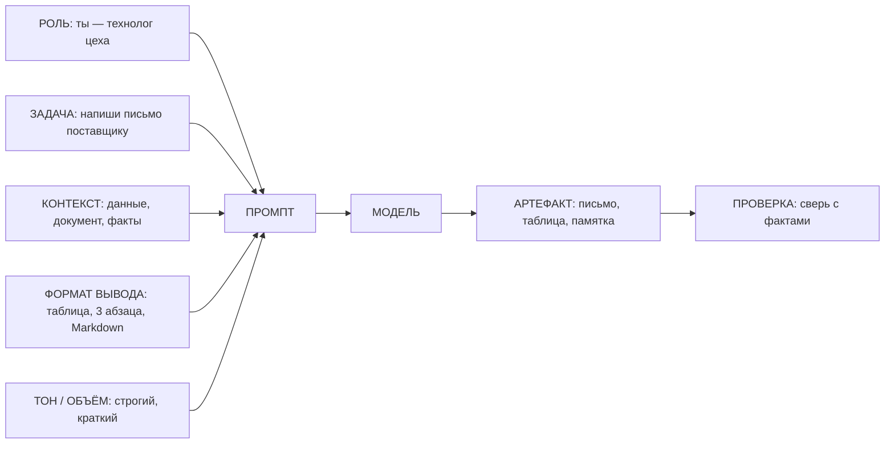
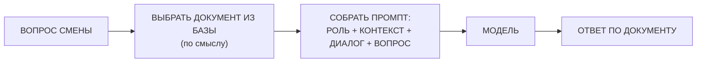

# Занятие 09. «Заставить ИИ работать: прикладной промптинг»

> Семестр 1 · Блок 2 «Приказы по уставу» · Курс 02, разделы `basic_applications` + `applied_prompting` · ~2 ч

## Миссия занятия

> «Научили черта думать вслух — а он ведь и читать, и писать умеет! Так и работай, молодежь: письма
> поставщикам, памятки смене, таблицы для учёта. И собери мне дежурного, который по инструкции отвечает,
> а не выдумывает с потолка!»
> — Прораб Василич

**Задача квеста:** перевести навыки промптинга (занятия 7–8) в реальную пользу завода: научиться давать
модели «поручение с точным ТЗ» — письма, сводки, памятки, таблицы — и собрать чат-бота на базе знаний
(«дежурного по инструкциям»).

**Итог занятия:** студент через агента собирает «инструменты смены»: сравнивает три тона письма
поставщику, структурирует сырую накладную в таблицу, сжимает инструкцию цеха в памятку-чек-лист
и собирает чат-бота на базе знаний завода; каждую работу сверяет с исходными документами
(проверка результата).

---

## Слайды

| № | Тип | Название | Краткое содержание |
|---|-----|----------|--------------------|
| 1 | `image_group` | Комикс «Заставить ИИ работать» | 5 панелей: Василич: «раз думать умеет — пусть работает» (письма, таблицы, памятки, дежурный) → Алиса: «прикладной промптинг — поручение с точным ТЗ» → задача в камеру: собрать инструменты смены |
| 2 | `rich_text` | «Поручение с ТЗ» | Метафора Алисы: ИИ — новый сотрудник; «напиши письмо» → вода; поручение с ТЗ (кому, что, формат, тон) → как надо; миссия занятия |
| 3 | `rich_text` | «Рецепт прикладного промпта» | 5 ингредиентов: роль + задача + контекст + формат вывода + тон/объём; плюс проверка; Mermaid |
| 4 | `rich_text` | «Письма: тон и структура» | Письмо поставщику по ТЗ: тон (деловой/строгий/тёплый), структура, объём; пример промпта-шаблона |
| 5 | `ai_comparison` | «Одно письмо — три тона» | 3 панели, одна модель (`openrouter/free`): строгое / деловое / вежливое письмо о задержке поставки; сравнить и выбрать под случай |
| 6 | `rich_text` | «Сводки: сжать до сути» | Сводка длинного текста: задать объём, аудиторию, что важно; связка с «длинным текстом» з.8 |
| 7 | `rich_text` | «Таблицы: сырое в структуру» | Сырой текст (накладная, отчёт) → таблица; задать колонки и формат (Markdown/CSV); числа сверять с исходником; задел на з.11–12 |
| 8 | `ai_task_chat` | «Накладная в таблицу» | Контрольная точка 1: сырая накладная → таблица с колонками + контрольная сумма; `checkPrompt` |
| 9 | `rich_text` | «Памятки и чек-листы» | Инструкция → памятка/чек-лист для смены: задать формат и «что важно»; связка со сводками слайда 6; пункты сверять с инструкцией |
| 10 | `ai_task_chat` | «Памятка для смены» | Контрольная точка 2: чек-лист «Приёмка партии глицерина» (п. 1.1–1.6) из инструкции цеха; пункты сверить с инструкцией; `checkPrompt` |
| 11 | `rich_text` | «Диспетчер по инструкциям» | Чат-бот на базе знаний: роль + START CONTEXT/END CONTEXT + диалог + вопрос; ответы из контекста; риск выдумки вне контекста; уточняющий вопрос; Mermaid |
| 12 | `video` | «Конвейер диспетчера» | Manim ~60 с (только сценарий): интент → документ из базы → сборка промпта → ответ по фактам; вне контекста — «не знаю» vs «выдумал» |
| 13 | `quiz` | «Что в промпте у диспетчера?» | Контрольная точка по слайду 11: из чего собирается промпт чат-бота с базой знаний |
| 14 | `resources` | «Материалы смены» | Скачивание: памятка, инструкция цеха (база знаний), накладная, задание главной практики |
| 15 | `image` | Мем «инструкция и коробка» | Разрядка перед главной практикой (человек проверяет картинку) |
| 16 | `rich_text` | «Как проверять результат» | Прикладной результат — рабочий артефакт: сверка с фактами/исходником; экономика токенов (длинный контекст); приватность |
| 17 | `ai_task_chat` | «Диспетчер на дежурство» | Главная контрольная точка: собрать чат-бота по инструкции цеха, протестировать 3 кейса (по инструкции / вне инструкции / уточняющий вопрос); `checkPrompt` |
| 18 | `image_group` | Комикс-развязка «Инструменты смены» | 4 панели: инструменты на доске, Василич принимает; врывается испуганная бухгалтерша: «Всё пропало!» → хук на занятие 10 (словесные хакеры) |

---

## Детали по слайдам

### 1. image_group — Комикс «Заставить ИИ работать»

- **Назначение:** завязка занятия: продолжение хука занятия 08 («раз умеет думать вслух — пусть работает»).
  Василич поручает в камеру: «заставить ИИ работать» — письма, таблицы, памятки, дежурный по инструкциям;
  Алиса объясняет суть прикладного промптинга. См. `comic.md`, сцена 1.
- **Содержание:**
  - `title`: «Заставить ИИ работать»
  - `images`: 5 панелей (кадры 1.1–1.5 из `comic.md`, файлы `slide-09/01.png–05.png`)
  - `show_frames`: true
  - `description`: «Аппаратная. Василич доволен: дежурный стал „думать вслух“ и считать верно. „Раз умеет —
    пусть и работает! Письма поставщикам, памятки смене, таблицы для учёта!“ Алиса объясняет: это
    прикладной промптинг — поручение модели с точным ТЗ, как приказ новому сотруднику. Стажёру поручают:
    собрать рабочие инструменты смены и дежурного, который отвечает по инструкции, а не выдумывает.»

### 2. rich_text — «Поручение с ТЗ»

- **Назначение:** первое понятие от имени Алисы (п.7 шаблона), ввод в прикладной промптинг по лекции
  `basic_applications` курса-02. Одна мысль: модель — как новый сотрудник, которому нужно поручение
  с точными требованиями (кто, что, в каком формате, каким тоном).
- **Содержание** (`markdown`):

```markdown
**Поручение с ТЗ.**

«Представь, деточка, что в цех пришёл новый сотрудник — толковый, но опыта ноль. Скажешь ему: „напиши
письмо“ — он напишет что-нибудь, наугад. А дашь приказ с ТЗ: „поставщику, про задержку, строгим тоном,
три абзаца, чтобы цифры были“ — сделает как надо.

С древним ИИ то же самое. Простая просьба даёт „воду“ и „наобум“. А **поручение с ТЗ** — роли, формата,
тона, объёма — даёт рабочий результат: письмо, таблицу, памятку. Это и есть **прикладной промптинг**: не
„поговорить“, а получить готовый артефакт для дела.

Мы уже научили фиксика говорить по уставу (занятие 7) и думать вслух (занятие 8). Теперь — заставим его
работать: соберём письма, таблицы, памятки и дежурного по инструкциям.

Подробнее — [прикладной промптинг](@prikladnoy-prompting).»
```

### 3. rich_text — «Рецепт прикладного промпта»

- **Назначение:** формальное объяснение ПОСЛЕ ввода (п.7 шаблона): универсальный рецепт прикладного
  промпта из пяти ингредиентов + обязательная проверка. Mermaid-схема.
- **Содержание** (`markdown`):

````markdown
**Рецепт прикладного промпта.**

«Любое прикладное поручение собирается из пяти ингредиентов. Как коктейль — заменишь один, и вкус другой.



Каждый ингредиент отвечает за своё:

- **Роль** — как сотрудник: технолог, кладовщик, методист.
- **Задача** — что сделать: написать, собрать, разложить.
- **Контекст** — на каких данных работать (вставляем документ, цифры, факты).
- **Формат вывода** — таблица, список, абзацы, разметка.
- **Тон и объём** — строгий/тёплый, краткий/подробный.

И помним: рецепт не отменяет проверку — результат сверяем с исходными документами.

Подробнее — [прикладной промптинг](@prikladnoy-prompting).»
````

### 4. rich_text — «Письма: тон и структура»

- **Назначение:** первое прикладное умение по лекции `writing_emails` курса-02: письмо — это поручение,
  где критичны тон и структура. Одна мысль: указали тон и структуру — письмо как надо, а не „вода“.
- **Содержание** (`markdown`):

```markdown
**Письма: тон и структура.**

«Письмо — самый частый прикладной запрос. Простая просьба „напиши письмо поставщику“ даст „воду“.
Добавишь тон, структуру и объём — получится письмо, которое можно отправлять.

Промпт-шаблон:

```
Ты — снабженец завода «БытХимИскИнДеталь».
Напиши письмо поставщику [кому] о [событии: задержке поставки].
Строгим деловым тоном. Структура: приветствие, суть проблемы,
что мы просим (срок, цифры), подпись. Не больше 3 абзацев.
```

Три тона на одно дело: **строгий** (нарушение — санкции), **деловой** (факты по делу), **тёплый**
(договориться по-человечески). Меняется только строка про тон — а результат разный. Перед отправкой
письмо читаем: модель пишет быстро, но факты и цифры проверить должен человек.

Подробнее — [прикладной промптинг](@prikladnoy-prompting).»
```

### 5. ai_comparison — «Одно письмо — три тона»

- **Назначение:** практика-эксперимент по лекции `writing_emails` курса-02: одно и то же письмо
  в трёх тонах на одной модели — видно, как меняется подача. Результат студент использует в выводах
  главной практики (слайд 17).
- **Содержание:**
  - `title`: «Одно письмо — три тона»
  - `mergeInput`: true
  - `panels` (модель во всех панелях одна — `openrouter/free`, тон зависит только от промпта; роутер
    кидает случайную бесплатную модель, для писем этого достаточно):
    - { label: «Строгий», model: `openrouter/free`, systemPrompt: «Ты — снабженец завода
      „БытХимИскИнДеталь“. Пишешь письма строгим деловым тоном: по факту, без лишних слов, с намёком
      на санкции. Структура: приветствие, суть, что просим, подпись.», aiName: «Снабженец (строгий)»,
      allowFileUpload: false }
    - { label: «Деловой», model: `openrouter/free`, systemPrompt: «Ты — снабженец завода
      „БытХимИскИнДеталь“. Пишешь письма ровным деловым тоном: факты, цифры, сроки. Структура:
      приветствие, суть, что просим, подпись.», aiName: «Снабженец (деловой)», allowFileUpload: false }
    - { label: «Тёплый», model: `openrouter/free`, systemPrompt: «Ты — снабженец завода
      „БытХимИскИнДеталь“. Пишешь письма доброжелательным, тёплым тоном: ценишь отношения, просишь
      помочь. Структура: приветствие, суть, что просим, подпись.», aiName: «Снабженец (тёплый)»,
      allowFileUpload: false }
  - `task` (Markdown): «Задай в общем поле один запрос: „Напиши письмо поставщику „ХимСнаб“ про задержку
    поставки глицерина: обещали 200 бочек к 1-му, привезли 120, остальное — через неделю. Мы просим
    ускориться и дать точный срок“. Отправь во все три панели сразу и сравни, как тон меняет подачу.
    Определи, в каком случае письмо уместнее всего (по ситуации), и запиши вывод — он понадобится
    в главной практике.»

### 6. rich_text — «Сводки: сжать до сути»

- **Назначение:** по лекции `summarize` курса-02: сводка длинного текста с заданными объёмом и аудиторией.
  Связка с приёмами длинного текста з.8.
- **Содержание** (`markdown`):

```markdown
**Сводки: сжать до сути.**

«В архиве — длинные инструкции и отчёты, а дирекции нужна выжимка. Модель сжимает текст, если задать
условия: **объём**, **аудиторию** и **что важно**.

Пример поручения:

```
Сократи инструкцию ниже до 5 пунктов для новой смены:
только что делать, без воды и истории.
Пиши короткими фразами.
```

Полезно и наоборот: спросить модель, о чём текст («сделай оглавление») — быстро понять структуру, не
читая всё. Это продолжение темы „длинный текст“ из занятия 8: сводка — это тоже работа с большим
документом, только сжатие до сути, а не пошаговый разбор.

Сводку сверяем с исходником: модель могла упустить важное или „додумать“ деталь.

Подробнее — [прикладной промптинг](@prikladnoy-prompting).»
```

### 7. rich_text — «Таблицы: сырое в структуру»

- **Назначение:** по лекции `table_generation` курса-02: структурирование сырого текста в таблицу —
  основа для Excel, баз данных и отчётов. Одна мысль: задали колонки и формат — модель раскладывает
  «кашу» в таблицу; числа сверяем с исходником.
- **Содержание** (`markdown`):

```markdown
**Таблицы: сырое в структуру.**

«Накладная написана „сплошным текстом“, а для учёта нужна таблица. Модель раскладывает сырые данные
в структуру, если указать **колонки** и **формат**:

```
Разложи текст ниже в таблицу. Колонки: наименование, количество,
цена за единицу, сумма. Формат: Markdown-таблица. Сумму посчитай.
```

Получится таблица, которую можно перенести в Excel, сводку или базу. Это фундамент следующих занятий
(11–12): там мы будем обрабатывать настоящие таблицы и Excel — а сейчас учимся превращать сырой текст
в структуру силами одной модели.

Подвох: модель может переврать цифры или „додумать“ строку. Поэтому считаем контрольную сумму и сверяем
с исходным документом.

Подробнее — [прикладной промптинг](@prikladnoy-prompting).»
```

### 8. ai_task_chat — «Накладная в таблицу»

- **Назначение:** контрольная точка 1 (структурирование данных): студент через агента разбирает сырую
  накладную в таблицу, считает контрольную сумму и сверяет с исходником. Проверка через `checkPrompt`.
  Материал — `files/nakladnaya-syro.md`.
- **Содержание:**
  - `task` (Markdown): «Разбери сырую накладную в таблицу.
    Сырой текст накладной — в файле `nakladnaya-syro.md` (загрузи его в чат). Поручение агенту:
    1) Разложи текст в Markdown-таблицу с колонками: наименование, количество, цена за единицу, сумма.
    2) Посчитай общую сумму и добавь строку „ИТОГО“.
    3) Сверь числа с исходником: каждое количество, цену и сумму.
    Вставь в чат итоговую таблицу и 2–3 строки: совпала ли сумма с контрольной из исходника, была ли
    ошибка и как её заметили. Нажми „Проверить“.»
  - `systemPrompt`: «Ты — методист по работе с древними ИИ на заводе „БытХимИскИнДеталь“. Проверяешь,
    правильно ли стажёр структурировал данные. Отвечай коротко и по делу.»
  - `aiName`: «Методист»
  - `model`: `nvidia/nemotron-3-super-120b-a12b:free`
  - `chainOfThought`: false
  - `showCoT`: false
  - `allowFileUpload`: true
  - `checkPrompt`: «Оцени работу студента: разложил ли он сырую накладную в таблицу с нужными колонками
    (наименование, количество, цена за единицу, сумма); посчитал ли итоговую сумму; сверил ли числа
    с исходником (контрольная сумма из файла) и заметил ли ошибку модели, если она была; написал ли вывод.
    Верные суммы из исходника: общая стоимость — 134 600 руб. Ответь „да“ или „нет“ с кратким пояснением.»

### 9. rich_text — «Памятки и чек-листы»

- **Назначение:** по лекции `summarize` курса-02: сжатие инструкции в памятку/чек-лист для смены.
  Одна мысль: задали формат и «что важно» — модель превращает длинную инструкцию в памятку;
  пункты сверяем с инструкцией.
- **Содержание** (`markdown`):

```markdown
**Памятки и чек-листы.**

«Инструкция цеха — на две страницы, а смене нужен листок: что делать и в каком порядке. Модель сжимает
инструкцию в памятку-чек-лист, если указать **формат** и **что важно**:

```
Сделай из инструкции ниже памятку-чек-лист для новой смены.
Только действия, по шагам, без пояснений. 5–7 пунктов.
```

Это сводка из занятия 6, только в виде готовых шагов для работы. Смена смотрит в листок — и делает.

Но модель может упустить шаг или „додумать“ пункт. Поэтому **каждый пункт памятки сверяем с инструкцией**:
закралось ли что-то лишнее или потерянное. Так и памятка станет точной, и потренируем проверку результата.

Подробнее — [прикладной промптинг](@prikladnoy-prompting).»
```

### 10. ai_task_chat — «Памятка для смены»

- **Назначение:** контрольная точка 2 (сжатие в памятку): студент через агента превращает инструкцию цеха
  в памятку-чек-лист и проверяет каждый пункт по исходнику. Проверка через `checkPrompt`.
  Материал — `files/instrukciya-ceha.md`.
- **Содержание:**
  - `task` (Markdown): «Составь памятку-чек-лист для новой смены.
    Инструкция цеха — в файле `instrukciya-ceha.md` (загрузи его в чат). Поручение агенту:
    1) Сделай из инструкции памятку-чек-лист „Приёмка партии глицерина“: только действия по шагам,
       из пунктов 1.1–1.6 инструкции, без пояснений.
    2) 5–7 пунктов, каждый — одна фраза.
    3) Сверь каждый пункт памятки с инструкцией: ничего не пропущено и не придумано.
    Вставь в чат готовую памятку в Markdown и 2–3 строки: все ли пункты соответствуют инструкции, нашёл
    ли ты ошибку модели. Нажми „Проверить“.»
  - `systemPrompt`: «Ты — методист по обучению на заводе „БытХимИскИнДеталь“. Проверяешь памятки-чек-листы,
    которые стажёр составил с помощью ИИ. Отвечай коротко и по делу.»
  - `aiName`: «Методист»
  - `model`: `nvidia/nemotron-3-super-120b-a12b:free`
  - `chainOfThought`: false
  - `showCoT`: false
  - `allowFileUpload`: true
  - `checkPrompt`: «Оцени работу студента: превратил ли он инструкцию цеха в памятку-чек-лист „Приёмка
    партии глицерина“ по пунктам 1.1–1.6 (вызвать лаборанта и кладовщика, проверить документы, проверить
    целостность бочек, отобрать пробу из 3 бочек, дождаться заключения лаборанта, опломбировать ёмкость
    и записать пломбу); 5–7 пунктов без пояснений; сверил ли каждый пункт с инструкцией и заметил ли
    ошибку модели, если была; написал ли вывод. Ответь „да“ или „нет“ с кратким пояснением.»

### 11. rich_text — «Диспетчер по инструкциям»

- **Назначение:** ключевая теория занятия по заданию `build_chatbot_from_kb` курса-02: чат-бот на базе
  знаний = промпт из роли + контекста (документ) + диалога + вопроса. Одна мысль: ответы берутся из
  контекста, вне контекста модель выдумывает. Mermaid-схема. Связка с з.3 (галлюцинации) и з.5 (поиск
  по смыслу).
- **Содержание** (`markdown`):

````markdown
**Диспетчер по инструкциям.**

«Теперь главное: соберём дежурного, который отвечает смене **по инструкции завода**. Такого не нужно
обучать заново — достаточно собрать правильный промпт.



В промпт вставляется **документ из базы знаний** — как контекст, ограниченный метками:

```
START CONTEXT
…текст инструкции цеха…
END CONTEXT

Вопрос: Как принять партию глицерина?
```

Что это даёт:

- **Ответы — из контекста.** Вопрос по инструкции — модель отвечает по документу, точно.
- **Вне контекста — не выдумывать.** Спросили „Сколько бочек в среду?“ — а в инструкции этого нет:
  модель должна честно сказать „не знаю / в инструкции нет“.
- **Уточняющий вопрос.** Неоднозначный запрос — модель переспрашивает, как опытный диспетчер.

Риск: если в контексте ответа нет, модель может „додумать“ — это мы уже ловили на занятии 3.
Хороший дежурный отвечает только по своим документам.

Подробнее — [прикладной промптинг](@prikladnoy-prompting).»
````

### 12. video — «Конвейер диспетчера»

- **Назначение:** наглядно показать механизм чат-бота на базе знаний: как из вопроса получается ответ
  по документу и что происходит, когда ответа в базе нет. Технический ролик (Manim). По договорённости —
  только сценарий + набросок кода (`videos/`), рендер позже.
- **Содержание:**
  - `title`: «Конвейер диспетчера»
  - `video_url`: `videos/09-konveyer-dispetchera.mp4` (отрендеренный файл — будет)
  - `video_type`: `direct`
  - `description`: «Технический ролик: смена спрашивает диспетчера „КАК ПРИНЯТЬ ПАРТИЮ ГЛИЦЕРИНА?“. Шаг 1 —
    „ПОИСК ПО СМЫСЛУ“ вытаскивает из базы знаний лист „ИНСТРУКЦИЯ: ПРИЁМКА СЫРЬЯ“. Шаг 2 — сборка промпта:
    „РОЛЬ + КОНТЕКСТ [лист] + ВОПРОС“. Шаг 3 — ответ по фактам листа. Второй вопрос „СЕГОДНЯ ДОЖДЬ?“ —
    в базе ответа нет: честное „НЕ ЗНАЮ, В БАЗЕ НЕТ“ (зелёная галочка) против „ВЫДУМАЛ“ (красный крест).
    Вывод: „ОТВЕЧАЙ ТОЛЬКО ПО СВОИМ ДОКУМЕНТАМ“. Программа-сценарий: `videos/manim/09-konveyer-dispetchera.py`
    (см. `video-guide.md`).»
- **План ролика (примерный сценарий, ~60 с):** см. раздел «Видео: план ролика» ниже.

### 13. quiz — «Что в промпте у диспетчера?»

- **Назначение:** контрольная точка по слайду 11 (задание `build_chatbot_from_kb` курса-02): проверить,
  понял ли студент, из чего собирается промпт чат-бота с базой знаний. Материал — `files/quiz-dispetcher.md`.
- **Содержание:**
  - `question`: «Из чего собирается промпт чат-бота, который отвечает по базе знаний?»
  - `markdown`: «Выбери один правильный вариант. Термины занятия — [в справке](@prikladnoy-prompting).»
  - `options`:
    - { text: «Роль + документ из базы знаний (контекст) + история диалога + вопрос», is_correct: true }
    - { text: «Только вопрос пользователя, без всякого контекста», is_correct: false }
    - { text: «Список всех секретов завода, чтобы отвечать на любые вопросы», is_correct: false }
    - { text: «Полная база знаний целиком в одном запросе», is_correct: false }
  - `explanation`: «Промпт дежурного — это роль + нужный документ из базы (контекст в метках
    START CONTEXT/END CONTEXT) + история диалога + вопрос. Полную базу в одно „окно“ не впихнуть
    (занятие 8), а секреты в промпты не кладут вовсе (приватность).»

### 14. resources — «Материалы смены»

- **Назначение:** раздать материалы практики: памятку приёмов, инструкцию цеха (база знаний),
  сырую накладную и задание главной практики.
- **Содержание:**
  - `title`: «Материалы смены»
  - `description` (Markdown): «Всё для практики занятия. В `pamyatka-prikladnoy-prompting.md` — рецепт
    прикладного промпта и все приёмы. В `instrukciya-ceha.md` — инструкция цеха (база знаний): по ней
    составишь памятку (слайд 10) и соберёшь дежурного (слайд 17). В `nakladnaya-syro.md` — сырая накладная
    для таблицы (слайд 8). В `zadanie-instrumenty-smeny.md` — бриф главной практики.»
  - `files`:
    - { name: `pamyatka-prikladnoy-prompting.md`, description: «Памятка: рецепт прикладного промпта и все приёмы занятия» }
    - { name: `instrukciya-ceha.md`, description: «Инструкция цеха — база знаний завода (для памятки и дежурного)» }
    - { name: `nakladnaya-syro.md`, description: «Сырая накладная — текст для таблицы (слайд 8)» }
    - { name: `zadanie-instrumenty-smeny.md`, description: «Задание главной практики: дежурный по инструкциям (слайд 17)» }

### 15. image — Мем «инструкция и коробка»

- **Назначение:** разрядка после блока теории и перед главной практикой. Сквозная тема — проверка
  результата: правильный ответ «зарыт» в длинной инструкции.
- **Содержание:**
  - `title`: «Мем: инструкция больше коробки»
  - `image_url`: `memes/images/m01296.jpg` (кандидат; картинку проверяет человек глазами — по правилам
    курса. Описание: коробка „дано“ и гигантская инструкция „найти“ — правильный ответ надо найти
    в документе, как дежурный ищет в базе знаний)
  - `description`: «Вопрос „дано“, ответ „найти“ — вон в той простыне. Так и дежурный: отвечает по своим
    документам, а не с потолка. Кандидаты для замены: `m00359` (МФЦ „документы мои документы“ — бумаги,
    которые надо разбирать), `m01908` (офис, тендеры — „просто подаём заявки“: документы и отчёты).»
- **Подбор:** `memes/pick_meme "документы, инструкция, найти в тексте"` (m01296 — 0.49, m00359 — 0.59)
  и `memes/pick_meme "работа с документами, бюрократия, бумаги"` (m01908 — 0.52, m00359 — 0.50).
  Все кандидаты — `is_clean=true`, картинку проверяет человек глазами.

### 16. rich_text — «Как проверять результат»

- **Назначение:** подготовка к главной практике: прикладной результат — рабочий артефакт (письмо уйдёт,
  таблица пойдёт в отчёт, дежурный отвечает смене) — проверка обязательна. Экономика токенов
  (длинный контекст) и приватность (в промпты только рабочие данные).
- **Содержание** (`markdown`):

```markdown
**Как проверять результат.**

«Прикладной результат — не „просто ответ“, а рабочий артефакт: письмо отправится, таблица попадёт
в отчёт, дежурный будет отвечать смене. Поэтому проверка обязательна.

1. **Сверь с исходником.** Письмо — с фактами заказа; таблицу — с накладной (контрольная сумма);
   памятку — с инструкцией; ответы дежурного — с документом из базы.
2. **Посчитай экономику.** Длинный контекст — это токены. База знаний в каждом запросе стоит денег:
   поэтому в промпт кладём только нужный документ, а не всё сразу (занятие 8).
3. **Без секретов.** В промпты — только рабочие данные. Пароли, ключи, личные данные — никогда
   (приватность): дежурный отвечает смене, а не раздаёт чужие тайны.

И главное: модель быстрая и вежливая, но проверяет за неё человек.»
```

### 17. ai_task_chat — «Диспетчер на дежурство»

- **Назначение:** главная контрольная точка занятия по заданию `build_chatbot_from_kb` курса-02: студент
  собирает промпт чат-бота на базе знаний и тестирует три кейса. Проверка через `checkPrompt`.
  Материал — `files/zadanie-instrumenty-smeny.md` + `files/instrukciya-ceha.md`.
- **Содержание:**
  - `task` (Markdown): «Собери дежурного по инструкциям и проверь его.
    Инструкция цеха — в файле `instrukciya-ceha.md`, бриф — в `zadanie-instrumenty-smeny.md` (загрузи
    в чат). Собери промпт дежурного по рецепту: роль + документ (контекст в метках START CONTEXT/END
    CONTEXT) + история диалога + вопрос. Затем протестируй три кейса:
    1) **По инструкции:** „Как принять партию глицерина?“ — ответ должен быть из документа.
    2) **Вне инструкции:** „Сколько бочек привезут в среду?“ — в инструкции этого нет; дежурный должен
       честно сказать, что не знает, а не выдумать.
    3) **Неоднозначный вопрос:** „Что делать с сырьём?“ — дежурный должен уточнить, о каком сырье речь.
    Вставь в чат собранный промпт, ответы на три кейса и 2–3 строки выводов: где ответ был из контекста,
    где модель попыталась выдумать и что ты сделал. Нажми „Проверить“.»
  - `systemPrompt`: «Ты — методист по работе с древними ИИ на заводе „БытХимИскИнДеталь“. Проверяешь,
    правильно ли стажёр собрал и протестировал дежурного на базе знаний. Отвечай коротко и по делу.»
  - `aiName`: «Методист»
  - `model`: `nvidia/nemotron-3-super-120b-a12b:free`
  - `chainOfThought`: false
  - `showCoT`: false
  - `allowFileUpload`: true
  - `checkPrompt`: «Оцени работу студента: собрал ли он промпт дежурного по рецепту (роль + контекст
    документа в метках START CONTEXT/END CONTEXT + диалог + вопрос); протестировал ли три кейса (вопрос
    по инструкции, вопрос вне инструкции — модель должна честно отказаться, неоднозначный вопрос —
    модель должна переспросить); написал ли выводы о том, где ответ был из контекста, а где модель
    пыталась выдумать; помнит ли про проверку результата и про то, что в промпт не кладут секреты.
    Ответь „да“ или „нет“ с кратким пояснением.»

### 18. image_group — Комикс-развязка «Инструменты смены»

- **Назначение:** развязка сюжета: инструменты смены собраны и висят на доске; Василич принимает работу;
  в аппаратную врывается испуганная бухгалтерша: «Всё пропало!» → хук на занятие 10 (словесные хакеры).
  См. `comic.md`, сцена 2.
- **Содержание:**
  - `title`: «Инструменты смены»
  - `images`: 4 панели (кадры 2.1–2.4 из `comic.md`, файлы `slide-09/06.png–09.png`)
  - `show_frames`: true
  - `description`: «В аппаратной на доске — листы: „ПИСЬМО ПОСТАВЩИКУ“, „ТАБЛИЦА: НАКЛАДНАЯ“,
    „ТЕСТ ДЛЯ НОВИЧКОВ“, „ДЕЖУРНЫЙ ПО ИНСТРУКЦИЯМ“. Стажёр показывает дежурного: вопрос по инструкции —
    ответ из документа; вопрос вне инструкции — честное „не знаю“. Василич принимает: „Работает черт!“
    И тут в аппаратную врывается испуганная бухгалтерша с охапкой папок: „ВАСИЛИЧ! ВСЁ ПРОПАЛО!“ —
    и всё. Что пропало и при чём тут дежурный — узнаем в начале занятия 10 (словесные хакеры).»

---

## Видео: план ролика «Конвейер диспетчера»

> Технический ролик на Manim (ManimCE), `videos/manim/09-konveyer-dispetchera.py`. Движок — Manim, потому
> что ролик объясняет механизм (конвейер: вопрос → документ → промпт → ответ). Стиль — из `comic-style.md`:
> палитра (болотный/ржавый/пыльный/оливковый + кислотно-зелёный люминофор), чёрный контур, надписи
> заглавными рубленым шрифтом. 1920×1080, 30 fps, длительность ~60 с, фиксированный `seed`.
> На момент сборки занятия ролик **не отрендерен** — есть план-сценарий и набросок кода
> (см. `videos/README.md`).

**Мысль ролика (одна):** дежурный отвечает только по документу из базы знаний; если ответа в документе
нет — честно говорит «не знаю», а не выдумывает.

| № | Время | Кадр | Что происходит | Надписи в кадре |
|---|-------|------|----------------|-----------------|
| 1 | 0–8 с | Завязка | Смена спрашивает диспетчера «КАК ПРИНЯТЬ ПАРТИЮ ГЛИЦЕРИНА?». Слева — стопка документов «БАЗА ЗНАНИЙ», справа — иконка диспетчера | «ВОПРОС СМЕНЫ» |
| 2 | 8–22 с | Шаг 1 | «ПОИСК ПО СМЫСЛУ» — из стопки выезжает один лист «ИНСТРУКЦИЯ: ПРИЁМКА СЫРЬЯ»; остальные листы остаются на месте | «ШАГ 1: НАЙТИ ДОКУМЕНТ ПО СМЫСЛУ» |
| 3 | 22–38 с | Шаг 2 | Сборка промпта: блоки «РОЛЬ» + «КОНТЕКСТ [лист]» + «ВОПРОС» сдвигаются в строку промпта | «ШАГ 2: СОБРАТЬ ПРОМПТ: РОЛЬ + КОНТЕКСТ + ВОПРОС» |
| 4 | 38–52 с | Шаг 3 | Диспетчер отвечает по фактам листа (строчки появляются из документа). Второй вопрос «СЕГОДНЯ ДОЖДЬ?» — документа нет: честное «НЕ ЗНАЮ, В БАЗЕ НЕТ» (зелёная галочка) против «ВЫДУМАЛ» (красный крест) | «ОТВЕТ ПО ДОКУМЕНТУ · ВНЕ БАЗЫ: НЕ ЗНАЮ, А НЕ ВЫДУМКА» |
| 5 | 52–60 с | Вывод | Крупная финальная надпись | «ОТВЕЧАЙ ТОЛЬКО ПО СВОИМ ДОКУМЕНТАМ» |

**Набросок кода** — скелет `Scene` с шагами (в `videos/manim/09-konveyer-dispetchera.py`); рендер —
по `video-guide.md` позже.

**Что НЕ показываем:** лиц и сюжета — ролик чисто технический, про конвейер. Сюжетная рамка только
в завязке (вопрос смены). После ролика — слайд 13 (квиз).

---

## Доп. информация

Блоки дополнительной информации (вкладка «Доп. информация» на платформе; слаги — общие на курс sem1).
Наполнение блоков — в `content/sem1/extra/<слаг>.md`.

| Слаг | Слайд | Ссылка на слайде |
|---|---|---|
| `prikladnoy-prompting` | 2, 3, 4, 6, 7, 9, 11, 13 | «прикладной промптинг» |
