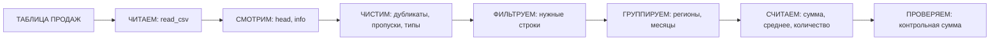

# Занятие 12. «Сводки и учёт: pandas»

> Семестр 1 · Блок 3 «Пыльные архивы» · Курс 04, лекции 04–05 + задание 02 · ~2 ч

## Миссия занятия

> «Вот дошли до учёта, молодежь! Год целый глицерин на складе тает — вагон! Сведи продажи: по регионам,
> по месяцам, проверь сумму — и доложи, куда делся. Только смотри: что черт посчитает — сам пересчитай,
> не доверяй ему на слово!» — Прораб Василич

**Задача квеста:** разобрать складской учёт через агента — понять главное понятие pandas (DataFrame),
научиться описывать сводки словами (читать, чистить, фильтровать, группировать, считать), проверить
итоги по контрольной сумме и найти, куда делся «растаявший» вагон глицерина.

**Итог занятия:** студент через агента читает и чистит таблицу продаж завода, строит сводные (по регионам
и «регионы × месяцы»), проверяет контрольную сумму, находит аномалию (менеджер «Кладовщик» — глицерин
на 60 000) и сдаёт разбор Василичу; параллельно — понимает, что такое DataFrame и как словами объяснить
агенту сводку.

---

## Слайды

| № | Тип | Название | Краткое содержание |
|---|-----|----------|--------------------|
| 1 | `image_group` | Комикс «Сводки и учёт» | 5 панелей: кладовщик-зумер с учётом → «глицерин растаял, вагон» → приказ Василича → Алиса про сводки → задача «сведи учёт» |
| 2 | `rich_text` | «Миссия: разберись в учёте» | Приказ Василича + задача квеста + итог занятия |
| 3 | `rich_text` | «Сводки — это ответы на вопросы» | Метафора журнала учёта от Алисы; формула-конвейер (читаем → смотрим → чистим → фильтруем → группируем → считаем → проверяем); Mermaid |
| 4 | `video` | «Как работают сводки: pandas» | Manim ~90 с: журнал учёта → DataFrame → чистка → фильтр → группировка → сводная → вывод |
| 5 | `rich_text` | «DataFrame — таблица с именем» | Лекция 04: столбцы/строки/индекс, чтение, `head`/`info`, фильтрация, сортировка, `sum`/`mean`, новый столбец |
| 6 | `rich_text` | «Сводные и группировка» | Лекция 05: `groupby`, `pivot_table`, даты и месяцы, пропуски и дубликаты, контрольные проверки |
| 7 | `quiz` | «Как сгруппировать и посчитать?» | Контрольная точка: что даёт `groupby("регион")["сумма"].sum()` |
| 8 | `resources` | «Учёт завода» | Скачивание: `prodazhi-zavoda.csv` (таблица продаж) + памятка «сводки через агента» |
| 9 | `jupyter` | «Попробуй сводку» | Разминка на платформе: создать таблицу, отфильтровать, сгруппировать, посчитать сумму, проверить вручную |
| 10 | `rich_text` | «Проверка, экономика, приватность» | Контрольная сумма; полдня рук vs минуты агента; продажи завода — коммерческая тайна |
| 11 | `ai_code_task` | «Разбери учёт и найди глицерин» | Главная практика через агента, два пути выполнения (платформа / локально); итог в выводе — 60 000 |
| 12 | `image_group` | Комикс-развязка «Глицерин найден» | 4 панели: найден менеджер «Кладовщик», признание про вейп-жижу, «парил как паровоз»; хук на занятие 13 (графики для дирекции) |
| 13 | `image` | Мем «сводки и учёт» | Разрядка после практики (человек проверяет картинку) |

---

## Детали по слайдам

### 1. image_group — Комикс «Сводки и учёт»

- **Назначение:** завязка занятия: продолжение хука финала занятия 11 («Следующая смена: сводки и учёт»).
  Кладовщик-зумер вбегает с учётом — «глицерин растаял, вагон!»; Василич приказывает свести учёт; Алиса
  объясняет, что сводка — это ответы на вопросы. См. `comic.md`, сцена 1.
- **Содержание:**
  - `title`: «Сводки и учёт»
  - `images`: 5 панелей (кадры 1.1–1.5 из `comic.md`, файлы `slide-12/01.png–05.png`)
  - `show_frames`: true
  - `description`: «Аппаратная. Вбегает кладовщик-зумер (худи „СКЛАД №2“, карго, бакетхет) с таблицами
    учёта: „Глицерин за год растаял, вагон!“. Василич: „Сведи учёт: посчитай по регионам и месяцам,
    проверь сумму — и доложи!“. Алиса объясняет: сводка — это ответы на вопросы, а таблицу „перекручивает“
    pandas по твоим словам. Задача квеста: разобрать учёт и найти вагон глицерина.»
- **Хук:** сцена 2 развязки (слайд 12) подводит к занятию 13 («Графики для дирекции»).

### 2. rich_text — «Миссия: разберись в учёте»

- **Назначение:** миссия занятия от имени Василича (п.2 шаблона): разобрать учёт, найти глицерин,
  каждую цифру перепроверить. Одна мысль: сводим учёт и не доверяем машине на слово.
- **Содержание** (`markdown`):

```markdown
**Миссия: разберись в учёте.**

«Вот дошли до учёта, молодежь! Год целый глицерин на складе тает — вагон! Сведи продажи: по регионам,
по месяцам, проверь сумму — и доложи, куда делся. Только смотри: что черт посчитает — сам пересчитай,
не доверяй ему на слово!»

**Задача квеста:** разобрать складской учёт через агента — прочитать таблицу продаж, почистить её
(дубликаты, пропуски, типы), посчитать продажи по регионам, построить сводную «регионы × месяцы»,
проверить контрольную сумму и найти, куда делся вагон глицерина.

**Итог занятия:** разобранный учёт — таблица прочитана и очищена, сводки построены, контрольная сумма
сходится, аномалия по глицерину найдена; плюс понимание, что такое DataFrame и как словами объяснить
агенту сводку.
```

### 3. rich_text — «Сводки — это ответы на вопросы»

- **Назначение:** первое понятие от имени Алисы (п.7 шаблона), по лекциям 04–05 курса-04: сводка —
  это «перекрутка» таблицы под вопрос; все операции описываются словами; главное — проверять контрольной
  суммой. Mermaid — «наглядность» прямо в тексте (п.8).
- **Содержание** (`markdown`):

````markdown
**Сводки — это ответы на вопросы.**

«Сводка, деточка, — это ответы на вопросы к таблице: кто продал больше, где провал, что не сходится.
Раньше мы такие журналы вели руками — полдня на месяц, и с ошибками. А pandas «перекрутит» таблицу
как угодно, если сказать ему словами.

Таблица в pandas называется **DataFrame**: столбцы с именами, строки, индекс. Сводка — цепочка команд:



Каждый шаг — это простая фраза агенту: «прочитай», «покажи первые 5 строк», «убери дубликаты»,
«сгруппируй по региону и посчитай сумму». Код писать не нужно — его напишет агент, а ты проверишь,
что итог сходится.

Подробнее — [сводки и учёт](@svodki-i-uchet).»
````

### 4. video — «Как работают сводки: pandas»

- **Назначение:** наглядно показать механизм сводки после рассказа Алисы: таблица «перекручивается»
  цепочкой операций — чтение, чистка, фильтрация, группировка, сводная. Технический ролик (Manim).
  По договорённости — сценарий + набросок кода (`videos/`), рендер позже.
- **Содержание:**
  - `title`: «Как работают сводки: pandas»
  - `video_url`: `videos/12-svodki-pandas.mp4` (отрендеренный файл — будет)
  - `video_type`: `direct`
  - `description`: «Технический ролик: журнал учёта с таблицей продаж (дата, регион, менеджер, товар,
    сумма). Таблица обводится в рамку „DataFrame“ и столбцы подсвечиваются по очереди (читаем и смотрим).
    Строки-дубликаты „сливаются“ в одну, пустые ячейки мигают и заполняются нулями (чистим). Неподходящие
    строки гаснут (фильтруем). Строки собираются в стопки по регионам с суммами и сортируются
    (группируем). Сетка „перекручивается“: регионы в строки, месяцы в столбцы (сводная). Вывод: „СВОДКА =
    ЧИТАЕМ → СМОТРИМ → ЧИСТИМ → ФИЛЬТРУЕМ → ГРУППИРУЕМ → СЧИТАЕМ → ПРОВЕРЯЕМ“. Программа-сценарий:
    `videos/manim/12-svodki-pandas.py` (см. `video-guide.md`).»
- **План ролика (примерный сценарий, ~90 с):** см. раздел «Видео: план ролика» ниже.

### 5. rich_text — «DataFrame — таблица с именем»

- **Назначение:** формальное объяснение после видео (п.7 шаблона), по лекции 04 курса-04: DataFrame —
  главное понятие pandas; операции описываются словами, а не синтаксисом. Одна мысль: DataFrame — таблица
  с именованными столбцами, и с ней говорят фразами «прочитай / покажи / отфильтруй / посчитай».
- **Содержание** (`markdown`):

````markdown
**DataFrame — таблица с именем.**

«Главное понятие, деточка, — **DataFrame**: таблица с именованными столбцами. Есть столбцы (дата, регион,
сумма), строки и индекс (номер строки). Код пишет агент, а ты командуешь словами:

```python
import pandas as pd
df = pd.read_csv("prodazhi-zavoda.csv")   # прочитай файл
df.head()      # покажи первые 5 строк
df.info()      # типы столбцов, сколько непустых
df.describe()  # статистика: среднее, минимум, максимум
```

Базовые операции:

```python
df[df["регион"] == "Юг"]          # отфильтруй: только Юг
df.sort_values("сумма", ascending=False)  # отсортируй по убыванию
df["сумма"].sum()                 # посчитай итог
df["сумма"].mean()                # среднее
df["бонус"] = df["сумма"] * 0.2   # добавь вычисляемый столбец
```

Первый шаг любой сводки — **посмотреть** на таблицу: правильно ли открылся файл, те ли столбцы,
нет ли мусора. Не посмотрел — дальше считать нечего.

Подробнее — [сводки и учёт](@svodki-i-uchet).»
````

### 6. rich_text — «Сводные и группировка»

- **Назначение:** формальное объяснение по лекции 05 курса-04: группировка, сводные таблицы, даты,
  пропуски и дубликаты — приёмы, закрывающие 80% реальных задач. Одна мысль: «посчитай по группам»
  и «перекрути в сводную» — главные команды сводок, а грязные данные чистим заранее.
- **Содержание** (`markdown`):

````markdown
**Сводные и группировка.**

«Самая частая команда, деточка: **посчитай по группам**. „По каждому региону“, „по месяцу“,
„по менеджеру“ — это `groupby`:

```python
df.groupby("регион")["сумма"].agg(["sum", "count", "mean"])
```

**Сводная таблица** — та же группировка, но «перекрученная»: регионы в строках, месяцы в столбцах,
в ячейках суммы:

```python
pd.pivot_table(df, values="сумма", index="регион", columns="месяц", aggfunc="sum")
```

**Даты** в файлах — это текст; чтобы считать по месяцам, их переводят в тип datetime и выделяют месяц:
`pd.to_datetime(df["дата"])`, потом `df["дата"].dt.to_period("M")`.

**Реальные данные грязные** — пустые ячейки (NaN), дубликаты, строки-текст вместо чисел:

```python
df.isna().sum()          # где пропуски
df = df.drop_duplicates()  # убери дубликаты
df["сумма"] = pd.to_numeric(df["сумма"], errors="coerce").fillna(0)
```

Решения о пропусках принимаешь ты: для суммы пропуск — это 0, для среднего возраста — уже нет.

Подробнее — [сводки и учёт](@svodki-i-uchet).»
````

### 7. quiz — «Как сгруппировать и посчитать?»

- **Назначение:** контрольная точка по теории сводок (лекции 04–05). Материал — `files/quiz-svodki.md`.
- **Содержание:**
  - `question`: «Агент выполнил строку `df.groupby("регион")["сумма"].sum()`. Что он получил?»
  - `markdown`: «Выбери один правильный вариант. Термины занятия — [в справке](@svodki-i-uchet).»
  - `options`:
    - { text: «Сумму продаж по каждому региону — таблицу „регион → сумма“», is_correct: true }
    - { text: «Среднюю сумму по всему файлу (одно число)», is_correct: false }
    - { text: «Только строки, где регион = „Москва“», is_correct: false }
    - { text: «Сводную таблицу: регионы в строках, месяцы в столбцах», is_correct: false }
  - `explanation`: «`groupby("регион")` собирает строки в группы по значению столбца „регион“,
    а `["сумма"].sum()` складывает суммы внутри каждой группы. Получается таблица „регион → сумма“.
    Среднюю по всему файлу дал бы `df["сумма"].mean()`, фильтрацию — `df[df["регион"] == "Москва"]`,
    а сводную „регионы × месяцы“ — `pivot_table(index="регион", columns="месяц")`.»

### 8. resources — «Учёт завода»

- **Назначение:** раздать материалы практики: таблицу продаж завода (с аномалией глицерина) и памятку
  «сводки через агента». Данные нужны для локального пути главной практики (слайд 11).
- **Содержание:**
  - `title`: «Учёт завода»
  - `description` (Markdown): «Это таблица продаж завода — то, что кладовщик принёс в аппаратную.
    Скачай оба файла. `prodazhi-zavoda.csv` — 47 строк за 2025 год: дата, регион, менеджер, товар, сумма;
    в файле есть дубликаты, пропуски и строки-текст — их и предстоит чистить. Памятка — подсказка, как
    описывать сводки агенту словами и как проверять результат (контрольная сумма). Всё понадобится
    на слайде 11 (для пути „локально“).»
  - `files`:
    - { name: `prodazhi-zavoda.csv`, description: «Таблица продаж завода за 2025 год (47 строк, с мусором)» }
    - { name: `pamyatka-svodki.md`, description: «Памятка: как описывать сводки агенту и проверять результат» }

### 9. jupyter — «Попробуй сводку»

- **Назначение:** hands-on перед главной практикой: студент сам (или через агента) пробует сводку —
  создаёт таблицу, фильтрует, группирует и считает сумму, проверяет её на калькуляторе. Интерактивная
  разминка на платформе.
- **Содержание:**
  - `title`: «Попробуй сводку»
  - `kernel`: `pyodide`
  - `task` (Markdown): «Это ноутбук — твоё рабочее место на курс. Выполни по порядку:
    1) запусти ячейку (Shift+Enter) — появится таблица продаж;
    2) добавь ячейку и посчитай сумму продаж по каждому региону: `df.groupby("регион")["сумма"].sum()`;
    3) проверь на калькуляторе: Юг = 100+150+300 = 550, Север = 200+250 = 450;
    4) отфильтруй только продажи на Юге: `df[df["регион"] == "Юг"]`;
    5) ответь себе: что делает каждая строчка? Не знаешь — спроси у агента словами.»
  - `code`: начальный код (разминка, по заданию 02):

```python
import pandas as pd

df = pd.DataFrame({
    "месяц": ["янв", "янв", "фев", "фев", "мар"],
    "регион": ["Юг", "Север", "Юг", "Север", "Юг"],
    "сумма": [100, 200, 150, 250, 300],
})
df.groupby("регион")["сумма"].sum()
```

  - `description`: «Ядро — `pyodide` (Python в браузере). Клетки автосохраняются в прогресс.»
- **Примечание:** если pandas недоступен в `pyodide`-ядре, начальный код заменяем на списки без библиотек
  (словарь и цикл для подсчёта по регионам) — учебная суть не меняется.

### 10. rich_text — «Проверка, экономика, приватность»

- **Назначение:** сквозные темы курса применительно к сводкам: проверка результата (контрольная сумма),
  экономика автоматизации (ручной учёт vs агент), приватность данных (продажи завода — коммерческая
  тайна). Одна мысль: сводка полезна, только если её проверили.
- **Содержание** (`markdown`):

```markdown
**Проверка, экономика, приватность.**

«Сводки — работа, которую раньше вели руками по журналам. Вот что помнить:

1. **Проверяем.** Сумма по регионам должна сойтись с общей суммой файла. Не сошлось — агент потерял
   строки или дубликаты раздули итог. Одну группу пересчитай вручную — на калькуляторе.
2. **Считаем.** Сводка по 47 строкам — минуты агенту против полдня руками. И так каждый месяц.
   А найденная аномалия — вагон глицерина: полмиллиона, которые «растаяли» в учёте.
3. **Секреты — в `.env`.** Продажи завода — коммерческая тайна: таблицу не загружаем в чужие облака,
   работаем локально, ключи и файлы не уходят в чат.

Польза: разобранный учёт — это основа для графиков дирекции и итогового отчёта в конце семестра.

Подробнее — [сводки и учёт](@svodki-i-uchet).»
```

### 11. ai_code_task — «Разбери учёт и найди глицерин»

- **Назначение:** главная практика-контрольная точка занятия: студент словами описывает агенту задачу —
  прочитать и почистить таблицу продаж, посчитать по регионам, построить сводную, найти аномалию
  глицерина, проверить контрольную сумму. **Два пути выполнения:** на платформе (чат с агентом +
  редактор; данные встроены в заготовку) или локально (opencode + скачанный CSV); в обоих случаях
  в выводе — сумма продаж глицерина менеджером «Кладовщик» (60 000), проверяет AI по `checkPrompt`.
  Материал — `files/zadanie-svodki.md` + `files/pamyatka-svodki.md`.
- **Содержание:**
  - `title`: «Разбери учёт и найди глицерин»
  - `task` (Markdown): «Разбери учёт завода через агента и найди, куда делся глицерин.
    1. Опиши агенту словами (рецепт — в памятке): прочитай таблицу продаж, покажи первые 5 строк и типы
       столбцов; почисти данные (убери дубликаты, пропуски в сумме заполни нулями, приведи сумму
       к числам); посчитай сумму и количество продаж по каждому региону; сделай сводную „регионы × месяцы“;
       проверь контрольную сумму; найди, что не так с глицерином (посмотри продажи глицерина
       по менеджерам и по месяцам).
    2. Выполни любым путём:
       - **На платформе:** в чате опиши задачу словами, получи код, вставь кнопкой „Вставить код
         в редактор“, запусти и проверь. Данные уже лежат в заготовке кода.
       - **Локально:** скачай `prodazhi-zavoda.csv` со слайда 8, запусти opencode в папке с файлом,
         опиши задачу словами, запусти и проверь. Итоговое число выведи в редакторе `print(...)`.
    3. Проверь своими глазами: контрольная сумма сходится? Одна строка пересчитана вручную? Смотри
       пошаговую проверку — [как проверить задание](@kak-proverit-svodki), агент для локального запуска —
       [opencode](@opencode-ustanovka).
    4. Добейся, чтобы **в выводе была строка с суммой продаж глицерина менеджером „Кладовщик“** (например,
       `print("ГЛИЦЕРИН У КЛАДОВЩИКА:", ...)`) и нажми „Проверить“.»
  - `language`: `python`
  - `code`: начальный код (данные встроены — путь «на платформе»):

```python
import io
import pandas as pd

sales_csv = """\
дата,регион,менеджер,товар,сумма
2025-01,Юг,Петров,Глицерин технический,53669
2025-01,Центр,Петров,Порошок «Бытовой»,
2025-01,Север,Петров,Сода кальцинированная,12490
2025-01,Центр,Кладовщик,Глицерин технический,7500
2025-02,Центр,Петров,Глицерин технический,54854
2025-02,Север,Сидоров,Глицерин технический,47380
2025-02,Юг,Петров,Порошок «Бытовой»,31130
2025-03,Север,Иванов,Глицерин технический,54440
2025-03,Север,Иванов,Кислота лимонная,23042
2025-03,Центр,Петров,Глицерин технический,"22652,50"
2025-03,Центр,Кладовщик,Глицерин технический,7500
2025-04,Север,Сидоров,Глицерин технический,53338
2025-04,Север,Иванов,Сода кальцинированная,15270
2025-04,Север,Сидоров,Сода кальцинированная,10212
2025-04,Центр,Кладовщик,Глицерин технический,7500
2025-04,Север,Сидоров,Глицерин технический,53338
2025-05,Центр,Петров,Глицерин технический,54144
2025-05,Север,Сидоров,Глицерин технический,54095
2025-05,Юг,Сидоров,Сода кальцинированная,17764
2025-05,Центр,Кладовщик,Глицерин технический,7500
2025-06,Юг,Петров,Глицерин технический,54982
2025-06,Юг,Сидоров,Глицерин технический,46354
2025-06,Север,Сидоров,Мыло хозяйственное,15838
2025-07,Юг,Сидоров,Глицерин технический,"25658,50"
2025-07,Центр,Петров,Глицерин технический,49134
2025-07,Север,Петров,Мыло хозяйственное,
2025-08,Центр,Сидоров,Глицерин технический,53192
2025-08,Север,Иванов,Сода кальцинированная,15047
2025-08,Север,Сидоров,Глицерин технический,48639
2025-09,Центр,Петров,Глицерин технический,45712
2025-09,Юг,Иванов,Кислота лимонная,15362
2025-09,Центр,Иванов,Порошок «Бытовой»,22555
2025-09,Центр,Кладовщик,Глицерин технический,7500
2025-10,Центр,Петров,Глицерин технический,45603
2025-10,Юг,Петров,Сода кальцинированная,13639
2025-10,Центр,Сидоров,Глицерин технический,53421
2025-10,Центр,Кладовщик,Глицерин технический,7500
2025-11,Юг,Петров,Глицерин технический,48420
2025-11,Юг,Петров,Сода кальцинированная,15803
2025-11,Центр,Петров,Порошок «Бытовой»,25490
2025-11,Центр,Кладовщик,Глицерин технический,7500
2025-11,Центр,Петров,Порошок «Бытовой»,25490
2025-12,Юг,Сидоров,Глицерин технический,50966
2025-12,Север,Иванов,Порошок «Бытовой»,39887
2025-12,Север,Петров,Мыло хозяйственное,12941
2025-12,Центр,Кладовщик,Глицерин технический,7500
2025-12,Север,Иванов,Порошок «Бытовой»,39887
"""

df = pd.read_csv(io.StringIO(sales_csv))
df.head()
```

  - `insertCodeButton`: true
  - `checkPrompt`: «Оцени решение студента по заданию „Разбери учёт и найди глицерин“ (задание + код +
    вывод). Проверь по коду и выводу: 1) таблица прочитана (из встроенных данных или файла) и показаны
    первые строки и типы столбцов; 2) выполнена очистка: убраны дубликаты (в файле их 3), пропуски
    в сумме заполнены нулями, сумма приведена к числам (строки „22652,50“ и „25658,50“ превратились
    в числа); 3) есть группировка по регионам (сумма/количество) и сводная „регионы × месяцы“;
    4) контрольная сумма: сумма по регионам сходится с общей суммой файла после очистки; 5) в выводе есть
    продажи глицерина по менеджерам, и менеджер „Кладовщик“ выделен как аномалия; 6) **итоговое число —
    сумма продаж глицерина менеджером „Кладовщик“ — равно 60 000** (8 строк по 7 500). Если итоговое
    число не 60 000 или этапа очистки нет — решение неполное. Ответь кратко: верно/неверно и почему.»
- **Примечание:** `expected_output` не задаём — код исследовательский, вывод неоднородный; проверка
  AI по `checkPrompt`, есть кнопка «На самом деле все верно».

### 12. image_group — Комикс-развязка «Глицерин найден»

- **Назначение:** развязка сюжета: аномалия найдена (менеджер «Кладовщик», 60 000), кладовщик признаётся —
  «мутил вейп-жижу, парил как паровоз»; сквозная тема «не доверяй машине без проверки»; хук на занятие 13
  (графики для дирекции). См. `comic.md`, сцена 2.
- **Содержание:**
  - `title`: «Глицерин найден»
  - `images`: 4 панели (кадры 2.1–2.4 из `comic.md`, файлы `slide-12/06.png–09.png`)
  - `show_frames`: true
  - `description`: «Аппаратная. На экране — продажи глицерина по менеджерам: строка „КЛАДОВЩИК — 60 000“
    подсвечена люминофором. Алиса: контрольная сумма по менеджерам не бьётся — вагон „продал сам себе“
    кладовщик. Кладовщик-зумер, красный как свёкла, признаётся: „Жижу для вейпов мутил, парил как
    паровоз!“ — на складе подпольный вейп-шоп „Пары Василича“. Василич в ярости, но разбор принят:
    „Дирекции нужны картинки, где завод теряет деньги — графики на следующем занятии“.»

### 13. image — Мем «сводки и учёт»

- **Назначение:** разрядка после практики. Сквозная тема — проверяй машину, но и сам не ленись
  пересчитать.
- **Содержание:**
  - `title`: «Мем: сводки и учёт»
  - `image_url`: `memes/images/m00048.jpg` (кандидат; картинку проверяет человек глазами — по правилам
    курса)
  - `description`: «„— Ты хорош в математике? — Зависит от сложности… — 10 × 0? — 0“ — а у нас в таблице
    пропуск, дубликат и вагон глицерина. Пока не пересчитал контрольную сумму — не заметишь!»
- **Подбор:** `memes/pick_meme "проверяй сам, не доверяй, пересчитать на калькуляторе, цифры"` →
  кандидаты `m00048` (0.536), `m00655` (0.510, «пропущенная цифра в таблице» — фит к «найди пропуск
  в данных»), все `is_clean=true`. Картинку проверяет человек; при замене — `memes/images/{id}.jpg`.

---

## Видео: план ролика «Как работают сводки: pandas»

> Технический ролик на Manim (ManimCE), `videos/manim/12-svodki-pandas.py`. Движок — Manim, потому что
> ролик объясняет механизм (как «перекручивается» таблица в сводку). Стиль — из `comic-style.md`:
> палитра (болотный/ржавый/пыльный/бежевый + кислотно-зелёный люминофор), чёрный контур, надписи
> заглавными рубленым шрифтом. 1920×1080, 30 fps, длительность ~90 с, фиксированный `seed 12`. На момент
> сборки занятия ролик **не отрендерен** — есть план-сценарий и набросок кода (см. `videos/README.md`).

**Мысль ролика (одна):** сводка — это «перекрутка» таблицы цепочкой словесных команд: читаем → смотрим →
чистим → фильтруем → группируем → считаем → проверяем. В конце цепочка складывается в одну формулу-вывод.

| № | Время | Кадр | Что происходит | Надписи в кадре |
|---|-------|------|----------------|-----------------|
| 1 | 0–8 с | Завязка | Экран-«журнал учёта»: большая таблица продаж (дата, регион, менеджер, товар, сумма), строки шевелятся | «УЧЁТ ЗАВОДА: ТАБЛИЦА ПРОДАЖ» |
| 2 | 8–18 с | Чтение | Таблица обводится в рамку «DataFrame», столбцы подсвечиваются по очереди люминофором | «ПРОЧИТАЛ → ПОСМОТРЕЛ: СТОЛБЦЫ · СТРОКИ · ТИПЫ» |
| 3 | 18–30 с | Чистка | Строки-дубликаты «сливаются» в одну; пустые ячейки мигают ржавым и заполняются нулями | «ПОЧИСТИЛ: ДУБЛИКАТЫ ДОЛОЙ, ПРОПУСКИ — НУЛЯМИ» |
| 4 | 30–44 с | Фильтрация | Неподходящие строки гаснут (серые), остаются только нужные | «ОТФИЛЬТРОВАЛ: ТОЛЬКО НУЖНЫЕ СТРОКИ» |
| 5 | 44–60 с | Группировка | Строки собираются в стопки по регионам (Север/Юг/Центр), над каждой появляется сумма; стопки сортируются по убыванию | «СГРУППИРОВАЛ → СУММА ПО КАЖДОМУ», «ОТСОРТИРОВАЛ» |
| 6 | 60–78 с | Сводная | Сетка «перекручивается»: регионы в строки, месяцы в столбцы, в ячейках суммы | «СВОДНАЯ: РЕГИОНЫ × МЕСЯЦЫ» |
| 7 | 78–90 с | Вывод | Кадры 2–6 по очереди складываются в одну строку-формулу, финальная крупная надпись | «СВОДКА = ЧИТАЕМ → СМОТРИМ → ЧИСТИМ → ФИЛЬТРУЕМ → ГРУППИРУЕМ → СЧИТАЕМ → ПРОВЕРЯЕМ» |

**Что НЕ показываем:** лиц и сюжета — ролик чисто технический, про устройство сводки. После ролика —
слайды 5–6 (формальное объяснение операций), затем квиз (слайд 7) и раздача учёта (слайд 8).

---

## Мемы

- **Слайд 13 (резюме, кандидат):** `m00048` — «— Ты хорош в математике? — 10 × 0? — 0». Подбор:
  `memes/pick_meme "проверяй сам, не доверяй, пересчитать на калькуляторе, цифры"`.
  Кандидаты (все `is_clean=true`):
  - `m00048` (0.536) — математическая шутка (фит к теме «пересчитай сам, проверь контрольную сумму»);
  - `m00655` (0.510) — таблица цифр с пропущенной единицей (фит к теме «пропуск и дубликат в данных»).
- Подбор субъективен: **картинку для слайда 13 проверяет человек глазами** (правило курса: не доверяй
  ИИ без проверки); после подтверждения оставляем `image_url: memes/images/m00048.jpg` или меняем на
  подтверждённый `memes/images/{id}.jpg`.

---

## Доп. информация

Блоки дополнительной информации (вкладка «Доп. информация» на платформе; слаги — общие на курс sem1).
Наполнение блоков — в `content/sem1/extra/<слаг>.md`.

| Слаг | Слайд | Ссылка на слайде |
|---|---|---|
| `svodki-i-uchet` | 3, 5, 6, 7, 10 | «сводки и учёт» |
| `opencode-ustanovka` | 10, 11 | «opencode» |
| `kak-proverit-svodki` | 11 | «как проверить задание» |
