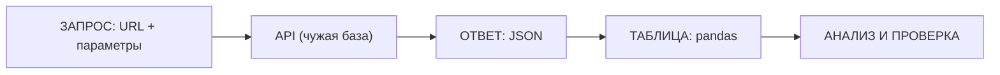

# Занятие 14. «Растворитель для конкурентов»

> Семестр 1 · Блок 3 «Пыльные архивы» · Курс 04, лекции 07–08 + задания 04–05 + курс 05, лекция 06 · ~2 ч

## Миссия занятия

> «Твою ж изоленту! Над проходной похабщину намалевали — ни вода, ни мыло не берёт!
> Сделаем свой растворитель, молодежь, и выпустим на рынок — чтоб неповадно было.
> Каждую цифру сверь с базой: не доверяй черту на слово!» — Прораб Василич

**Задача квеста:** через агента разобрать «живые данные»: извлечь состав краски из PDF-протокола
заводской лаборатории (PyMuPDF), идентифицировать компоненты через химическую базу PubChem (формула,
масса, SMILES, InChIKey) как «источник правды», найти научные статьи по растворимости через CrossRef/OpenAlex
и собрать «техпаспорт растворителя-новинки», где каждая цифра проверена, а каждый вывод — со ссылкой.

**Итог занятия:** техпаспорт растворителя «Сольвент №1»: PDF-протокол разобран, доли компонентов
сведены в 100%, компоненты краски и растворителя сверены с PubChem, статьи про растворимость акриловых
смол найдены с DOI; студент понимает, как словами «заказать» агенту живые данные из API и как проверить,
что он не наврал.

---

## Слайды

| № | Тип | Название | Краткое содержание |
|---|-----|----------|--------------------|
| 1 | `image_group` | Комикс «Растворитель для конкурентов» | 5 панелей: проходная со словом на стене → «вода не берёт, мыло не берёт» → приказ Василича → Алиса: «акрил, вот протокол» → задача «собери техпаспорт растворителя» |
| 2 | `rich_text` | «Миссия: сделай свой растворитель» | Приказ Василича + задача квеста + итог занятия |
| 3 | `rich_text` | «Живые данные: интернет — ещё один склад» | Лекция 07: веб-API, URL+параметры, JSON, статусы, ключи; формула заказа агенту; Mermaid |
| 4 | `video` | «Как стучаться в чужие двери» | Manim ~90 с: ноутбук → запрос → API → JSON → таблица; статусы; «сверяй с источником» (программа в `videos/`, рендер позже) |
| 5 | `rich_text` | «PubChem — источник правды по веществам» | Курс 05, лекция 06: PUG REST, формула запроса, как проверить агента (сравнить SMILES), CID и InChIKey вместо названий |
| 6 | `rich_text` | «Научные статьи: CrossRef и OpenAlex» | DOI как «паспорт» статьи; поиск по словам; как ссылаться в техпаспорте |
| 7 | `rich_text` | «PDF: текст и таблицы (PyMuPDF)» | Лекция 08: `get_text`, `pymupdf4llm`, `find_tables`; итеративный процесс; проверка «доли в сумме 100%» |
| 8 | `quiz` | «Как убедиться, что вещество не выдумка?» | Контрольная точка: сверяться с PubChem, а не верить на слово |
| 9 | `resources` | «Материалы практики» | Скачивание: протокол лаборатории (PDF) + памятка + снапшоты API (`dannye/`) |
| 10 | `jupyter` | «Попробуй API» | Разминка на платформе: разобрать JSON-ответ PubChem (ацетон) и превратить в таблицу |
| 11 | `rich_text` | «Проверка, экономика, приватность» | PubChem — источник правды; технолог-день vs агент-минуты; API без ключей, секреты — в `.env` |
| 12 | `ai_code_task` | «Собери техпаспорт растворителя» | Главная практика через агента, два пути (локально / платформа); в выводе — состав, проверенные цифры и DOI |
| 13 | `image_group` | Комикс-развязка «Растворитель готов» | 4 панели: техпаспорт на экране → цифры сверены → краска снята, банка «Сольвент №1» → хук на занятие 15 (автоматизация) |
| 14 | `image` | Мем «проверяй цифры» | Разрядка после практики (человек проверяет картинку) |

---

## Детали по слайдам

### 1. image_group — Комикс «Растворитель для конкурентов»

- **Назначение:** завязка занятия: продолжение хука финала занятия 13 (заводчанин с доской, на которой
  «слово намалевали — не стирается»). Утром у проходной — толпа: краску не берут ни вода, ни мыло.
  Василич приказывает сделать свой растворитель; Алиса объясняет, что покрытие акриловое и что у
  лаборатории есть протокол исследования. См. `comic.md`, сцена 1.
- **Содержание:**
  - `title`: «Растворитель для конкурентов»
  - `images`: 5 панелей (кадры 1.1–1.5 из `comic.md`, файлы `slide-14/01.png–05.png`)
  - `show_frames`: true
  - `description`: «Проходная завода. На стене у портала намалёвано большое слово (замазано для цензуры —
    белая замазка с подтёком). Заводчане трут стену тряпками и вёдрами — краска не слезает. Василич
    пробует кибер-рукой, злится: „Вода не берёт, мыло не берёт!“. Дирекция чует суперстойкую краску
    конкурентов. В аппаратной Алиса разглядывает образец в очках: „Акрил, деточка, вот протокол
    лаборатории“. Василич приказывает в камеру: вытащить состав из протокола, проверить по PubChem,
    найти статьи и собрать техпаспорт растворителя.»
- **Хук:** сцена 2 развязки (слайд 13) подводит к занятию 15 («Сторожевой пёс аппаратной» — автоматизация).

### 2. rich_text — «Миссия: сделай свой растворитель»

- **Назначение:** миссия занятия от имени Василича (п.2 шаблона): разобрать живой источник данных (API),
  проверить каждую цифру и собрать техпаспорт растворителя. Одна мысль: данные из интернета, проверенные
  источником правды.
- **Содержание** (`markdown`):

```markdown
**Миссия: сделай свой растворитель.**

«Твою ж изоленту! Над проходной похабщину намалевали — ни вода, ни мыло не берёт!
Сделаем свой растворитель, молодежь, и выпустим на рынок — чтоб неповадно было.
Каждую цифру сверь с базой: не доверяй черту на слово!»

**Задача квеста:** через агента разобрать состав краски из PDF-протокола лаборатории, проверить каждый
компонент через PubChem (формула, масса, SMILES, InChIKey), найти научные статьи по растворимости через
CrossRef/OpenAlex и собрать техпаспорт растворителя-новинки, где цифры сверены, а выводы — со ссылками.

**Итог занятия:** техпаспорт растворителя «Сольвент №1»: состав, проверенные цифры и ссылки-DOI —
готовый артефакт для диагностического отчёта завода.
```

### 3. rich_text — «Живые данные: интернет — ещё один склад»

- **Назначение:** первое понятие от имени Алисы (п.7 шаблона), по лекции 07 курса-04: веб-API — это
  «дверь на чужой склад»; запрос = URL + параметры, ответ = JSON, успех проверяется статусом; ключи —
  в `.env`. Mermaid — «наглядность» прямо в тексте (п.8).
- **Содержание** (`markdown`):

````markdown
**Живые данные: интернет — ещё один склад.**

«Интернет, деточка, — это прям рил огромный склад, а веб-API — дверь на него. Приходишь по адресу (URL),
называешь, что нужно (параметры после `?`), и забираешь ящик с данными — JSON. Главное — проверить,
что дверь открылась:

| Статус | Что значит |
|---|---|
| 200 | Дверь открылась, данные отдали |
| 404 | Такого нет — проверь адрес |
| 401 / 403 | Нужен ключ — добавь в `.env` |
| 429 | Слишком часто стучимся — подожди |

```python
import requests
resp = requests.get(url, params={"name": "acetone"})
print(resp.status_code)   # 200 — успех
dannye = resp.json()      # JSON → Python-структура → таблица
```



Заказать данные фиксику — формула: что нужно, откуда (URL), какой формат, как проверить.

Подробнее — [живые данные](@zhivye-dannye).»
````

### 4. video — «Как стучаться в чужие двери»

- **Назначение:** наглядно показать механизм после рассказа Алисы: как данные «приходят» из чужого API,
  как читать статусы и почему ответ сверяют с источником правды. Технический ролик (Manim).
  По договорённости — детальный сценарий и код в `videos/`, рендер позже (в рендеры не углубляемся).
- **Содержание:**
  - `title`: «Как стучаться в чужие двери»
  - `video_url`: `videos/14-rastvoritel-dlya-konkurentov-api.mp4` (отрендеренный файл — будет)
  - `video_type`: `direct`
  - `description`: «Технический ролик: ноутбук посылает запрос (URL с параметрами) → чужой сервер
    отвечает — сначала статус (200/404/401/429), потом ящик JSON → JSON превращается в таблицу →
    таблица анализируется и сверяется с источником. Заводская метафора: „дверь на склад“.
    План ролика — в `videos/README.md`; скрипт Manim и рендер — позже.»

### 5. rich_text — «PubChem — источник правды по веществам»

- **Назначение:** формальное объяснение по лекции 06 курса-05: PubChem — «Википедия молекул» и «источник
  правды»; PUG REST — те же запросы по URL; главный приём — проверить «придуманное» агентом вещество
  через PubChem. Одна мысль: название можно выдумать, а формулу и массу из базы — нельзя.
- **Содержание** (`markdown`):

````markdown
**PubChem — источник правды по веществам.**

«Рецептуру, деточка, никому на слово не доверишь — без б. Для молекул источник правды — база PubChem:
миллионы веществ с формулой, массой и структурой. Фиксик „придумал“ вещество — сверяемся с PubChem.

PUG REST — это те же запросы по URL:

```python
import requests
url = ("https://pubchem.ncbi.nlm.nih.gov/rest/pug/compound/name/acetone"
       "/property/MolecularFormula,MolecularWeight,CanonicalSMILES,InChIKey/JSON")
svoystva = requests.get(url).json()["PropertyTable"]["Properties"][0]
print(svoystva["MolecularFormula"], svoystva["MolecularWeight"])
print(svoystva["CanonicalSMILES"])
```

Приём проверки: попроси фиксика получить официальный SMILES и массу по названию и сравнить со своим
вариантом. Названия бывают синонимами — надёжнее работать с числовым ID (CID) и «отпечатком» молекулы
(InChIKey).

Подробнее — [живые данные](@zhivye-dannye).»
````

### 6. rich_text — «Научные статьи: CrossRef и OpenAlex»

- **Назначение:** формальное объяснение: вывод «растворитель возьмёт краску» подкрепляется научной
  статьёй; у статьи есть «паспорт» — DOI; ищем в CrossRef (цитирование) и OpenAlex (открытая база
  публикаций). Одна мысль: ссылка с DOI — это проверяемый вывод.
- **Содержание** (`markdown`):

````markdown
**Научные статьи: CrossRef и OpenAlex.**

«Вывод „растворитель возьмёт краску“ надо подкрепить статьёй, а не словами, солнышко. У статьи есть
паспорт — DOI (цифровой идентификатор). Ищем по словам:

```python
import requests
otvet = requests.get("https://api.crossref.org/works",
                     params={"query": "poly methyl methacrylate solubility acetone",
                             "rows": 3}).json()
for statya in otvet["message"]["items"]:
    print(statya["DOI"], "—", statya["title"][0][:60])
```

CrossRef — реестр цитирований, OpenAlex — открытая база публикаций
(`https://api.openalex.org/works?search=acrylic+resin+solubility`).
В техпаспорте у каждого вывода — ссылка-DOI на статью про растворимость акриловых смол.

Подробнее — [живые данные](@zhivye-dannye).»
````

### 7. rich_text — «PDF: текст и таблицы (PyMuPDF)»

- **Назначение:** формальное объяснение по лекции 08 курса-04: PDF — не таблица, а «страницы-картинки»;
  текст вытаскивает PyMuPDF, таблицы — `find_tables()`, весь документ в Markdown — надстройка
  `pymupdf4llm`. Одна мысль: работа с PDF итеративная, а извлечённые цифры сверяем с оригиналом.
- **Содержание** (`markdown`):

````markdown
**PDF: текст и таблицы (PyMuPDF).**

«Лаборатория прислала протокол в PDF, деточка, а PDF — это не таблица, а страницы с координатами текста.
Цифры оттуда вытаскивает PyMuPDF, и это прям переговоры: извлекли → посмотрели → уточнили.

```python
import fitz  # PyMuPDF
doc = fitz.open("issledovanie-kraski.pdf")
text = doc[0].get_text()          # текст страницы
print(text[:500])
```

Таблицы — через `page.find_tables()` → `to_pandas()`, весь документ сразу в Markdown для ИИ —
надстройка `pymupdf4llm`. Проверка по-заводски: доли компонентов из таблицы сводим в 100%
и сверяем с протоколом глазами. Сошлось — красава.

Подробнее — [живые данные](@zhivye-dannye).»
````

### 8. quiz — «Как убедиться, что вещество не выдумка?»

- **Назначение:** контрольная точка по ключевому приёму занятия: проверка «предложенного» агентом
  вещества через PubChem. Материал — `files/quiz-zhivye-dannye.md`.
- **Содержание:**
  - `question`: «Агент сообщил: „растворитель для акриловой краски — ацетон“. Как убедиться, что он
    не выдумал вещество?»
  - `markdown`: «Выбери один правильный вариант. Подсказка — [живые данные](@zhivye-dannye).»
  - `options`:
    - { text: «Запросить PubChem по названию и сравнить формулу, массу и SMILES», is_correct: true }
    - { text: «Поверить агенту на слово — модель умная», is_correct: false }
    - { text: «Спросить вторую модель; если подтвердит — верить», is_correct: false }
    - { text: «Проверить растворитель по запаху», is_correct: false }
  - `explanation`: «PubChem — источник правды по веществам: запрашиваем официальные формулу, массу
    и SMILES по названию и сравниваем с тем, что дал агент. Второе мнение модели — тоже мнение,
    а не факт. Проверяем по базе, а не на веру.»

### 9. resources — «Материалы практики»

- **Назначение:** раздать материалы практики: PDF-протокол лаборатории (для локального пути),
  памятку «как заказать живые данные у агента» и снапшоты ответов API (фолбэк для платформенного пути).
- **Содержание:**
  - `title`: «Материалы практики»
  - `description` (Markdown): «Протокол исследования образца краски — его составила заводская лаборатория
    после анализа пробы с проходной. PDF текстовый: таблицу состава из него можно вытащить PyMuPDF.
    Снапшоты в папке `dannye/` — настоящие ответы API PubChem/CrossRef/OpenAlex (проверены при сборке
    занятия): понадобятся, если на платформе не будет доступа к интернету. Памятка — как словами
    „заказать“ агенту данные и как проверить, что он не наврал. Всё понадобится на слайде 12.»
  - `files`:
    - { name: `issledovanie-kraski.pdf`, description: «Протокол исследования образца краски (PDF с таблицей состава)» }
    - { name: `pamyatka-zhivye-dannye.md`, description: «Памятка: как заказать агенту живые данные и проверить результат» }
    - { name: `dannye/`, description: «Снапшоты ответов API: pubchem-*.json, crossref-rastvorimost.json, openalex-rastvorimost.json» }

### 10. jupyter — «Попробуй API»

- **Назначение:** hands-on перед главной практикой: разобрать JSON-ответ PubChem и превратить его
  в таблицу — без сети (ответ встроен). Учебная суть: JSON → структура → DataFrame.
- **Содержание:**
  - `title`: «Попробуй API»
  - `kernel`: `pyodide`
  - `task` (Markdown): «Это ноутбук — твоё рабочее место. Выполни по порядку:
    1) запусти ячейку (Shift+Enter) — из JSON-ответа PubChem выведутся формула, масса, SMILES и InChIKey
       ацетона;
    2) добавь ячейку и преврати ответ в таблицу pandas (столбцы: название, формула, масса, SMILES);
    3) добавь ячейку и добавь в таблицу этилацетат — его данные из снапшота `dannye/pubchem-etilacetat.json`
       (или попроси агента сгенерировать JSON-строку);
    4) ответь себе: почему для паспорта растворителя надёжнее хранить InChIKey, а не название?»
  - `code`: начальный код (JSON-ответ PubChem по ацетону):

```python
import json
import pandas as pd

json_otvet = """{
  "PropertyTable": {
    "Properties": [
      {
        "CID": 180,
        "MolecularFormula": "C3H6O",
        "MolecularWeight": "58.08",
        "CanonicalSMILES": "CC(=O)C",
        "InChIKey": "CSCPPACGZOOCGX-UHFFFAOYSA-N"
      }
    ]
  }
}"""

dannye = json.loads(json_otvet)
svoystva = dannye["PropertyTable"]["Properties"][0]
print(svoystva["MolecularFormula"], svoystva["MolecularWeight"])
print(svoystva["CanonicalSMILES"])
print(svoystva["InChIKey"])

df = pd.DataFrame([{"вещество": "ацетон", **svoystva}])
df
```

  - `description`: «Ядро — `pyodide` (Python в браузере). Клетки автосохраняются в прогресс. Сеть
    не нужна — JSON-ответ уже встроен.»

### 11. rich_text — «Проверка, экономика, приватность»

- **Назначение:** сквозные темы курса применительно к живым данным: проверка результата (PubChem —
  источник правды), экономика автоматизации (технолог-день vs агент-минуты), приватность (публичные API
  без ключей, секреты — в `.env`). Одна мысль: живой источник — не повод верить, а повод проверять.
- **Содержание** (`markdown`):

```markdown
**Проверка, экономика, приватность.**

1. **Проверяем.** PubChem — источник правды: любую «выдумку» агента сверяем по названию (формула, масса,
   SMILES, InChIKey). Доли из протокола сводим в 100%. У каждой статьи — DOI, который можно открыть
   и проверить.
2. **Считаем.** Технолог-химик со справочниками разбирал бы образец полдня. Агент с API — минуты,
   а новый образец краски — просто повторный запуск. Техпаспорт — готовая часть диагностического отчёта.
3. **Секреты.** Все три API бесплатные и без ключей. Если бы ключ понадобился — только в `.env`,
   не в код и не в чат. В публичные сервисы уходят только рабочие данные, без секретов.

Подробнее — [живые данные](@zhivye-dannye).
```

### 12. ai_code_task — «Собери техпаспорт растворителя»

- **Назначение:** главная практика-контрольная точка занятия: студент словами описывает агенту задачу —
  разобрать протокол, проверить компоненты по PubChem, найти статьи и собрать техпаспорт растворителя.
  **Два пути выполнения:** локально (opencode + живой интернет: агент сам читает PDF и стучится в API)
  или на платформе (встроенные данные: состав из протокола + снапшоты ответов API). В обоих случаях
  в выводе — состав, проверенные цифры и ссылки-DOI, проверяет AI по `checkPrompt`.
  Материал — `files/zadanie-rastvoritel.md` + `files/pamyatka-zhivye-dannye.md`.
- **Содержание:**
  - `title`: «Собери техпаспорт растворителя»
  - `task` (Markdown): «Собери через агента техпаспорт растворителя для краски конкурента «ХимБытИскИнЛакоКраск».
    1. Разбери состав краски: локально — вытащи таблицу из `issledovanie-kraski.pdf` (PyMuPDF:
       текст + `find_tables`); на платформе — используй встроенную таблицу `sostav`. Сведи доли в 100%.
    2. Проверь компоненты по PubChem: локально — запроси живой API по названию каждого компонента
       (формула, масса, SMILES, InChIKey); на платформе — распарси встроенные снапшоты `pubchem`.
       Найди официальные данные для ацетона, этилацетата и ксилола — кандидатов в растворитель.
    3. Найди научные статьи про растворимость акриловых смол (плёнкообразователь): CrossRef
       (`api.crossref.org/works?query=...`) и OpenAlex (`api.openalex.org/works?search=...`).
       Выпиши DOI минимум одной статьи.
    4. Собери техпаспорт «Сольвент №1»: состав (этилацетат 45%, ацетон 35%, ксилол 20% — или обоснуй
       свой), для каждого компонента проверенные цифры из PubChem и ссылку-DOI про растворимость.
    5. Выведи через `print()`: таблицу компонентов (название, формула, масса, InChIKey) и итоговый
       техпаспорт с выводами. Нажми „Проверить“.
    Пути выполнения:
    - **Локально:** скачай PDF и памятку со слайда 9, запусти opencode в папке с файлом, опиши задачу
      словами, проверь результат.
    - **На платформе:** опиши задачу агенту в чате, вставь код кнопкой „Вставить код в редактор“, запусти.
      Если интернет недоступен — используй встроенные снапшоты и заготовку кода.»
  - `language`: `python`
  - `code`: начальный код (путь «на платформе»: состав из протокола + снапшоты PubChem и CrossRef):

```python
import io
import json
import pandas as pd

# 1. Состав краски из протокола заводской лаборатории
#    (на платформе таблица встроена; локально агент читает PDF сам)
sostav_csv = """\
компонент,доля_процентов,назначение
Акриловая смола (полиметилметакрилат),42,плёнкообразователь
Диоксид титана,18,белый пигмент
Сажа техническая,4,чёрный пигмент
Ксилол (смесь изомеров),20,растворитель в составе краски
Бутилацетат,12,растворитель в составе краски
Присадки,4,стабилизация
"""
sostav = pd.read_csv(io.StringIO(sostav_csv))
print("СУММА ДОЛЕЙ:", sostav["доля_процентов"].sum())
sostav

# 2. Снапшоты ответов PubChem (фолбэк для пути «на платформе»;
#    локально агент стучится в живой API сам)
pubchem = {
    "acetone": """{"PropertyTable": {"Properties": [{"CID": 180, "MolecularFormula": "C3H6O",
        "MolecularWeight": "58.08", "CanonicalSMILES": "CC(=O)C",
        "InChIKey": "CSCPPACGZOOCGX-UHFFFAOYSA-N"}]}}""",
    "ethyl acetate": """{"PropertyTable": {"Properties": [{"CID": 8857, "MolecularFormula": "C4H8O2",
        "MolecularWeight": "88.11", "CanonicalSMILES": "CCOC(=O)C",
        "InChIKey": "XEKOWRVHYACXOJ-UHFFFAOYSA-N"}]}}""",
    "p-xylene": """{"PropertyTable": {"Properties": [{"CID": 7809, "MolecularFormula": "C8H10",
        "MolecularWeight": "106.16", "CanonicalSMILES": "CC1=CC=C(C=C1)C",
        "InChIKey": "URLKBWYHVLBVBO-UHFFFAOYSA-N"}]}}""",
}

# 3. Снапшот CrossRef: статья про растворимость ПММА в ацетоне
crossref = """{"items": [{"DOI": "10.1016/j.supflu.2005.12.018",
    "title": ["High-pressure viscosity and density of poly(methyl methacrylate) + acetone systems"]}]}"""

for nazvanie, otvet in pubchem.items():
    svoystva = json.loads(otvet)["PropertyTable"]["Properties"][0]
    print(nazvanie, "->", svoystva["MolecularFormula"], svoystva["MolecularWeight"])
```

  - `insertCodeButton`: true
  - `checkPrompt`: «Оцени решение студента по заданию „Собери техпаспорт растворителя“ (задание + код +
    вывод). Проверь по коду и выводу: 1) состав краски получен (из PDF или встроенной таблицы) и доли
    сведены в 100% (42+18+4+20+12+4); 2) компоненты проверены по PubChem — в выводе есть формула, масса
    и InChIKey для ацетона (C3H6O, 58.08, CSCPPACGZOOCGX-UHFFFAOYSA-N), этилацетата (C4H8O2, 88.11,
    XEKOWRVHYACXOJ-UHFFFAOYSA-N) и ксилола (C8H10, 106.16, URLKBWYHVLBVBO-UHFFFAOYSA-N); 3) в выводе есть
    минимум одна ссылка-DOI на статью про растворимость акриловых смол (например,
    10.1016/j.supflu.2005.12.018 — ПММА в ацетоне); 4) собран техпаспорт растворителя: состав
    (этилацетат + ацетон + ксилол), проверенные цифры и выводы со ссылками. Если этапа проверки по
    PubChem или ссылки-DOI в выводе нет, а паспорт не собран — решение неполное. Ответь кратко:
    верно/неверно и почему.»
- **Примечание:** `expected_output` не задаём — код исследовательский (работа с PDF и API, вывод
  текстовый); проверка AI по `checkPrompt`, есть кнопка «На самом деле все верно».

### 13. image_group — Комикс-развязка «Растворитель готов»

- **Назначение:** развязка сюжета: техпаспорт собран, каждая цифра сверена с PubChem, доли сошлись в 100%;
  растворитель снял краску с проходной, продукт запускается на рынок; сквозная тема «проверяй цифры»;
  хук на занятие 15 (автоматизация отчётов). См. `comic.md`, сцена 2.
- **Содержание:**
  - `title`: «Растворитель готов»
  - `images`: 4 панели (кадры 2.1–2.4 из `comic.md`, файлы `slide-14/06.png–09.png`)
  - `show_frames`: true
  - `description`: «Аппаратная. На экране ноутбука — техпаспорт „Сольвент №1“: таблица состава, массы
    и формулы из PubChem, ссылки-DOI. Алиса сверяет: „Формулы и массы из PubChem, статьи с DOI — всё
    на месте, и доли из протокола сошлись в 100%“. У проходной Василич с банкой „Сольвент №1“, на стене —
    чистое место: „Ни вода, ни мыло не брали — а наш взял!“. Василич (в камеру): „Выпускаем на рынок,
    молодежь! Каждая цифра в паспорте — проверена“. Алиса: „Завтра начнём автоматизировать, чтоб отчёты
    сами собирались“. Надпись: „СЛЕДУЮЩАЯ СМЕНА: СТОРОЖЕВОЙ ПЁС АППАРАТНОЙ“.»

### 14. image — Мем «проверяй цифры»

- **Назначение:** разрядка после практики. Сквозная тема — не доверяй без проверки: даже «очевидное»
  равенство стоит пересчитать.
- **Содержание:**
  - `title`: «Мем: проверяй цифры»
  - `image_url`: `memes/images/m01447.jpg` (кандидат; картинку проверяет человек глазами — по правилам
    курса)
  - `description`: «„Уважай чужое мнение!“ — „Их мнение: 3² = 6“. Василич бы сказал: „Проверяй, молодежь, а то черти научат“.»
- **Подбор:** `memes/pick_meme "не доверяй проверяй сомнение источник правды цифры"` → кандидаты `m01447`
  (0.434, «3² = 6»), `m01833` (0.447, «учёные vs СМИ, вырвано из контекста»), все `is_clean=true`.
  Картинку проверяет человек; при замене — `memes/images/{id}.jpg`.

---

## Доп. информация

Блоки дополнительной информации (вкладка «Доп. информация» на платформе; слаги — общие на курс sem1).
Наполнение блоков — в `content/sem1/extra/<слаг>.md`.

| Слаг | Слайд | Ссылка на слайде |
|---|---|---|
| `zhivye-dannye` | 3, 5, 6, 7, 8, 11 | «живые данные» |
| `opencode-ustanovka` | 11, 12 | «opencode» |
