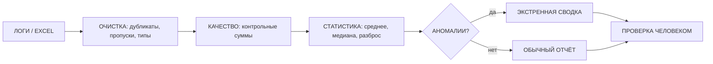

# Занятие 15. «Сторожевой пёс аппаратной»

> Семестр 1 · Блок 3 «Пыльные архивы» · Курс 04, лекции 09–11 · ~2 ч

## Миссия занятия

> «ЭТО ЧТО ЗА ДЕЛО, МОЛОДЕЖЬ?! Логи цеха потоком валятся, датчики ночью такую чушь пишут —
> минус сто пятьдесят градусов в сушилке! Вручную каждое утро всё это перебирать — твою ж изоленту!
> Собери мне сторожа: программу, чтоб сама логи читала, мусор выкидывала, и если что не так —
> тревогу била!» — Прораб Василич

**Задача квеста:** через агента собрать «сторожевого пса аппаратной» — скрипт-пайплайн, который
читает журнал датчиков цеха (Excel/CSV), чистит и проверяет качество данных (дубликаты, пропуски,
«галлюцинации датчиков», выбросы), считает базовую статистику и при аномалиях формирует
«экстренную сводку».

**Итог занятия:** работающий скрипт-сторож с известными контрольными числами: журнал 291 строка →
после очистки 282, аномалий по нормам 5, из них настоящая тревога — 1 (скачок давления до 8.4 атм
на Линии 1 в 03:10). Студент понимает, как словами «заказать» агенту автоматизацию повторяющейся
рутины и почему каждой цифре из данных и от ИИ нельзя верить без проверки.

---

## Слайды

| № | Тип | Название | Краткое содержание |
|---|-----|----------|--------------------|
| 1 | `image_group` | Комикс «Сторожевой пёс аппаратной» | 5 панелей: ночь, логи валятся, датчик «выдумал» -150°C → Алиса: «датчики галлюцинируют» → приказ Василича построить сторожа → задача |
| 2 | `rich_text` | «Миссия: собери сторожа» | Приказ Василича + задача квеста + итог занятия |
| 3 | `rich_text` | «Логи и Excel: ещё один склад» | Лекция 09: листы, `read_excel`, шапка не в первой строке, числа с запятой; запись обратно |
| 4 | `rich_text` | «Пайплайн: конвейер от сырья до тревоги» | Лекция 10: конвейер от логов до сводки; Mermaid; контрольные суммы; n8n — продвинутая опция |
| 5 | `rich_text` | «Качество данных и галлюцинации» | Лекция 11: 4 уровня ошибок; «каждая цифра может быть неверна»; чек-лист сомнения |
| 6 | `rich_text` | «Среднее, медиана и выбросы» | Лекция 11: базовая статистика; пример «9 премий и премия директора»; как ловить выбросы |
| 7 | `quiz` | «Датчик показал -150°C. Это…» | Контрольная точка: невозможное значение — «галлюцинация датчика», а не аномалия производства |
| 8 | `resources` | «Материалы практики» | Скачивание: журнал датчиков (xlsx + CSV), нормы датчиков, памятка |
| 9 | `jupyter` | «Разминка: статистика» | Встроенные данные: `describe()`, среднее vs медиана при выбросе |
| 10 | `ai_code_task` | «Собери сторожа аппаратной» | Главная практика через агента, два пути (локально / платформа); в выводе — очищенный журнал, статистика, аномалии, экстренная сводка |
| 11 | `rich_text` | «Проверка, экономика, приватность» | Сторож экономит ночные смены; проверка контрольными суммами; данные локальные, секреты — в `.env` |
| 12 | `image_group` | Комикс-развязка «Сторож сработал» | 4 панели: ночная тревога 8.4 атм → подклинил клапан → утром сводка сторожа → хук на занятие 16 (Совет директоров) |
| 13 | `image` | Мем «пропуск в данных» | Разрядка после практики (человек проверяет картинку) |

---

## Детали по слайдам

### 1. image_group — Комикс «Сторожевой пёс аппаратной»

- **Назначение:** завязка занятия: продолжение финала занятия 14 («завтра начнём автоматизировать,
  чтоб отчёты сами собирались»). Ночью в аппаратной логи цеха идут потоком, датчик «выдумал»
  невозможное значение — нужен автоматический сторож. См. `comic.md`, сцена 1.
- **Содержание:**
  - `title`: «Сторожевой пёс аппаратной»
  - `images`: 5 панелей (кадры 1.1–1.5 из `comic.md`, файлы `slide-15/01.png–05.png`)
  - `show_frames`: true
  - `description`: «Полночь в аппаратной. Алиса у мониторов: логи цеха сыплются потоком. Крупный
    план экрана: в таблице логов две строки подсвечены красным — «00:40 Т2-Л2 -150°C» и
    «03:45 П1-ПАР 99999». Алиса (в камеру): „Датчики выдумывают, деточка, — минус сто пятьдесят
    в сушилке не бывает“. Утром Василич злится, что логи приходится перебирать вручную. Алиса
    объясняет, что нужен сторож: программа читает журнал, чистит, проверяет и бьёт тревогу.
    Василич (в камеру): „Задача, молодежь: построй сторожевого пса аппаратной!“»
- **Хук:** сцена 2 развязки (слайд 12) подводит к занятию 16 («Судный день в аппаратной»).

### 2. rich_text — «Миссия: собери сторожа»

- **Назначение:** миссия занятия от имени Василича (п.2 шаблона): автоматизировать повторяющуюся
  рутину — проверку логов цеха. Одна мысль: рутину отдаём скрипту, но цифры проверяем.
- **Содержание** (`markdown`):

````markdown
**Миссия: собери сторожа.**

«Логи цеха потоком валятся, датчики ночью такую чушь пишут — минус сто пятьдесят в сушилке!
Вручную каждое утро перебирать — твою ж изоленту! Собери мне сторожа: программу, чтоб сама
логи читала, мусор выкидывала и, если что не так, — тревогу била!»»

**Задача квеста:** через агента собрать скрипт-сторожа: прочитать журнал датчиков цеха (Excel/CSV),
очистить (дубликаты, пропуски, «галлюцинации датчиков», мусор), проверить качество данных,
посчитать статистику и при аномалиях сформировать экстренную сводку.

**Итог занятия:** работающий сторож с контрольными числами: 291 строка → 282 после очистки,
5 аномалий по нормам, 1 настоящая тревога (давление 8.4 атм, Линия 1, 03:10).
````

### 3. rich_text — «Логи и Excel: ещё один склад»

- **Назначение:** формальное объяснение по лекции 09: логи цеха лежат в таблицах Excel/CSV; чтение,
  ловушки (листы, шапка не в первой строке, числа с запятой), запись результатов обратно. Одна
  мысль: Excel — обычный источник данных, работаем с ним как с любым складом.
- **Содержание** (`markdown`):

````markdown
**Логи и Excel: ещё один склад.**

«Логи цеха, деточка, лежат в Excel — это ещё один склад. Открываем, как любой другой:

```python
import pandas as pd
df = pd.read_excel("zhurnal.xlsx")          # читаем лист по умолчанию
wb = openpyxl.load_workbook("zhurnal.xlsx") # список листов — wb.sheetnames
df = pd.read_excel("zhurnal.xlsx", sheet_name="Логи", header=2)  # шапка не в первой строке
```

Ловушки: листов много — уточняй, какой нужен; шапка бывает на 3-й строке — `header=2`;
числа с запятой в русской локали читаются как текст — проси агента привести к числу.
Результаты записываем обратно: `df.to_excel("svodka.xlsx", index=False)` — это и есть отчёт
для коллег, открывается как обычный Excel.

Подробнее — [разбираем архив](@razbor-arhiva).»
````

### 4. rich_text — «Пайплайн: конвейер от сырья до тревоги»

- **Назначение:** наглядное объяснение конвейера (лекция 10) — как «сторож» устроен изнутри:
  конвейер от сырых логов до сводки, каждый шаг проверяется отдельно, в конце — контрольные
  суммы. Mermaid-диаграмма вместо видео (по договорённости рендеры не делаем).
- **Содержание** (`markdown`):

````markdown
**Пайплайн: конвейер от сырья до тревоги.**

«Сторож, деточка, — это конвейер: сырьё на входе, готовый продукт на выходе.
Каждый этап проверяется отдельно — так проще найти, где сломалось»:



Правила: шаг за шагом, а не «всё сразу»; контрольные суммы (число строк, итоги сходятся);
выводы — только из цифр. Когда отчёт нужен каждую ночь, конвейер можно запускать по расписанию
(продвинутая опция — платформа автоматизации n8n, скрипт на расписании).

Подробнее — [качество данных](@kachestvo-dannyh).»
````

### 5. rich_text — «Качество данных и галлюцинации»

- **Назначение:** формальное объяснение по лекции 11: откуда берутся ошибки в данных, четыре уровня
  (источник, обработка, интерпретация, галлюцинации ИИ); «галлюцинации датчиков» — мост к
  галлюцинациям ИИ; чек-лист сомнения. Одна мысль: каждая цифра может быть неверна, пока не проверена.
- **Содержание** (`markdown`):

````markdown
**Качество данных и галлюцинации.**

«Числа, деточка, лгут — на всех четырёх уровнях:

1. **Источник**: опечатка, дубликат, пропуск, устаревшие данные.
2. **Обработка**: неверный фильтр, перепутанные разделители, склеенные столбцы.
3. **Интерпретация**: вывод, который не следует из цифр (корреляция ≠ причина).
4. **Галлюцинации ИИ**: уверенные, но выдуманные цифры.

У датчиков бывают свои «галлюцинации»: ночью сушилка „показала“ −150 °C — физически невозможно.
Это сбой датчика, его строка — мусор для анализа, а не аномалия производства.

Чек-лист сомнения: откуда данные, за какой период? Число строк сходится? Контрольная сумма?
Единицы верные? Похоже ли на правду? Пересчитать вторым способом.

Подробнее — [качество данных](@kachestvo-dannyh).»
````

### 6. rich_text — «Среднее, медиана и выбросы»

- **Назначение:** формальное объяснение базовой статистики (лекция 11): среднее обманчиво при
  выбросах, медиана устойчива; минимум/максимум/разброс. Заводской пример с премиями.
- **Содержание** (`markdown`):

````markdown
**Среднее, медиана и выбросы.**

«Считать умеем, деточка, — но цифры надо понимать. У девяти рабочих премия 50 000, а у директора
завода — 5 000 000:

$$ \text{средняя} = \frac{9 \times 50\,000 + 5\,000\,000}{10} = 545\,000,\qquad
   \text{медиана} = 50\,000 $$

Обе цифры „верны“, но рассказывают разные истории. Среднее притягивают выбросы, медиана — нет.

```python
df["значение"].mean()     # среднее
df["значение"].median()   # медиана — устойчива к выбросам
df["значение"].min()      # минимум
df["значение"].max()      # максимум
df["значение"].std()      # разброс
df["значение"].describe() # всё сразу
```

Если среднее сильно больше медианы — ищи выброс: сбой датчика или настоящую аномалию.

Подробнее — [качество данных](@kachestvo-dannyh).»
````

### 7. quiz — «Датчик показал -150°C. Это…»

- **Назначение:** контрольная точка по ключевому приёму занятия: отличать «галлюцинацию датчика»
  (мусор) от настоящей аномалии производства. Материал — `files/quiz-kachestvo-dannyh.md`.
- **Содержание:**
  - `question`: «Ночью датчик температуры в сушильной камере показал −150 °C. Что это, скорее всего?»
  - `markdown`: «Выбери один правильный вариант. Подсказка — [качество данных](@kachestvo-dannyh).»
  - `options`:
    - { text: «Сбой датчика: невозможное значение, строка-мусор для анализа», is_correct: true }
    - { text: «Настоящая аномалия производства — сушилка замерзает», is_correct: false }
    - { text: «Дубликат строки в журнале логов», is_correct: false }
    - { text: «Средняя температура за смену», is_correct: false }
  - `explanation`: «−150 °C в сушильной камере физически невозможно — это „галлюцинация датчика“
    (аналог галлюцинации ИИ: уверенное, но выдуманное значение). Такую строку помечаем и исключаем
    из анализа, а не считаем аномалией производства. Настоящую тревогу ищем среди возможных,
    но необычных значений.»

### 8. resources — «Материалы практики»

- **Назначение:** раздать материалы практики: журнал датчиков цеха (Excel и CSV-версия),
  справочник допустимых норм и памятку «как заказать агенту пайплайн». Всё понадобится на слайде 10.
- **Содержание:**
  - `title`: «Материалы практики»
  - `description` (Markdown): «Журнал датчиков цеха за ночную смену 13 января 2120 г. — настоящая
    выгрузка, в которой намешаны дефекты: дубликаты, пропуски, „галлюцинации датчиков“
    (невозможные значения), значения-текст и одна настоящая аномалия. Проверь сам: 291 строка,
    3 дубликата, 5 пропусков. Нормы — справочник допустимых диапазонов по каждому датчику.
    Памятка — как словами „заказать“ агенту конвейер и как проверить, что он не наврал.»
  - `files`:
    - { name: `zhurnal-datchikov.xlsx`, description: «Журнал датчиков цеха (Excel, 291 строка, с дефектами)» }
    - { name: `zhurnal-datchikov.csv`, description: «То же — в CSV (для платформенного пути и агента)» }
    - { name: `normy-datchikov.csv`, description: «Нормы датчиков: допустимые диапазоны значений» }
    - { name: `pamyatka-payplajn.md`, description: «Памятка: как заказать агенту пайплайн и проверить результат» }

### 9. jupyter — «Разминка: статистика»

- **Назначение:** hands-on перед главной практикой: встроенные данные датчика с выбросом; посчитать
  `describe()`, увидеть, что среднее «потащило» выбросом, а медиана — нет. Сеть не нужна.
- **Содержание:**
  - `title`: «Разминка: статистика»
  - `kernel`: `pyodide`
  - `task` (Markdown): «Это ноутбук — твоё рабочее место. Выполни по порядку:
    1) запусти ячейку (Shift+Enter) — из встроенных данных датчика Т1-Л1 выведется статистика;
    2) посмотри на `mean` и `median`: почему среднее сильно больше медианы? Найди выброс;
    3) добавь ячейку и посчитай статистику без выброса (отфильтруй его) — сравни; 
    4) ответь себе: какую из цифр ты бы написал в сводке для дирекции и почему?»
  - `code`: начальный код:

```python
import io
import pandas as pd

# Показания датчика Т1-Л1 (температура реактора), 00:00–00:45
zhurnal = """\
время,датчик,линия,параметр,значение
2120-01-13 00:00,Т1-Л1,Линия 1,температура,84
2120-01-13 00:05,Т1-Л1,Линия 1,температура,86
2120-01-13 00:10,Т1-Л1,Линия 1,температура,85
2120-01-13 00:15,Т1-Л1,Линия 1,температура,220
2120-01-13 00:20,Т1-Л1,Линия 1,температура,87
2120-01-13 00:25,Т1-Л1,Линия 1,температура,84
2120-01-13 00:30,Т1-Л1,Линия 1,температура,85
2120-01-13 00:35,Т1-Л1,Линия 1,температура,86
2120-01-13 00:40,Т1-Л1,Линия 1,температура,84
2120-01-13 00:45,Т1-Л1,Линия 1,температура,85
"""
df = pd.read_csv(io.StringIO(zhurnal))
print("СРЕДНЕЕ:", df["значение"].mean())
print("МЕДИАНА:", df["значение"].median())
df["значение"].describe()
```

  - `description`: «Ядро — `pyodide` (Python в браузере). Клетки автосохраняются в прогресс.
    Сеть не нужна — данные встроены.»

### 10. ai_code_task — «Собери сторожа аппаратной»

- **Назначение:** главная практика-контрольная точка занятия: студент словами описывает агенту
  конвейер-сторожа — прочитать журнал, очистить, проверить качество, найти аномалии и сформировать
  экстренную сводку. **Два пути выполнения:** локально (opencode + файлы журнала: агент сам читает
  xlsx/csv и стучится в данные) или на платформе (встроенный фрагмент журнала в коде).
  В выводе — очищенный журнал, статистика, аномалии и сводка с настоящей тревогой (давление 8.4 атм).
  Материал — `files/pamyatka-payplajn.md`.
- **Содержание:**
  - `title`: «Собери сторожа аппаратной»
  - `task` (Markdown): «Собери через агента сторожа для аппаратной. Это конвейер из 6 шагов:
    1. **Прочитай** журнал: локально — файл `zhurnal-datchikov.xlsx` (или `.csv`); на платформе —
       встроенный фрагмент `zhurnal` в коде. Покажи первые 5 строк и типы.
    2. **Очисти**: удали дубликаты, реши, что делать с пропусками, приведи числа с запятой
       („22,5“ → 22.5), убери мусор („шум“). Объясни, что удалил и почему.
    3. **Проверь качество**: сколько строк было, стало; сколько дубликатов и пропусков нашёл.
    4. **Посчитай статистику** по „значение“: среднее, медиану, минимум, максимум, разброс.
    5. **Найди аномалии**: сверь каждый датчик с нормами (`normy-datchikov.csv` / таблица в коде).
       Отдельно пометь невозможные значения („галлюцинации датчиков“) и настоящие тревоги.
    6. **Сформируй экстренную сводку**: если есть тревога — список строк-аномалий, что не так,
       время; сохрани в файл `svodka.txt` и выведи через `print()`.
    Проверка: контрольные числа локального журнала — 291 строка → 282 после очистки, 5 аномалий,
    1 тревога (давление 8.4 атм, Линия 1, 03:10). Нажми „Проверить“.»
  - `language`: `python`
  - `code`: начальный код (путь «на платформе»: фрагмент журнала и нормы встроены):

```python
import io
import pandas as pd

# Фрагмент журнала (путь «на платформе»; локально агент читает полный файл)
zhurnal = """\
время,датчик,линия,параметр,значение
2120-01-13 00:00,Т1-Л1,Линия 1,температура,84
2120-01-13 00:00,Р1-Л1,Линия 1,давление,3.1
2120-01-13 00:00,В1-АП,Аппаратная,вибрация,2.4
2120-01-13 00:00,П1-ПАР,Котельная,расход пара,48
2120-01-13 00:00,Р2-Л2,Линия 2,давление,2.8
2120-01-13 00:00,Т2-Л2,Линия 2,температура,91
2120-01-13 03:10,Т1-Л1,Линия 1,температура,86
2120-01-13 03:10,Р1-Л1,Линия 1,давление,8.4
2120-01-13 03:10,В1-АП,Аппаратная,вибрация,420.5
2120-01-13 03:10,П1-ПАР,Котельная,расход пара,шум
2120-01-13 03:10,Р2-Л2,Линия 2,давление,2.9
2120-01-13 03:10,Т2-Л2,Линия 2,температура,92
2120-01-13 03:10,Р1-Л1,Линия 1,давление,8.4
2120-01-13 00:00,Т1-Л1,Линия 1,температура,
"""
df = pd.read_csv(io.StringIO(zhurnal))

# Нормы датчиков
normy = pd.DataFrame([
    ("Т1-Л1", 60, 120), ("Т2-Л2", 60, 120),
    ("Р1-Л1", 0, 6), ("Р2-Л2", 0, 6),
    ("В1-АП", 0, 5), ("П1-ПАР", 10, 80),
], columns=["датчик", "норма_мин", "норма_макс"])

print("СТРОК БЫЛО:", len(df))
print("ДУБЛИКАТОВ:", df.duplicated().sum())
print("ПРОПУСКОВ:", df["значение"].isna().sum())
```

  - `insertCodeButton`: true
  - `checkPrompt`: «Оцени решение студента по заданию „Собери сторожа аппаратной“ (задание + код +
    вывод). Проверь по коду и выводу: 1) журнал прочитан (из файла или фрагмента) и показаны первые
    строки/типы; 2) выполнена очистка: убраны дубликаты, пропуски, мусор („шум“), число с запятой
    приведено („22,5“ → 22.5); 3) проверка качества: указаны сколько строк было/стало, сколько
    дубликатов и пропусков; 4) посчитана статистика (среднее, медиана, минимум, максимум); 5) найдены
    аномалии сверкой с нормами, при этом „галлюцинации датчиков“ (невозможные значения) помечены
    отдельно от настоящих тревог; 6) сформирована экстренная сводка, где есть тревога: давление
    8.4 атм на Линии 1 в 03:10 (для локального полного журнала: 291 → 282 строки, 5 аномалий, 1 тревога;
    для встроенного фрагмента числа меньше — главное, логика и тревога 8.4 атм в выводе). Если очистки,
    сверки с нормами или сводки с тревогой в выводе нет — решение неполное. Ответь кратко:
    верно/неверно и почему.»
- **Примечание:** `expected_output` не задаём — код исследовательский (файлы/данные, вывод
  текстовый); проверка AI по `checkPrompt`, есть кнопка «На самом деле все верно».

### 11. rich_text — «Проверка, экономика, приватность»

- **Назначение:** сквозные темы курса применительно к автоматизации: проверка результата
  (контрольные суммы, «не верь цифре без кода»), экономика (сторож вместо ночных смен),
  приватность (данные завода остаются локально, секреты — в `.env`). Одна мысль: автоматизация
  экономит рутину, но не отменяет проверку.
- **Содержание** (`markdown`):

````markdown
**Проверка, экономика, приватность.**

1. **Проверяем.** Каждая цифра сторожа — из данных, а не из головы: контрольные суммы (число строк,
   итоги), требование «покажи код, которым посчитано». «Галлюцинации датчиков» и выдумки ИИ
   отсекаем сверкой с нормами и здравым смыслом.
2. **Считаем.** Лог вручную перебирали бы дежурный час каждое утро — 365 часов в год. Сторож делает
   это за минуты, а новую смену запуск — это просто повторный прогон. Аварийная бригада по тревоге
   сторожа спасла линию — вот настоящая экономия.
3. **Секреты.** Данные завода — коммерческая тайна, живут на заводских машинах, ни в какие чужие
   облака не уходят. Если появятся ключи — только в `.env`, не в код и не в чат.

Подробнее — [качество данных](@kachestvo-dannyh), [opencode](@opencode-ustanovka).
````

### 12. image_group — Комикс-развязка «Сторож сработал»

- **Назначение:** развязка сюжета: ночью сторож поймал настоящую аварию (скачок давления 8.4 атм),
  аварийная бригада успела; утром сводка сторожа показала контрольные числа занятия; хук на занятие
  16 (Совет директоров, полный диагностический отчёт). См. `comic.md`, сцена 2.
- **Содержание:**
  - `title`: «Сторож сработал»
  - `images`: 4 панели (кадры 2.1–2.4 из `comic.md`, файлы `slide-15/06.png–09.png`)
  - `show_frames`: true
  - `description`: «Два часа ночи. На экране — экстренная сводка сторожа: „ТРЕВОГА: Р1-Л1, 8.4 атм,
    03:10“ — красная плашка. Рядом остывшая чашка. Василич по телефону: „Подклинило клапан на
    Линии 1 — если бы не пёс, разорвало бы!“. Утром Алиса и Василич смотрят сводку сторожа:
    291 строка → 282 чистая, 5 аномалий, 1 тревога. Василич (в камеру): „Завтра Совет директоров —
    соберём полный диагностический отчёт завода, молодежь!“ Надпись: „СЛЕДУЮЩАЯ СМЕНА: СУДНЫЙ
    ДЕНЬ В АППАРАТНОЙ“.»

### 13. image — Мем «пропуск в данных»

- **Назначение:** разрядка после практики. Сквозная тема — качество данных: пропуски и «все цифры
  на месте» нужно проверять глазами.
- **Содержание:**
  - `title`: «Мем: пропуск в данных»
  - `image_url`: `memes/images/m00655.jpg` (кандидат; картинку проверяет человек глазами — по правилам
    курса)
  - `description`: «В таблице цифр от 0 до 9 пропущена единица — и никто не заметил. Как и в журнале
    датчиков: пропуск и дубликат не видны, пока их не поищешь специально. Сторож ищет — и находит.»
- **Подбор:** `memes/pick_meme "ИИ придумал цифру не верь проверяй данные"` и
  `memes/pick_meme "аномалия выбросы не доверяй статистика"` → кандидаты `m00655` (0.407, «таблица
  цифр с пропущенной единицей»), `m00048` (0.406, «проверь вычисления»), `m01833` (0.393, «учёные vs
  СМИ, вырвано из контекста»), все `is_clean=true`. Картинку проверяет человек; при замене —
  `memes/images/{id}.jpg`.

---

## Доп. информация

Блоки дополнительной информации (вкладка «Доп. информация» на платформе; слаги — общие на курс sem1).
Наполнение блоков — в `content/sem1/extra/<слаг>.md`.

| Слаг | Слайд | Ссылка на слайде |
|---|---|---|
| `kachestvo-dannyh` | 4, 5, 6, 7, 11 | «качество данных» |
| `razbor-arhiva` | 3 | «разбираем архив» |
| `opencode-ustanovka` | 11 | «opencode» |
