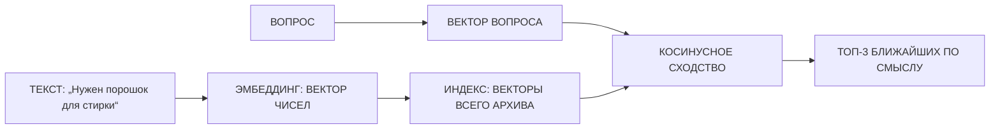

# Эмбеддинги и семантический поиск

> Доп. инфо к занятию 05. Ссылки со слайдов 2 и 6: `[семантический поиск и эмбеддинги](@embeddings-i-semanticheskiy-poisk)`
> и `[что значат числа и смысловая арифметика](@embeddings-i-semanticheskiy-poisk)`.
> Теория — лекция 08 курса-01 «Строим поисковые приложения».

## Проблема: поиск по словам не работает

Поиск по ключевым словам ищет **точные совпадения**: набрали «порошок» — получили только документы,
где встречается слово «порошок». Стоит написать иначе («моющее средство», «средство для стирки») —
и нужный документ не найден, хотя по смыслу он про то же самое.

Пример с завода. Нужен «порошок для стирки». Поиск по слову найдёт накладную (там прямо написано
«стиральный порошок»), но не найдёт инструкцию цеха №7 — там «моющее средство». А именно в инструкции
норма расхода. Без неё ответ неполный.

## Решение: смысл в числах (эмбеддинг)

**Эмбеддинг** — это числовое представление текста: вектор из сотен чисел, который передаёт смысл
(вложение, англ. embedding). Мысль, сказанная другими словами, получает почти тот же вектор:
«порошок» и «моющее средство» — близко.

**Косинусное сходство** — мера близости векторов: чем меньше угол между ними, тем ближе тексты
по смыслу. Максимум — 1 (векторы совпадают), минимум — −1 (противоположны).

**Индекс эмбеддингов** — хранилище всех векторов документов. По запросу машина превращает его
в вектор и находит в индексе самые близкие (топ-k).

## Схема семантического поиска

## Топ-k

Машина возвращает не один, а несколько самых близких кандидатов (топ-3, топ-5). Зачем: ответ на сложный
вопрос может собираться из нескольких документов (занятие 05 — вопрос про порошок требует склейки
инструкции про расход и приказа про закупку).

## Где взять эмбеддинги

Эмбеддинги делает специальная модель. Для практики занятия используем бесплатную локальную
`sentence-transformers` + `intfloat/multilingual-e5-small` — она работает без интернета и без ключей
(и приватно: текст никуда не уходит).

## Что означают числа в эмбеддинге

У слова десятки смысловых характеристик: у «кирпича» — материал, цвет, вес, прочность; у «порошка» —
свойство (чистит), сыпучесть, цвет. Казалось бы, каждой характеристике можно отдать одно число вектора.
Так в ролике и нарисовано (упрощение): «ЧИСЛО №1 — научные слова близко». Но по-настоящему это не так.

Отдельная координата эмбеддинга **не соответствует** понятной человеку категории. Числа получились
из текстов без подсказок «это про научность, а это про цвет» — модель сама решила, как их устроить.
Поэтому каждая координата — обычно **смесь** признаков: чуть научности, чуть цвета, чуть глянцевости.
Точно разложить её на составляющие нельзя, и подписать ось нечем.

Смысл слова **размазан по всем числам сразу**. Поэтому:

- смотреть на одно число и «угадывать смысл» нельзя;
- сходство считают по **всему вектору** (косинусный угол), а не по одной координате;
- числа дробные и отрицательные — это не «сколько-то признаков», а координаты в многомерном пространстве.

У модели из практики (`intfloat/multilingual-e5-small`) у каждого текста **384 числа** — точка
в 384-мерном пространстве. Три оси из ролика — наглядная условность, реальных осей сотни.

## Смысловая арифметика

Пространство эмбеддингов устроено не только так, что «близкое по смыслу — рядом». Внутри него работают
**закономерности направлений**: одно и то же отношение между словами задаёт один и тот же вектор-разность.

Например, связь «цвет материала» — одно и то же направление для разных материалов:

- кирпич → красный, изолента → синяя, утеплитель → бежевый.

Если взять «вектор цвета» (красный − кирпич) и прибавить его к «изолента», получится примерно «синяя».
Вектор-разность (красный − кирпич) и (синий − изолента) — почти один и тот же.

Заводской аналог самого известного примера смысловой арифметики «король − мужчина + женщина = королева»:
связь «руководит» задаёт направление между «директор» и «завод», а значит, «начальник цеха» и «цех»
связаны тем же сдвигом:

- директор → завод, начальник цеха → цех.

Ещё заводской пример — связь «замешан с водой»: она одна и та же для пары «соль → рассол» и для пары
«цемент → бетон».

Важно: это работает, потому что модель при обучении «видела» тексты, где такие связи повторяются.
Для коротких текстов и маленьких моделей закономерности менее надёжны, чем для отдельных слов и больших
эмбеддингов, — примеры выше иллюстрация идеи, а не гарантированный расчёт.

Тонкость для самых любопытных. «Кирпич → красный» — это **разность векторов**, а не матрицы. Подбор
**матриц преобразования** решением уравнений — отдельная техника: одно линейное преобразование W,
которое переводит целое пространство эмбеддингов одного представления в другое (между моделями или
языками), подбирается оптимизацией (метод наименьших квадратов / ортогональный Прокруст). Для поиска
по архиву она не нужна — мы просто сравниваем векторы в одном пространстве.

## Вывод

Поиск по архиву — это превращение документов в векторы (индекс) и поиск векторов, ближайших
к вектору запроса. Смысл ищет не точные слова, а близость значений — поэтому «порошок» находит
и «моющее средство».
