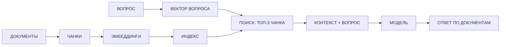

# RAG и векторные базы

> Доп. инфо к занятию 05. Ссылки со слайдов 11 и 12: `[RAG и векторные базы](@rag-i-vektornye-bazy)`.
> Теория — лекция 15 курса-01 «RAG и векторные базы данных».

## Проблема: модель не знает архив

Языковая модель учили на текстах из прошлого; данные конкретного завода она не видела. Спросишь
«сколько порошка заказываем на месяц?» — ответит «из головы»: красиво, но цифры может выдумать.
Проверить такой ответ не по чему.

## Решение: RAG — генерация с расширением поиска

**RAG** (Retrieval-Augmented Generation, «генерация с расширением поиска») — на каждый вопрос машина
сначала **ищет ответ в базе знаний**, а потом отвечает по найденному. Четыре шага:

1. **База знаний.** Документы режут на кусочки-**чанки** и превращают каждый в вектор-эмбеддинг
   (см. [эмбеддинги](@embeddings-i-semanticheskiy-poisk)); векторы складывают в **индекс**.
2. **Вопрос.** Вопрос тоже превращается в вектор.
3. **Извлечение (retrieval).** Из индекса берут самые близкие к вопросу чанки — топ-3.
4. **Расширенная генерация.** Модели дают вопрос **вместе с этими чанками** — и она отвечает по ним.

## Схема RAG

## Зачем

- **Актуальность.** Ответы — по свежим документам (приказ №14, новые накладные), а не по воспоминаниям
  модели из прошлого.
- **Меньше выдумок.** Модель обязана отвечать по приложенному контексту — и ответ можно **сверить
  с документом** (сквозная тема курса: не доверяй ИИ без проверки).
- **Дешевле.** Не нужно переучивать модель на данных завода (fine-tuning) — знания приходят с документами
  в запросе.

## Чем платить

- В запрос уходят несколько чанков, а не весь архив, — токены тратятся разумно. Но чем больше чанков
  и чем они длиннее, тем дороже каждый запрос: размер контекста ограничен (занятие 2), а лишние чанки
  могут зашумлять ответ.
- Качество зависит от чанков: неудачно порезанный документ не найдётся по смыслу. Если ответ плохой —
  проверяй, какие чанки попали в топ, и меняй размер чанков.

## Вывод

RAG = вопрос + документы из архива → ответ по источникам. Так модель отвечает по проверяемым документам,
не выдумывает, а знания завода обновляются простым добавлением файлов в базу — без переучивания.
