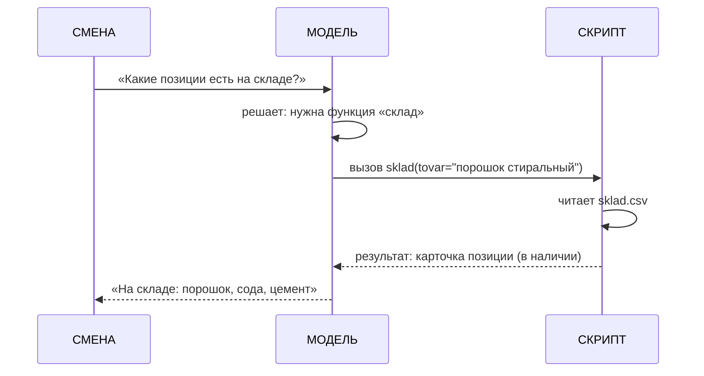

# Вызов функций (function calling)

> Доп. инфо к занятию 06. Ссылки со слайдов 7, 9, 10:
> `[вызов функций (function calling)](@vyzov-funkciy)`.
> Теория — лекция 11 курса-01 «Интеграция с вызовом функций».

## Проблема: модель «из головы»

Модель отвечает по тому, что «в голове» (обучена на текстах), и не имеет доступа к живым данным.
Спросим: «Какие позиции есть на складе?» — живого списка на сегодня у неё нет. Она может и приврать
(назвать позиции, которых нет), чтобы не сконфузить. Как безрукий: при всём уме, а взять ничего не может.

## Решение: кнопка на столе

**Вызов функций (function calling)** — способ дать модели доступ к внешним данным и действиям:
модель не выполняет код сама, а «жмёт кнопку» — решает, какую функцию вызвать, и формирует аргументы.
Реальную функцию выполняет программа, и её результат возвращается модели. Пример с завода: функция
`sklad(tovar)` — «карточка позиции из файла склада: есть ли в наличии».

## Как устроен цикл

1. **Описываем функцию** — инструмент: имя, параметры, что она делает (например `sklad(tovar)`).
2. **Модель решает.** На вопрос смены модель отвечает не перечнем, а «хочу вызвать `sklad`»
   с аргументом (tovar = порошок стиральный). Позиции проверяет по одной.
3. **Программа выполняет** функцию (читает `sklad.csv`) и кладёт результат в диалог.
4. **Модель отвечает** по реальным результатам: «На складе: порошок стиральный, сода, цемент»
   (сахара нет — остаток 0).

Ответ опирается на живые данные, а не на выдумку — и его можно сверить с источником.

## Токены (экономика)

Описание функций уходит в контекст вместе с запросом — это **токены**, то есть деньги. Поэтому функции
описываем коротко и подключаем только нужные: лишнее описание — лишние токены в каждом запросе.

## Приватность

В функцию уходят данные из запроса. Чужие данные и секреты в такие вызовы не шлём (как с ключами
API в `.env` — занятие 3). В практику курса в функцию «склад» уходят только названия позиций.

## Где работает

Скрипт с вызовом функций запускается у тебя на компьютере через локальный opencode (см.
[opencode](@opencode-ustanovka)). Не все бесплатные модели поддерживают tools — перед запуском
проверяем модель по каталогу https://openrouter.ai/collections/free-models.
